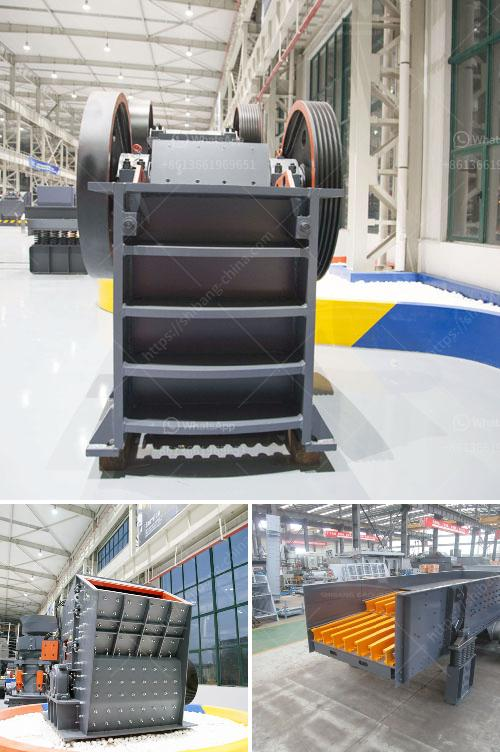

<h3>معدات فحص الصخور</h3>
تعتبر معدات فحص الصخور أدوات حيوية في مجالات مختلفة مثل الجغرافيا والجيولوجيا والنفط والتعدين والبناء. تساعد هذه المعدات على تحديد خواص وصفات الصخور وفهم تكوينها وتركيبها الداخلي، مما يساهم في تحليل الأملاح المعدنية واستخلاص المعادن وتحديد خصائص المواد الأرضية وتصميم المنشآت الهندسية.

إحدى المعدات الشائعة في فحص الصخور هي جهاز الأشعة السينية. يعمل هذا الجهاز عن طريق توليد أشعة سينية ذات تردد عالٍ ويتم توجيهها نحو عينات الصخور. تتفاعل الأشعة السينية مع المكونات المختلفة للصخر، مما يؤدي إلى تكوين صور ظلية للصخور توضح تركيبها الداخلي وتفاصيلها الدقيقة.

وتعتبر الميكروسكوبية الإلكترونية الماسحة (SEM) أداة قوية في فحص الصخور. يعمل الSEM عن طريق توجيه شعاع من الإلكترونات على سطح العينة واستشعار الإشعاع المنبعث من العينة. تتيح هذه العملية إنتاج صور ثلاثية الأبعاد للصخور بدقة عالية، مما يساعد على تحليل تفاصيل بنية الصخور وتمسكها وتفاعلها مع مكوناتها الأخرى.

بجانب ذلك، تشمل معدات فحص الصخور أجهزة قياس انتشار الأشعة السينية والأشعة تحت الحمراء والطيف الكهرومغناطيسي، وأجهزة تصوير الأشعة الضوئية والتصوير بالأشعة تحت الحمراء والتصوير الحراري، وغيرها الكثير.

يساعد استخدام معدات فحص الصخور على فهم تعافي الصخور وتأثيرات الضغط والحرارة والزمن عليها. فضلاً عن ذلك، يعتبر استخدام هذه المعدات البديل المثلى لاستخراج عينات من الصخور بطرق تقليدية يمكن أن تتسبب في تغيير تركيبها وتدمير خصائصها الأصلية.

باختصار، تعد معدات فحص الصخور أدوات حاسمة في فهم الصخور وتحليلها وتوضيح تكوينها وخصائصها. وضعت التحسينات التقنية في هذه المعدات في السنوات الأخيرة إمكانيات فحص الصخور على نطاق أعلى وتحليل أكثر دقة، مما ساهم في تقدم مجالات مختلفة من العلوم الأرضية والهندسية.
<h3>Contact us</h3><ul><li><strong>Whatsapp:&nbsp;<a href="https://wa.me/8613661969651">+8613661969651</a></strong></li><li><a href="https://swt.shibang-china.com/?git&amp;zhl&amp;معدات فحص الصخور"><strong>Online Service(chat now)</strong></a></li></ul><h3>Related</h3><ul><li><a href='مشغل مصنع كسارة في كسارة.md'>مشغل مصنع كسارة في كسارة</a></li><li><a href='كيفية بدء منجم المحاجر.md'>كيفية بدء منجم المحاجر</a></li><li><a href='تصميم كسارة الحجر.md'>تصميم كسارة الحجر</a></li><li><a href='آلات مطحنة في جنوب أفريقيا.md'>آلات مطحنة في جنوب أفريقيا</a></li><li><a href='مخطط تدفق التعدين ومعالجة المعادن للنيكل.md'>مخطط تدفق التعدين ومعالجة المعادن للنيكل</a></li></ul>