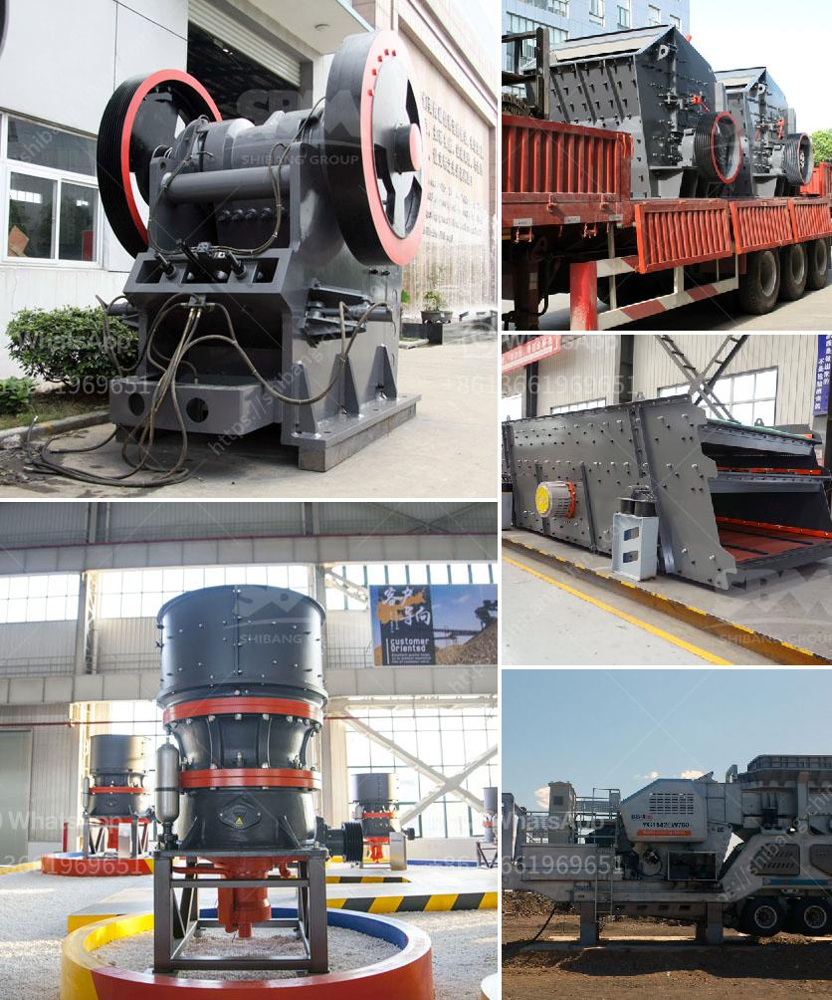

<h3>معدات فحص الكسارات</h3>
تطورت صناعة الكسارات بشكل كبير خلال العقود الماضية، مما أدى إلى استخدام معدات فحص الكسارات الحديثة. تعتبر هذه المعدات أداة أساسية في صناعة التعدين والبناء، حيث تساعد في فصل المواد الصلبة عن المواد العضوية وتحويلها إلى مواد قابلة للاستخدام في المشاريع الهندسية.

تهدف معدات فحص الكسارات إلى تحقيق عملية فحص دقيقة وفعالة للمواد المختلفة التي تمر عبر الكسارة. تتكون هذه المعدات عادة من شاشات اهتزازية متعددة الطبقات يتم استخدامها للتحكم في حجم الجسيمات وفحصها وتصنيفها وتهدئتها. كما تتميز بقدرتها على التعامل مع تدفق أعلى من المواد المدخلة، مما يقلل من وقت التوقف ويزيد من كفاءة عملية الفحص.

تتوفر معدات فحص الكسارات في مجموعة متنوعة من الأحجام والتصاميم لتلبية احتياجات العملاء المختلفة. تتضمن هذه التصاميم الشائعة شاشات قابلة للسحب، وشاشات دائرية، وشاشات اهتزازية خطية، وشاشات مأخذية. تعتبر الشاشات الهزازة خيارًا شائعًا للفحص الأساسي والدقيق، حيث تستخدم لفصل المواد إلى حجم الجسيمات المطلوبة وإزالة أي غبار أو رواسب غير مرغوب فيها.

بالإضافة إلى ذلك، يمكن تجهيز معدات فحص الكسارات بالعديد من الأجهزة المساعدة لتعزيز كفاءتها. تشمل هذه الأجهزة الجهاز الهيدروليكي لتعديل زاوية الشاشة، والناقلات الهوائية لتحسين تدفق المواد، والنواقل الدوارة للتخلص من المواد غير النظيفة، وأنظمة الرش لغسل المواد.

تعتبر معدات فحص الكسارات ضرورية لتحقيق نتائج عالية الجودة في صناعة البناء. يتطلب الاستفادة الكاملة من هذه الأدوات الاستثمار في تقنيات التحكم الحديثة والتكنولوجيا المتقدمة لتحقيق الأداء المثلى. يجب أن تتم صيانة وتشغيل هذه المعدات بدقة وفقاً للإرشادات المصنعة لضمان سلامة المشغلين واستدامة العملية.

باختصار، تلعب معدات فحص الكسارات دورًا حاسمًا في صناعة التعدين والبناء. تمثل هذه المعدات التقنية الحديثة اللازمة لفصل وفحص المواد وتصنيفها وتنظيفها قبل استخدامها في المشاريع الهندسية المختلفة. يجب أن يتم استخدام هذه المعدات بصورة سليمة وتشغيلها بشكل دوري للحفاظ على أدائها الأمثل وضمان سلامة العاملين.
<h3>Contact us</h3><ul><li><strong>Whatsapp:&nbsp;<a href="https://wa.me/8613661969651">+8613661969651</a></strong></li><li><a href="https://swt.shibang-china.com/?git&amp;zhl&amp;معدات فحص الكسارات"><strong>Online Service(chat now)</strong></a></li></ul><h3>Related</h3><ul><li><a href='معدات تعدين مستعملة للبيع في غانا.md'>معدات تعدين مستعملة للبيع في غانا</a></li><li><a href='كسارة الحجر المستعملة للبيع في زيمبابوي.md'>كسارة الحجر المستعملة للبيع في زيمبابوي</a></li><li><a href='كسارة الفك هي.md'>كسارة الفك هي</a></li><li><a href='تكلفة معدات سحق الجرانيت.md'>تكلفة معدات سحق الجرانيت</a></li><li><a href='آلة كسارة الصخور في ماليزيا.md'>آلة كسارة الصخور في ماليزيا</a></li></ul>