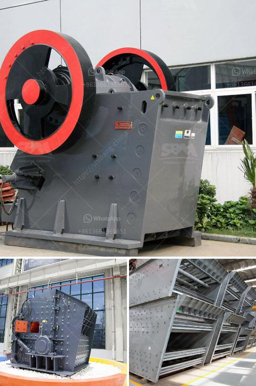

<h3>معدات في ماليزيا لسحق المحمولة</h3>
في السنوات الأخيرة، شهدت صناعة التعدين في ماليزيا تطورًا كبيرًا وازدهارًا مستمرًا. ومع زيادة الطلب على المواد الخام والمنتجات المعدنية، أصبحت شركات التعدين تبحث عن معدات فعالة ومتقدمة لسحق المواد الصخرية والأحجار، والتي يمكن أن تحقق أقصى قدر من الإنتاجية والكفاءة. وفي هذا السياق، أثبتت المعدات المحمولة لسحق المواد نفسها كخيار مثالي لشركات التعدين في ماليزيا.

توفر المعدات المحمولة لسحق المواد في ماليزيا حلاً متنقلاً وقابلاً للنقل لشركات التعدين. تأتي هذه المعدات في مجموعة متنوعة من الأحجام والطاقات، مما يسمح للشركات بتحديد الجهاز الأنسب لاحتياجاتها المحددة. تشمل المعدات المتاحة كسارة الفك المحمولة وكسارة الصدم المحمولة وكسارة المخروط المحمولة، وغيرها من الأنواع المتقدمة التي تلبي متطلبات مختلفة.

في الماضي، كانت شركات التعدين تعتمد على المعدات التقليدية الثابتة التي تتطلب الكثير من الوقت والجهد للتركيب والتجهيز. ومع ذلك، أصبحت المعدات المحمولة تنظر إليها بإيجابية كبيرة، حيث تتميز بسهولة النقل والتنقل بين المواقع المختلفة دون الحاجة إلى تفكيكها وتجهيزها من جديد. بفضل هذه الميزة، تستطيع الشركات الاستفادة من المعدات المحمولة لسحق المواد على نحو فعال وسريع.

بالإضافة إلى ذلك، توفر المعدات المحمولة لسحق المواد في ماليزيا نتائج ممتازة بفضل تكنولوجيا المعالجة المتقدمة التي تمتلكها. تتميز هذه المعدات بقدرتها على سحق المواد الصخرية القوية والصعبة بكفاءة عالية، مما يساعد على زيادة الإنتاجية وتقليل التكاليف. وبفضل تكنولوجياها المبتكرة، تستخدم هذه المعدات كميات أقل من الطاقة مقارنة بالمعدات التقليدية، مما يقلل من انبعاثات الكربون ويحسن الاستدامة البيئية.

في الختام، يمثل الاستخدام المتزايد للمعدات المحمولة لسحق المواد في ماليزيا تقدمًا هامًا في صناعة التعدين. فهذه المعدات توفر حلاً ملائمًا وفعالًا لشركات التعدين، حيث تجمع بين القدرة على النقل والتنقل السهل والكفاءة العالية. وبفضل تكنولوجيتها المتقدمة، تساهم في زيادة الإنتاجية وتحسين الاستدامة البيئية.
<h3>Contact us</h3><ul><li><strong>Whatsapp:&nbsp;<a href="https://wa.me/8613661969651">+8613661969651</a></strong></li><li><a href="https://swt.shibang-china.com/?git&amp;zhl&amp;معدات في ماليزيا لسحق المحمولة"><strong>Online Service(chat now)</strong></a></li></ul><h3>Related</h3><ul><li><a href='كسارة الخرسانة للبيع في نيو جيرسي.md'>كسارة الخرسانة للبيع في نيو جيرسي</a></li><li><a href='عملية سحق الصخور في الركام.md'>عملية سحق الصخور في الركام</a></li><li><a href='كسارة للجرانيت.md'>كسارة للجرانيت</a></li><li><a href='كسارة الصخور بوسطن.md'>كسارة الصخور بوسطن</a></li><li><a href='أريد شراء كسارة البوزولان.md'>أريد شراء كسارة البوزولان</a></li></ul>