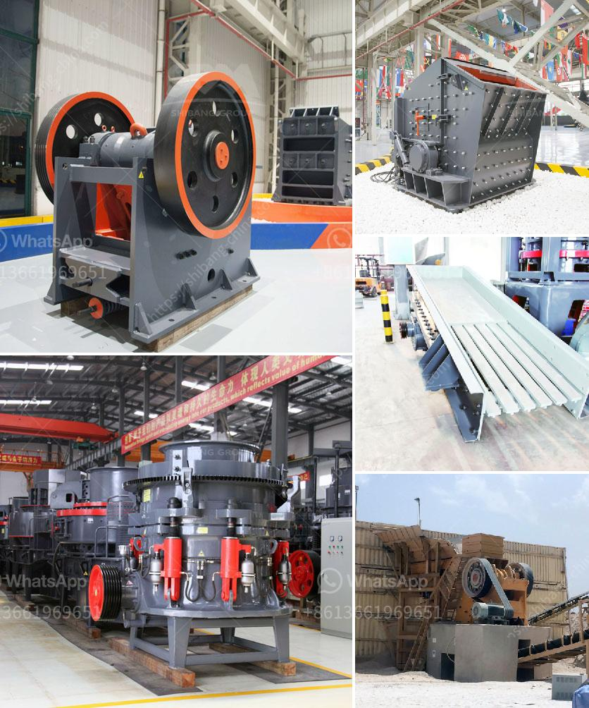

<h3>معدات كسارة الحجر للبيع</h3>
تعتبر معدات كسارة الحجر من أهم المعدات التي تستخدم في صناعة البناء والتعدين. فهي تساهم في تكسير الصخور الكبيرة إلى أجزاء صغيرة قابلة للاستخدام في العديد من التطبيقات المختلفة. وإذا كنت تبحث عن معدات كسارة الحجر للبيع، فإليك بعض المعلومات الهامة.

في البداية، تتوفر معدات كسارة الحجر بمختلف الأحجام والأنواع وفقًا لاحتياجات المشروع ومستوى الإنتاج المطلوب. تتراوح سعة الإنتاج لهذه الكسارات عادةً بين 50 إلى 500 طن في الساعة. بعض أنواع المعدات تشمل الكسارات الفكية والكسارات المخروطية والكسارات الصدمية وغيرها.

كما أن هناك العديد من العوامل التي يجب مراعاتها عند شراء معدات كسارة الحجر. من أهم هذه العوامل هي الجودة والأداء وسهولة الصيانة وتكلفة التشغيل ومتطلبات الطاقة وغيرها. قم بالبحث واستشارة خبراء المجال لضمان اختيار الجهاز الأنسب لاحتياجاتك.

بالإضافة إلى ذلك، يجب أن تدرس أيضًا الخدمات المقدمة بعد البيع، مثل خدمة التركيب والتشغيل والتدريب على استخدام المعدات. كما يفضل اختيار الشركات المصنعة ذات السمعة الطيبة والموثوقة لضمان الجودة والموثوقية.

بالنظر إلى السعر، فإن معدات كسارة الحجر للبيع تتراوح في الأسعار. إلا أنه يجب ألا تقتصر اهتمامك على السعر فقط، ولكن يجب أن تنظر أيضًا إلى الجودة والأداء والاحتياجات الخاصة بمشروعك. قد تجد بعض العروض المغرية من حيث السعر، لكن قد يكون هناك تأثير سلبي على الأداء ومدة الخدمة.

في النهاية، تعد معدات كسارة الحجر من الاستثمارات الهامة في صناعة البناء والتعدين. وللحصول على أفضل قيمة لمالك، يجب التركيز على الجودة والأداء وسهولة الصيانة وتكلفة التشغيل. قم بالبحث والاستشارة والمقارنة بين العروض المتاحة قبل اتخاذ القرار النهائي.
<h3>Contact us</h3><ul><li><strong>Whatsapp:&nbsp;<a href="https://wa.me/8613661969651">+8613661969651</a></strong></li><li><a href="https://swt.shibang-china.com/?git&amp;zhl&amp;معدات كسارة الحجر للبيع"><strong>Online Service(chat now)</strong></a></li></ul><h3>Related</h3><ul><li><a href='تنقية الجرافيت في معالجة المعادن.md'>تنقية الجرافيت في معالجة المعادن</a></li><li><a href='آلة سحق كبيرة.md'>آلة سحق كبيرة</a></li><li><a href='دراسة جدوى مشروع مصنع الإسمنت pdf.md'>دراسة جدوى مشروع مصنع الإسمنت pdf</a></li><li><a href='آلة غسيل الفحم طن.md'>آلة غسيل الفحم طن</a></li><li><a href='كسارة أولية للبيع.md'>كسارة أولية للبيع</a></li></ul>