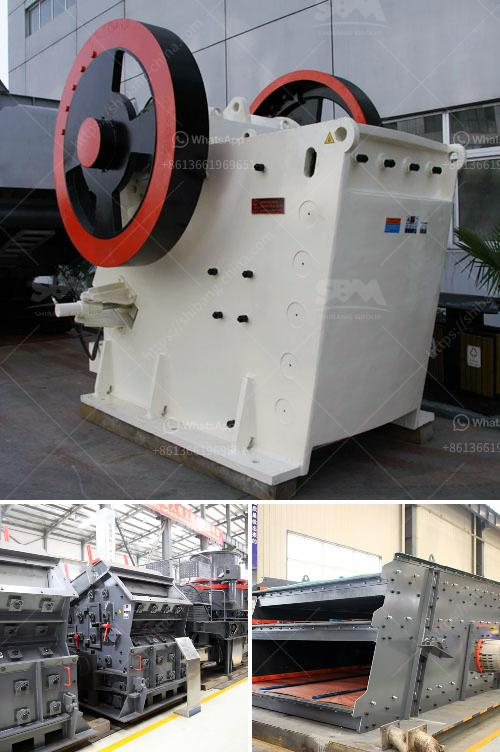

<h3>معدات كسارة الحجر</h3>
تعتبر كسارة الحجر من أهم المعدات التي تستخدم في صناعة البناء والتشييد. فهي تستخدم لكسر الحجارة الكبيرة إلى جزيئات صغيرة، وتحويلها إلى مواد بناء قابلة للاستخدام.

تعتبر كسارة الحجر ضرورية لإنتاج الركامات والمواد الأساسية المستخدمة في البناء. فبدونها، سيكون من الصعب الحصول على الركامات اللازمة لإنشاء المباني والطرق. وبفضل هذه المعدات، يمكننا الحصول على ركامات متنوعة التركيب والحجم، تلبي احتياجات مشاريع البناء المختلفة.

تتكون كسارة الحجر من عدة أجزاء رئيسية، بما في ذلك الصندوق المانع للتسرب، ونظام الدوار، ومحامل الدعم. وتكمن أهمية هذه المكونات في قدرتها على تحمل الأحمال الكبيرة والمتكررة، والتي تنشأ أثناء عملية الكسر.

تأتي كسارة الحجر بأحجام وأشكال مختلفة، لتتناسب مع متطلبات مشاريع البناء المختلفة. فهناك كسارات صغيرة الحجم، يتم استخدامها في المشاريع الصغيرة وفي الفضاءات المحدودة. وهناك أيضًا كسارات كبيرة الحجم، تستخدم في المشاريع الكبيرة التي تتطلب كميات كبيرة من الركامات.

بجانب ذلك، تحتوي بعض الكسارات على تقنيات متطورة، مثل الأجهزة الهيدروليكية والكهربائية. فهذه التقنيات تساعد على تسهيل عملية الكسر، وتجعلها أكثر كفاءة وسرعة. وبذلك، يمكن توفير الوقت والجهد في إنتاج الركامات.

باختصار، تعد كسارة الحجر معدة أساسية في صناعة البناء والتشييد، حيث تلعب دورًا حاسمًا في إنتاج الركامات والمواد الأساسية المستخدمة في المشاريع الكبيرة والصغيرة. وبفضل التطورات التكنولوجية، أصبح بإمكاننا الحصول على كسارات أكثر كفاءة وفعالية، مما يعزز تقدم قطاع البناء والتشييد ويسهم في التنمية الاقتصادية.
<h3>Contact us</h3><ul><li><strong>Whatsapp:&nbsp;<a href="https://wa.me/8613661969651">+8613661969651</a></strong></li><li><a href="https://swt.shibang-china.com/?git&amp;zhl&amp;معدات كسارة الحجر"><strong>Online Service(chat now)</strong></a></li></ul><h3>Related</h3><ul><li><a href='سعر كسارة مخروطية 250 طن.md'>سعر كسارة مخروطية 250 طن</a></li><li><a href='مستخدمة لمطاحن ريموند للبيع في الهند.md'>مستخدمة لمطاحن ريموند للبيع في الهند</a></li><li><a href='كسارة الفك PE 150x250.md'>كسارة الفك PE 150x250</a></li><li><a href='سينغ كسارة الحجر ناشيك.md'>سينغ كسارة الحجر ناشيك</a></li><li><a href='مصنع طحن الذهب في زيمبابوي.md'>مصنع طحن الذهب في زيمبابوي</a></li></ul>