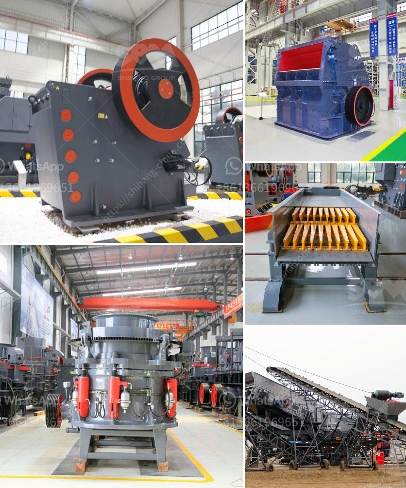

<h3>معدات كسارة الذهب</h3>
كسارة الذهب هي معدة مهمة في عملية استخلاص الذهب من خاماته. تعد عملية استخلاص الذهب من الخام عملية معقدة تتطلب مجموعة متنوعة من المعدات والآلات الخاصة بالكسارة. تعتمد هذه المعدات على تكسير الخام إلى جزيئات صغيرة يمكن من خلالها استخلاص الذهب.

إحدى المعدات الرئيسية في عملية كسارة الذهب هي الكسارة الفكية. تستخدم الكسارة الفكية لسحق الخام الذهبي الخام إلى قطع صغيرة. تتكون الكسارة الفكية من قواطع ثابتة ومتحركة يتم ضغط الخام بينهما. يعمل التحرك الصعودي والهبوطي للفك المتحرك على سحق الخام وتقليل حجمه. تتميز الكسارة الفكية بقدرتها على التعامل مع خامات ذات صلابة عالية وتوفير كفاءة عالية في عملية الكسر.

بعد عملية الكسر الأولية باستخدام الكسارة الفكية، تستخدم معدات أخرى مثل الكسارة المخروطية لتحويل الخام السحق إلى أحجام أصغر. تستخدم الكسارة المخروطية الكسر المجزأ لتقليل حجم الخام إلى الحجم المطلوب. يتم بعد ذلك استخدام الطواحين لطحن الخام إلى مسحوق ناعم يحتوي على ذرات الذهب.

يعتبر جهاز اللبنة الجاذبة الجهاز الرئيسي في عملية استخلاص الذهب من الخامات المطحونة. يتكون هذا الجهاز من جدران مخروطية تمتد من الأسفل إلى الأعلى. تدخل المحلول المعدني المطحون في أعلى الجهاز ويتم توجيهه بواسطة الضغط والخلايا الجاذبة إلى الأسفل. يتم جمع ذرات الذهب التي تكون أثقل من المحلول في القاع والتي تشكل المركز الذهبي.

بالإضافة إلى المعدات المذكورة، هناك العديد من المعدات الأخرى التي تستخدم في عملية كسارة الذهب. منها الغسالات والفصل الكهروستاتيكي والمقياس ومشروع استخلاص الذهب الأوتوماتيكي. تتفاوت معدات كسارة الذهب في الحجم والسعة والتقنيات المستخدمة، وتعتمد على طبيعة الخام واحتياجات عملية الاستخلاص.

باختصار، تعد معدات كسارة الذهب أدوات أساسية في عملية استخلاص الذهب من الخامات. تتكون من مجموعة متنوعة من الكسارات والطواحين والجهاز اللبنة الجاذبة والعديد من المعدات الأخرى. تعتمد اختيار المعدات على طبيعة الخام وحجمه والكمية المتوقعة من الذهب المستخرج، وتهدف إلى تحقيق أقصى قدر ممكن من كفاءة الاستخلاص.
<h3>Contact us</h3><ul><li><strong>Whatsapp:&nbsp;<a href="https://wa.me/8613661969651">+8613661969651</a></strong></li><li><a href="https://swt.shibang-china.com/?git&amp;zhl&amp;معدات كسارة الذهب"><strong>Online Service(chat now)</strong></a></li></ul><h3>Related</h3><ul><li><a href='مصنع تكسير وفحص الكسارة.md'>مصنع تكسير وفحص الكسارة</a></li><li><a href='آلات تصنيع الرمل في الصين.md'>آلات تصنيع الرمل في الصين</a></li><li><a href='آلات الطحن بالكرات الكوارتز.md'>آلات الطحن بالكرات الكوارتز</a></li><li><a href='صيغة حساب قدرة كسارة الفك.md'>صيغة حساب قدرة كسارة الفك</a></li><li><a href='موردين رمل السيليكا في زيمبابوي.md'>موردين رمل السيليكا في زيمبابوي</a></li></ul>