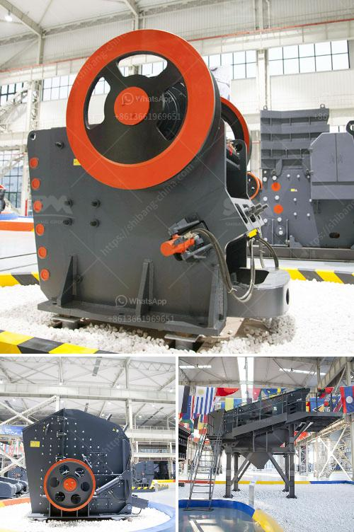

<h3>معدات كسارة الفك المتنقلة</h3>
يعتبر تطور صناعة التعدين والإنشاءات أحد أهم العوامل التي تدعم النمو الاقتصادي وتعزز التنمية المستدامة في العديد من الدول. ومن بين أهم الأدوات والمعدات التي تعتبر أساسية في عمليات التعدين والإنشاءات هي معدات الكسارة الفك المتنقلة.

تعد معدة الكسارة الفك المتنقلة أداة فعالة ومهمة في عملية التكسير وسحق الصخور والأحجار. يتم استخدامها عادة في المناجم ومواقع البناء والمواد الخام والحجر الجيري والحجارة الكبيرة الحجم. تتميز هذه المعدة بأنها يمكن نقلها بسهولة من مكان لآخر حسب الاحتياجات.

تتكون معدة الكسارة الفك المتنقلة من إطار رئيسي مصنوع من الفولاذ الصلب عالي الجودة ومحرك يعمل بالديزل أو بالكهرباء. كما تحتوي على فكين قابلين للتعديل لتنظيم حجم المنتج النهائي. تعتبر سهولة استخدام هذه الأداة وفعاليتها من أهم المميزات التي يجب أخذها في الاعتبار عند اختيار معدات الكسارة الفك المتنقلة.

تساعد معدة الكسارة الفك المتنقلة في زيادة إنتاجية عمليات التعدين والإنشاءات. فبفضل تصميمها المتين وقدرتها على سحق الصخور الصعبة ، يمكن أن تعمل بكفاءة في ظروف العمل القاسية. تتميز هذه المعدات أيضًا بأنها تعزز سلامة العمال ، حيث يتم توفير حاجز للحماية حول المجموعة الحركية للفكين ، مما يقلل من فرص حدوث الحوادث.

بالإضافة إلى ذلك ، فإن استخدام معدة الكسارة الفك المتنقلة يعني أيضًا تقليل تكاليف النقل والتصنيع التقليدية. فعوضًا عن نقل الصخور إلى موقع ثابت للتكسير ، يمكن تقليل التكاليف النقل بإحضار المعدة مباشرةً إلى موقع العمل. وبالتالي ، يتم توفير الوقت والجهد والمال التي كانت ستستغرق في تحريك المواد وتجهيزها في مواقع الكسارة.

في الختام ، فإن معدة الكسارة الفك المتنقلة هي أداة أساسية في صناعة التعدين والإنشاءات. تحسن الكفاءة وتقلل من تكاليف التصنيع والنقل ، مما يعزز الاستدامة والتنمية العمرانية. تعد هذه المعدة اختيارًا مثاليًا للمناجم وشركات الإنشاءات التي ترغب في زيادة إنتاجيتها وتحقيق أقصى قدر من الكفاءة والربحية.
<h3>Contact us</h3><ul><li><strong>Whatsapp:&nbsp;<a href="https://wa.me/8613661969651">+8613661969651</a></strong></li><li><a href="https://swt.shibang-china.com/?git&amp;zhl&amp;معدات كسارة الفك المتنقلة"><strong>Online Service(chat now)</strong></a></li></ul><h3>Related</h3><ul><li><a href='مطحنة الأسطوانة للحجر.md'>مطحنة الأسطوانة للحجر</a></li><li><a href='شركة تصنيع معدات تعدين الذهب في الصين.md'>شركة تصنيع معدات تعدين الذهب في الصين</a></li><li><a href='شركة تصنيع مطحنة ريموند في جنوب أفريقيا.md'>شركة تصنيع مطحنة ريموند في جنوب أفريقيا</a></li><li><a href='كسارات الحجر في بيلين.md'>كسارات الحجر في بيلين</a></li><li><a href='مطاحن الكرة الفلسبار.md'>مطاحن الكرة الفلسبار</a></li></ul>