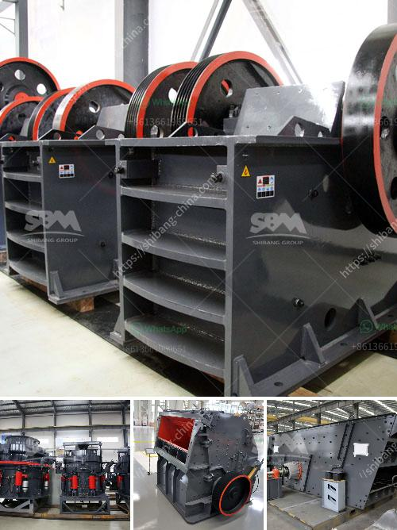

<h3>معدات كسارة الفك للبيع في الفلبين</h3>
تُعتبر كسارات الفك من أهم المعدات المستخدمة في صناعة التعدين والبناء. فهي تستخدم لسحق المواد الخام وتقسيمها إلى مواد صغيرة الحجم تستخدم في البناء وصناعة الطرق. وتعتبر الفلبين واحدة من الدول الناشئة في مجال صناعة المعادن والبناء، وبالتالي فإن هناك حاجة كبيرة لمعدات الكسارات في هذا البلد.

تتميز كسارات الفك بأنها آلات قوية وفعالة تستخدم في عملية التكسير. تتكون الكسارة الفكية من جزئين رئيسيين، وهما: الفك الثابت المثبت جيدًا والفك المتحرك الذي يتحرك في اتجاه صعودي وهبوطي. عند عملية التكسير، يتم سحق المواد بين الفك الثابت والفك المتحرك، حيث ينقسم المواد إلى قطع صغيرة. وتُستخدم هذه القطع الصغيرة في إنشاء الطرق أو في صناعة الخرسانة.

تستخدم كسارات الفك بشكل واسع في عملية تكسير المواد مثل الحجر الجيري والجرانيت والخامات المعدنية الأخرى. وتُستخدم أيضًا في إعادة تدوير الخرسانة والركام. وبفضل تصميمها المتين وقوتها، تعد كسارات الفك مثالية للاستخدام في العديد من المشاريع الكبيرة والصغيرة.

في الفلبين، يوجد العديد من الشركات التي تقدم معدات كسارات الفك للبيع. وتتنوع هذه المعدات في الأحجام والقدرات. فهناك مجموعة متنوعة من الكسارات التي توفرها الشركات لتلبية احتياجات عملائها. يمكن العثور على معدات الكسارات الجديدة والمستعملة في السوق، وتتنوع أسعارها وفقًا للمواصفات والحالة.

عند اختيار معدات الكسارة المناسبة للبيع في الفلبين، يجب أخذ العديد من العوامل في الاعتبار. يجب أن يتم اختيار الكسارة التي تلبي الاحتياجات الخاصة بالمشروع، وذلك عن طريق تحديد القدرة المطلوبة وحجم التغذية المناسب. كما يجب النظر في تصميم الكسارة وجودتها واعتماديتها. ويجب أيضًا التحقق من مصداقية وسمعة الشركة التي تقدم الكسارة.

بشكل عام، يجب أن يتم الاستثمار في معدات الكسارات التي توفر الأداء العالي والجودة الممتازة والصيانة المنخفضة. علاوة على ذلك، يجب على المشتري دراسة سوق معدات الكسارات والمقارنة بين الأسعار المختلفة للحصول على أفضل صفقة ممكنة.

مع ازدياد الطلب على معدات الكسارات في الفلبين، فإن العديد من الشركات تقدم خدمات بيع وصيانة هذه المعدات. يمكن للمشترين الاستفادة من خدمات هذه الشركات للحصول على المعدات المطلوبة وضمان أداءها المثلى على المدى الطويل.

باختصار، تُعتبر معدات كسارة الفك من الأدوات الأساسية في صناعة التعدين والبناء، وهناك حاجة كبيرة لهذه المعدات في الفلبين. يجب على المشترين اختيار الكسارة المناسبة من حيث الأداء والجودة والسعر. وباستخدام خدمات الشركات المتخصصة، يمكن للمشترين الحصول على معدات الكسارات عالية الجودة والموثوقة لتلبية احتياجاتهم.
<h3>Contact us</h3><ul><li><strong>Whatsapp:&nbsp;<a href="https://wa.me/8613661969651">+8613661969651</a></strong></li><li><a href="https://swt.shibang-china.com/?git&amp;zhl&amp;معدات كسارة الفك للبيع في الفلبين"><strong>Online Service(chat now)</strong></a></li></ul><h3>Related</h3><ul><li><a href='تقدير تكلفة مصنع تعدين النحاس.md'>تقدير تكلفة مصنع تعدين النحاس</a></li><li><a href='آلة معالجة البلانت.md'>آلة معالجة البلانت</a></li><li><a href='مطاحن الكرة لتعدين ٦ × ٦.md'>مطاحن الكرة لتعدين ٦ × ٦</a></li><li><a href='معدات تعدين الرمال والحصى للبيع.md'>معدات تعدين الرمال والحصى للبيع</a></li><li><a href='تأجير حزام الناقل في أيرلندا.md'>تأجير حزام الناقل في أيرلندا</a></li></ul>