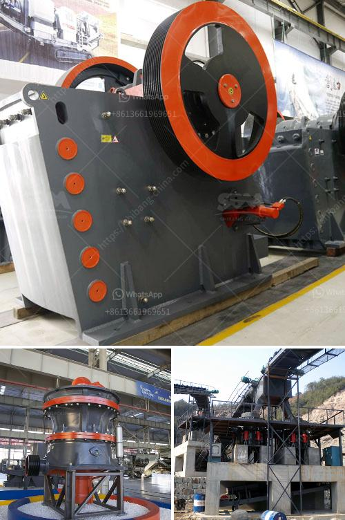

<h3>معدات كسارة المحجر للبيع</h3>
معدات كسارة المحجر الصناعية هي آلات متخصصة تستخدم لتكسير الصخور والحجارة الكبيرة في المحاجر لإنتاج مواد البناء والركام. هذه المعدات تلعب دورًا حاسمًا في صناعة البناء والبنية التحتية، حيث تساهم في توفير الموارد الطبيعية والمواد الأولية اللازمة للمشاريع الضخمة.

إحدى أهم المعدات التي تستخدم في عمليات التكسير هي كسارة الفك. تتكون كسارة الفك من جزأين رئيسيين هما الفك المتحرك والفك الثابت، حيث يتم وضع الصخور بين الفكين ومن ثم يتم تحطيمها وتكسيرها إلى قطع صغيرة تسهل المعالجة ونقلها.

تتوفر معدات كسارة المحجر بمختلف الأحجام والقدرات والتقنيات. يمكن العثور على معدات كسارة المحجر المستعملة بأسعار منخفضة، وهذه العروض لها شهرة كبيرة بين المشترين الذين يبحثون عن تكلفة منخفضة وكفاءة عالية في نفس الوقت. ومع ذلك، فإن شراء معدات جديدة يعتبر أفضل خيار إذا كان لديك الميزانية المناسبة، حيث توفر المعدات الجديدة أحدث التقنيات وأعلى كفاءة في العمل.

بالإضافة إلى ذلك، يجب النظر في متطلبات المشروع والقدرات المطلوبة للمعدات. في حالة المشاريع الصغيرة والمتوسطة، يمكن استخدام معدات كسارة محمولة، حيث يمكن نقلها بسهولة بين المواقع المختلفة. أما في حالة المشاريع الكبيرة والمستمرة، فإن معدات كسارة ثابتة تعد الخيار الأفضل، حيث يمكن تجهيزها بسرعة وتعمل بشكل مستمر لفترات طويلة.

عند البحث عن معدات كسارة المحجر للبيع، من المهم أيضًا الانتباه إلى موثوقية وجودة الموردين. يجب عليك اختيار مورد جيد وذو سمعة جيدة، والذي يمكنه توفير قطع الغيار الأصلية وخدمة ما بعد البيع الممتازة.

في النهاية، تعتبر معدات كسارة المحجر الصناعية من العناصر الأساسية في عمليات التكسير وإعادة تدوير المواد الخام. من خلال اختيار المعدات المناسبة والتعاون مع مورد موثوق، يمكن للشركات والمشاريع تحقيق الكفاءة والاستفادة القصوى من هذه المعدات الحاسمة.
<h3>Contact us</h3><ul><li><strong>Whatsapp:&nbsp;<a href="https://wa.me/8613661969651">+8613661969651</a></strong></li><li><a href="https://swt.shibang-china.com/?git&amp;zhl&amp;معدات كسارة المحجر للبيع"><strong>Online Service(chat now)</strong></a></li></ul><h3>Related</h3><ul><li><a href='محطات الكسارات للبيع في باكستان.md'>محطات الكسارات للبيع في باكستان</a></li><li><a href='تكلفة آلة طحن الرمال السيليكا.md'>تكلفة آلة طحن الرمال السيليكا</a></li><li><a href='كسارة صخور وشاشات في الفلبين.md'>كسارة صخور وشاشات في الفلبين</a></li><li><a href='كسارة فكية صغيرة في المملكة المتحدة.md'>كسارة فكية صغيرة في المملكة المتحدة</a></li><li><a href='سحق الحجر الأسود تايلاند.md'>سحق الحجر الأسود تايلاند</a></li></ul>