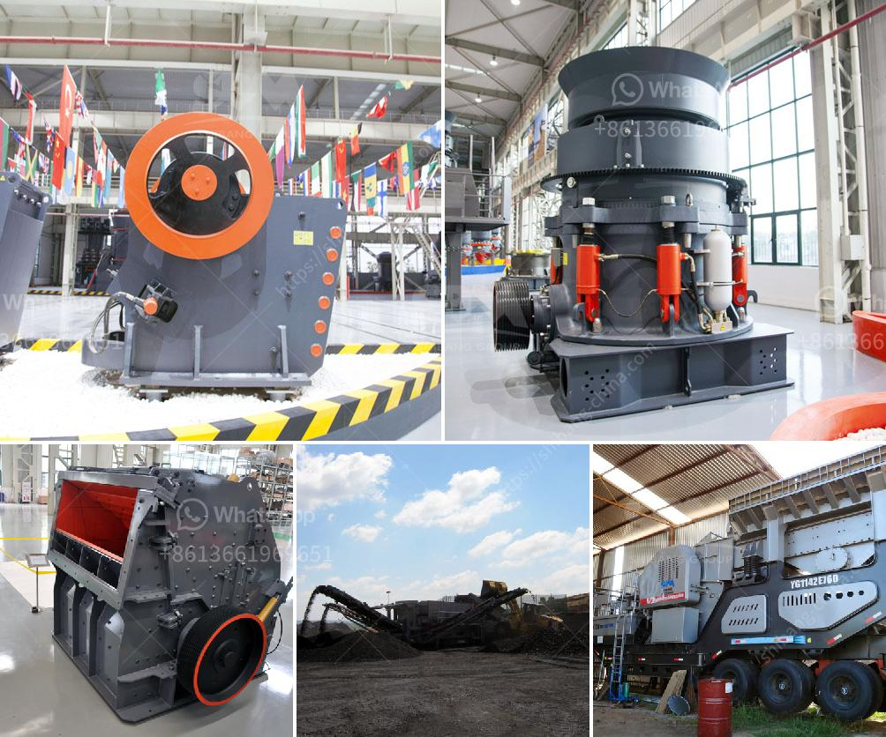

<h3>معدات لإنتاج الحجر الطبيعي</h3>
تعد معدات إنتاج الحجر الطبيعي من أهم الأدوات في عملية استخراج وتصنيع الحجر الطبيعي. تستخدم هذه المعدات في تحويل الصخور الطبيعية إلى منتجات مصقولة وجاهزة للاستخدام في مجموعة متنوعة من التطبيقات، مثل البناء والديكور الداخلي والخارجي والأعمال اللوحية والعديد من الأغراض الأخرى.

أحد أنواع المعدات المستخدمة في إنتاج الحجر الطبيعي هو آلة قطع الحجر. تعتبر آلة قطع الحجر من الأدوات الأساسية في هذه العملية، حيث تقوم بقطع الصخور الطبيعية إلى قطع نصف منتظمة الشكل والحجم. تتميز آلات قطع الحجر بتقنيات قطع متقدمة تستخدم الليزر أو الماء عالي الضغط أو حبيبات الرمل لتحقيق نتائج دقيقة وعالية الجودة.

بعد قطع الصخور، يتم استخدام آلات التلميع والتشكيل لإعطاء الأحجار الطبيعية النهائية مظهرًا جماليًا ولمسة نهائية ناعمة. تستخدم هذه الآلات أقراص التلميع والتشكيل لإزالة العيوب السطحية والتجاعيد وتحقيق التشطيب النهائي المطلوب. يتم استخدام مواد كيميائية وشمع خاص لتعزيز لمعان الحجر وحمايته من العوامل الجوية والتآكل.

بالإضافة إلى ذلك، تستخدم معدات تقطيع الحجر في عملية تقسيم الأحجار الكبيرة إلى أحجام وأشكال محددة وفقًا لاحتياجات المشروع. تشمل هذه المعدات اللوحات والمناشير الكهربائية والمناشير التلقائية، وتتنوع في حجمها وقوة التقطيع المطلوبة.

لضمان السلامة والفعالية في عمليات إنتاج الحجر الطبيعي، يجب أيضًا استخدام معدات حماية شخصية مثل القفازات والنظارات الواقية وأقنعة الوجه والأحذية المناسبة. تساعد هذه المعدات في تقليل المخاطر المرتبطة بالعمل المباشر مع الحجر الطبيعي، مثل الإصابات والتعرض للغبار والمواد الكيميائية الضارة.

بشكل عام، فإن معدات إنتاج الحجر الطبيعي تلعب دورًا حاسمًا في جميع مراحل تصنيع الحجر، بدءًا من استخراجه وقطعه وتشكيله وحتى تلميعه وتشطيبه. تساعد هذه المعدات في تحقيق نتائج عالية الجودة وتحسين كفاءة العمل وتقليل التكاليف، مما يعزز التنافسية في سوق الحجر الطبيعي.
<h3>Contact us</h3><ul><li><strong>Whatsapp:&nbsp;<a href="https://wa.me/8613661969651">+8613661969651</a></strong></li><li><a href="https://swt.shibang-china.com/?git&amp;zhl&amp;معدات لإنتاج الحجر الطبيعي"><strong>Online Service(chat now)</strong></a></li></ul><h3>Related</h3><ul><li><a href='آلة تكسير وطحن مناجم الذهب.md'>آلة تكسير وطحن مناجم الذهب</a></li><li><a href='آلة فرز للبيع في جنوب أفريقيا.md'>آلة فرز للبيع في جنوب أفريقيا</a></li><li><a href='معدات تعدين مستخدمة.md'>معدات تعدين مستخدمة</a></li><li><a href='كسارة الصخور المحمولة.md'>كسارة الصخور المحمولة</a></li><li><a href='شراء كسارة الفك الأولية في نيجيريا.md'>شراء كسارة الفك الأولية في نيجيريا</a></li></ul>