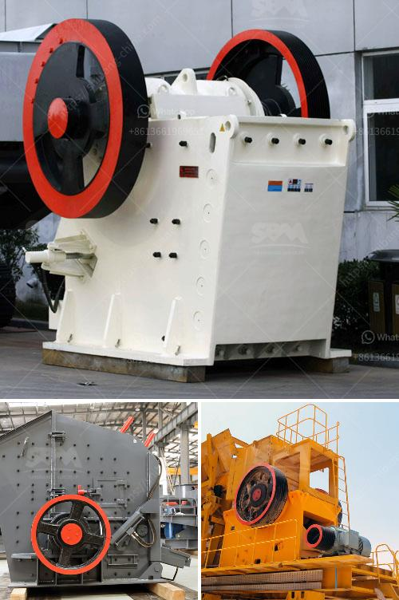

<h3>معدات لتركيز خام الذهب</h3>
تركيز خام الذهب هو عملية تزويد الخام بالتركيز اللازم لاستخلاص الذهب منه. وتعتبر معدات التركيز من العوامل الرئيسية في عملية استخراج الذهب. تهدف هذه المعدات إلى فصل الذهب عن المواد الأخرى الموجودة في الخام، مثل الصخور والمعادن الغير قيمة.

يتم استخدام العديد من المعدات المختلفة في تركيز خام الذهب. من أبرز هذه المعدات هي الطاولات الاهتزازية والسيور الناقلة والشلالات الدوامية ووحدات التعويم.

تعتبر الطاولات الاهتزازية من أكثر المعدات شيوعًا في صناعة تركيز الذهب. تعمل الطاولات الاهتزازية على استخلاص الذهب من خلال استخدام قوة الجاذبية الأرضية. حيث يتم وضع الخام على الجزء العلوي من الطاولة المهتزة، وتهتز الطاولة ببطء مما يسمح للذهب بالتكدس في الجزء السفلي من الطاولة بينما تزول المواد الأخرى.

أما السيور الناقلة فتستخدم لنقل الخام من مكان إلى آخر في عملية التركيز. تعمل السيور الناقلة على نقل الخام بشكل مستمر ومنتظم دون توقف أو إعاقة. تتسم السيور الناقلة بالسرعة والقوة والمرونة في العمل، مما يسهل استخلاص الذهب من الخام بكفاءة.

أما الشلالات الدوامية فهي تعمل على توريد الماء إلى عملية تركيز الذهب، حيث يتم خلط الخام مع المياه والشلالات الدوامية. تتأثر الجاذبية بفعل تيار المياه، مما يساعد على انتقال الذهب والمواد الصلبة الأخرى لتركيز الذهب.

أخيرًا، وحدات التعويم هي معدات تستخدم لفصل الذهب عن الخام. تعتمد هذه المعدات على تقنية التعويم لاستخلاص الذهب. تتم عملية التعويم من خلال التشبع الهوائي للخام بالهواء وعملية التخفيف، مما يسمح بانتقال الذهب إلى الماء والمواد الأخرى إلى الجزء السفلي من الجهاز.

باختصار، تعتبر المعدات المستخدمة في تركيز خام الذهب أساسية في العملية العامة لاستخلاص الذهب. وتشمل هذه المعدات الطاولات الاهتزازية والسيور الناقلة والشلالات الدوامية ووحدات التعويم. تتفاوت هذه المعدات في الحجم والقدرة والوظيفة، ويجب استخدامها بشكل صحيح للحصول على نتائج فعالة في تركيز خام الذهب.
<h3>Contact us</h3><ul><li><strong>Whatsapp:&nbsp;<a href="https://wa.me/8613661969651">+8613661969651</a></strong></li><li><a href="https://swt.shibang-china.com/?git&amp;zhl&amp;معدات لتركيز خام الذهب"><strong>Online Service(chat now)</strong></a></li></ul><h3>Related</h3><ul><li><a href='مطحنة للحجر الجيري في إيطاليا.md'>مطحنة للحجر الجيري في إيطاليا</a></li><li><a href='مطحنة هامر للحجر الجيري في جنوب أفريقيا.md'>مطحنة هامر للحجر الجيري في جنوب أفريقيا</a></li><li><a href='شراء كسارة الفك الأولية في نيجيريا.md'>شراء كسارة الفك الأولية في نيجيريا</a></li><li><a href='مطحنة رايموند في بورور.md'>مطحنة رايموند في بورور</a></li><li><a href='تصميم وتخطيط محطة تكسير الحجارة pdf.md'>تصميم وتخطيط محطة تكسير الحجارة pdf</a></li></ul>