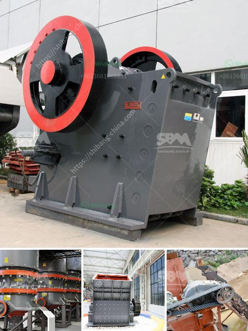

<h3>معدات محجر الحجر الجيري</h3>
تُعد محاجر الحجر الجيري من أهم المنشآت الصناعية التي تستخدم في العديد من الصناعات المختلفة. وتكمن أهمية هذه المعدات في قدرتها على استخراج الحجر الجيري بكفاءة وسرعة، وتجهيزه للمنتج النهائي حسب الاحتياجات المطلوبة.

المعدات التي يتضمنها محجر الحجر الجيري تتنوع وتشمل مجموعة من الآلات المتخصصة. من أبرز هذه المعدات:

1. الكسارات: تعتبر الكسارات جزءًا أساسيًا في محجر الحجر الجيري، حيث تقوم بتحطيم الصخور الكبيرة إلى قطع أصغر يمكن تناولها من قِبل المعدات الأخرى. تتضمن الكسارات الأنواع المختلفة مثل الفكية والتصادمية والمخروطية، حسب استخدامها وقدرتها على التعامل مع الحجارة ذات الأحجام المختلفة.

2. الحفارات: تستخدم الحفارات في استخراج الحجر الجيري من المحجر. تتوفر حفارات بمختلف الأحجام والقدرات لتناسب احتياجات المحجر وحجم الأحجار المستخرجة. تُستخدم الحفارات بشكل رئيسي لنقل الحجارة من المحجر إلى كسارة الحجر.

3. السيور الناقلة: تستخدم لنقل الحجارة المكسورة من الكسارة إلى المرحلة التالية في عملية التصنيع أو التعبئة والتغليف. تتوفر السيور الناقلة بأحجام وأطوال مختلفة لتناسب احتياجات المحجر.

4. المصانع والغرابيل: تستخدم لفرز وغربلة الحجارة المكسورة للحصول على الحجم المناسب للاستخدام المطلوب. يتم فصل الحجارة المختلفة حسب حجمها، حيث يتم استخدام الحصى الأكبر في البناء والحجم الأصغر للإسمنت أو الأسفلت.

5. معدات النقل: تشمل شاحنات النقل الثقيلة والعربات الأخرى التي تُستخدم لنقل الحجر الجيري بعد استخراجه من المحجر إلى المرحلة التالية، سواء كانت مصانع التصنيع أو موقع التخزين.

بحكم أهمية محاجر الحجر الجيري في العديد من الصناعات، فإن توفر المعدات اللازمة للعملية يُعتبر أمرًا حاسمًا لنجاح وفاعلية المحجر. وعلى الرغم من أن الأنواع والأحجام المستخدمة من المعدات قد تختلف حسب الاحتياجات والموارد المتاحة، إلا أن وجود معدات عالية الجودة والأداء يعزز إنتاجية المحجر ويساهم في تحسين عملية استخراج الحجر الجيري.

باختصار، تعد معدات محجر الحجر الجيري أدوات حاسمة لاستخراج وتجهيز الحجر الجيري بكفاءة وجودة عالية. تتضمن هذه المعدات الكسارات والحفارات والسيور الناقلة والغرابيل ومعدات النقل، كلها تعمل سويًا لضمان تدفق سلس وفعال لإنتاج الحجر الجيري وتلبية احتياجات العملاء.
<h3>Contact us</h3><ul><li><strong>Whatsapp:&nbsp;<a href="https://wa.me/8613661969651">+8613661969651</a></strong></li><li><a href="https://swt.shibang-china.com/?git&amp;zhl&amp;معدات محجر الحجر الجيري"><strong>Online Service(chat now)</strong></a></li></ul><h3>Related</h3><ul><li><a href='تكلفة آلة سحق الحجر كسارة الحجر.md'>تكلفة آلة سحق الحجر كسارة الحجر</a></li><li><a href='إغلاق محطة الكسارة.md'>إغلاق محطة الكسارة</a></li><li><a href='سعر مصنع كسارة الحجر بسعة 200 طن في الساعة.md'>سعر مصنع كسارة الحجر بسعة 200 طن في الساعة</a></li><li><a href='مصنع طحن الذهب في زيمبابوي.md'>مصنع طحن الذهب في زيمبابوي</a></li><li><a href='آلات سحق الفحم في جنوب أفريقيا.md'>آلات سحق الفحم في جنوب أفريقيا</a></li></ul>