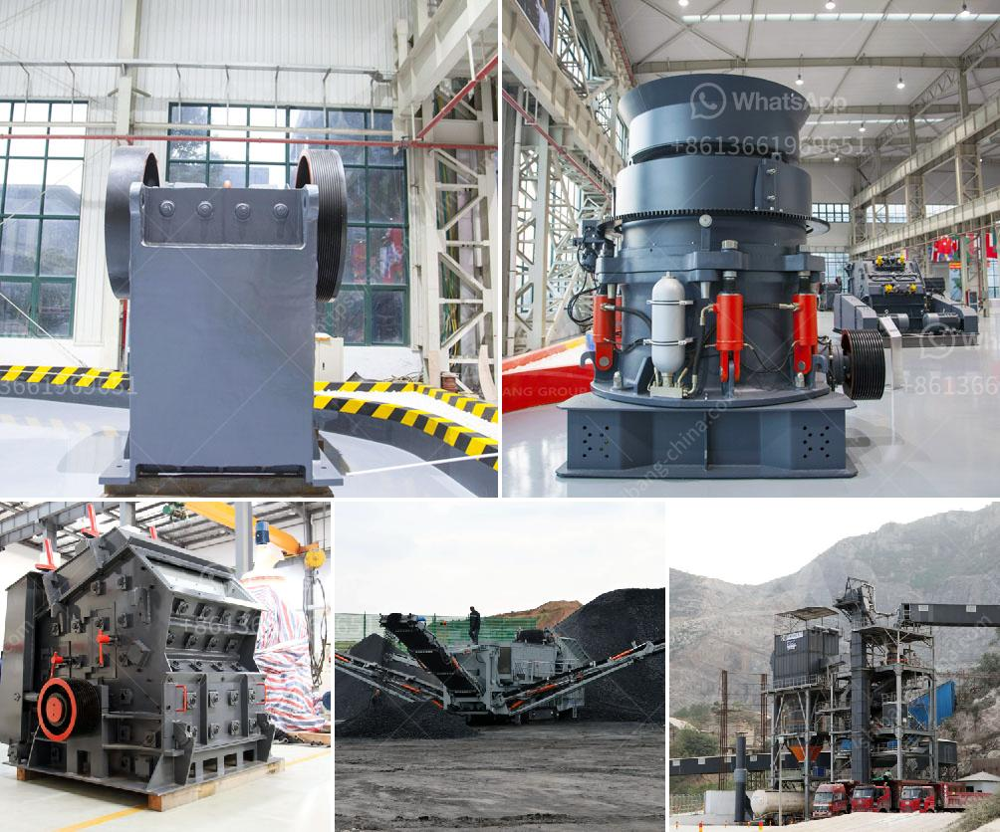

<h3>معدات مستخدمة في تعدين الفحم</h3>
تعتبر صناعة تعدين الفحم من الصناعات الهامة في العالم، حيث يتم استخراج الفحم الذي يستخدم في توليد الطاقة وفي صناعات أخرى. يتطلب تعدين الفحم استخدام معدات متطورة لتسهيل عملية استخراجه وتجهيزه للاستخدام النهائي.

من بين المعدات الهامة المستخدمة في تعدين الفحم هي الحفارات الكبيرة. تعتبر الحفارات أداة رئيسية في استخراج الفحم، حيث تتميز بقدرتها على حفر الأرض واستخراج الفحم وتحميله في الآليات الأخرى. تتوفر الحفارات بعدة أحجام وأنواع، بحيث يمكن اختيار الحفارة المناسبة حسب حجم الفحم المستهدف استخراجه وطبيعة المنطقة التي يتم فيها التنقيب.

أيضًا، يستخدم في تعدين الفحم الآليات الثقيلة مثل الجرافات والشاحنات الضخمة. تتمثل مهمة الجرافات في نقل الفحم المستخرج إلى المناطق المخصصة لتجهيزه، حيث يتم تفريغها في الشاحنات الضخمة لنقلها إلى المواقع النهائية. تعمل الجرافات والشاحنات بهياكلها القوية وأحجامها الكبيرة على تسهيل عملية نقل الفحم بكفاءة عالية.

وبشكل متكامل، يستخدم أيضًا معدات الكسر والطحن لتجهيز الفحم المستخرج. تهدف هذه المعدات إلى تكسير الفحم الخام إلى مجموعات أصغر وتكسيره إلى حجم مناسب للتجهيز النهائي، وذلك لاستخلاص قيمته الحرارية وتحضيره للاستخدام. تتكون هذه المعدات من كسارات الفك والكسارات اللفية والطواحين لتحقيق أعلى كفاءة ممكنة في عملية الطحن والتجهيز.

بصورة عامة، تعد معدات التعدين في صناعة الفحم متعددة ومتنوعة وتتطلب تقنيات حديثة لتحقيق أعلى كفاءة ممكنة في الاستخراج والتجهيز. يتم تصميم وتطوير هذه المعدات بشكل مستمر لتلبية متطلبات السوق وتحسين عمليات الاستخراج والتجهيز من حيث الكفاءة والأمان.
<h3>Contact us</h3><ul><li><strong>Whatsapp:&nbsp;<a href="https://wa.me/8613661969651">+8613661969651</a></strong></li><li><a href="https://swt.shibang-china.com/?git&amp;zhl&amp;معدات مستخدمة في تعدين الفحم"><strong>Online Service(chat now)</strong></a></li></ul><h3>Related</h3><ul><li><a href='سعر مصنع كسارة الحجر بسعة 200 طن في الساعة.md'>سعر مصنع كسارة الحجر بسعة 200 طن في الساعة</a></li><li><a href='شركات تصنيع آلات الكسارة في باكستان.md'>شركات تصنيع آلات الكسارة في باكستان</a></li><li><a href='آلة طحن وتلميع الصخور.md'>آلة طحن وتلميع الصخور</a></li><li><a href='مطحنة الكرة لأكسيد الرصاص.md'>مطحنة الكرة لأكسيد الرصاص</a></li><li><a href='مصانع التكسير الكاملة في جيرميستون.md'>مصانع التكسير الكاملة في جيرميستون</a></li></ul>