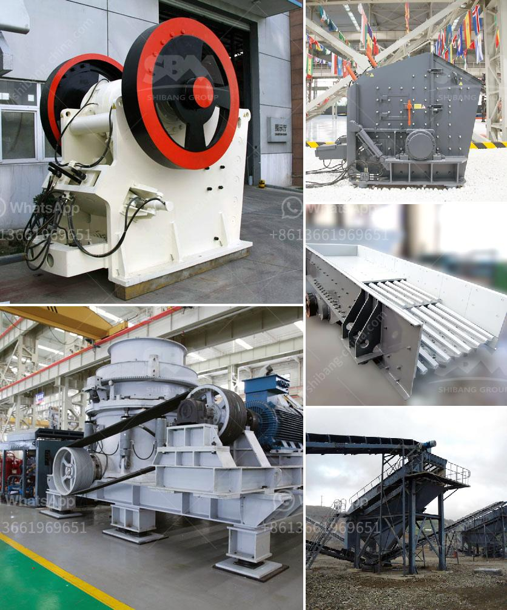

<h3>معدات مصنع الإسمنت اللازمة</h3>
تعد معدات مصنع الإسمنت أحد العناصر الرئيسية لإنتاج الإسمنت بشكل فعال وبأعلى جودة. يتطلب إنشاء مصنع إسمنت عمليات عديدة ومعقدة تكون بالاعتماد على تقنيات حديثة ومعدات متقدمة. هنا نستعرض بعض المعدات الأساسية التي تعتبر ضرورية في مصنع الإسمنت.

1- كسارات الحجر: تستخدم لسحق الحجر الجيري والصخور الأخرى إلى قطع صغيرة قبل دخولها إلى عملية التجهيز اللاحقة.

2- الطواحين: تتكون من طواحين الأسطوانة والكرة، وتستخدم لطحن الحجر الجيري والطفلة والكلنكر والمواد الخام الأخرى للحصول على مسحوق الإسمنت النهائي.

3- الأفران: تعتبر الأفران أهم المعدات في مصنع الإسمنت، حيث تقوم بتسخين المواد الخام بشكل مستمر بدرجات حرارة عالية تزيد عن 1450 درجة مئوية، وهذا يسمح بتفاعل المواد الخام لتكوين الكلنكر الأسمنتي.

4- المبردات: يتم استخدام المبردات لتبريد الكلنكر بعد فصله عن الفرن ولإعداده لعمليات التكسير والطحن النهائية.

5- مصنفات الهواء: تستخدم لفصل المساحيق المضافة في معالجة وطحن الكلنكر، وتضمن عملية تجانس المسحوق في المصنع.

6- وحدات التعبئة: تستخدم لتعبئة الإسمنت في كيسات أو أكياس جاهزة للشحن والتوزيع. تتراوح وحدات التعبئة في الحجم والسعة بناءً على احتياجات السوق وتوجيهات الشركة.

7- المعدات الأخرى: بالإضافة إلى المعدات الأساسية المذكورة أعلاه، تتضمن مصانع الإسمنت أيضًا المصاعد، وأنظمة الناقلات، ومخازن التخزين، وأنظمة الرفع والتغذية، والآلات المستخدمة في مراقبة الجودة والتحليل المخبري.

باختصار، تعد معدات مصنع الإسمنت اللازمة لإنتاج الإسمنت عملية معقدة تتطلب التكنولوجيا الحديثة والمعدات المتطورة. يتم استخدام مجموعة متنوعة من المعدات من مرحلة تكسير الحجر الجيري إلى مرحلة طحن الكلنكر وتعبئته ونقله. وبهذه المعدات الحديثة، يمكن تحقيق إنتاج إسمنت عالي الجودة وبأقصى كفاءة وفعالية.
<h3>Contact us</h3><ul><li><strong>Whatsapp:&nbsp;<a href="https://wa.me/8613661969651">+8613661969651</a></strong></li><li><a href="https://swt.shibang-china.com/?git&amp;zhl&amp;معدات مصنع الإسمنت اللازمة"><strong>Online Service(chat now)</strong></a></li></ul><h3>Related</h3><ul><li><a href='تكلفة مصنع لوحات الجبس في الهند.md'>تكلفة مصنع لوحات الجبس في الهند</a></li><li><a href='طاحونة كرات لطحن الحجر الجيري.md'>طاحونة كرات لطحن الحجر الجيري</a></li><li><a href='مصنع سحق وطحن.md'>مصنع سحق وطحن</a></li><li><a href='مطحنة مسحوق عالي الضغط في الهند.md'>مطحنة مسحوق عالي الضغط في الهند</a></li><li><a href='قائمة موردي الحجر الجيري.md'>قائمة موردي الحجر الجيري</a></li></ul>