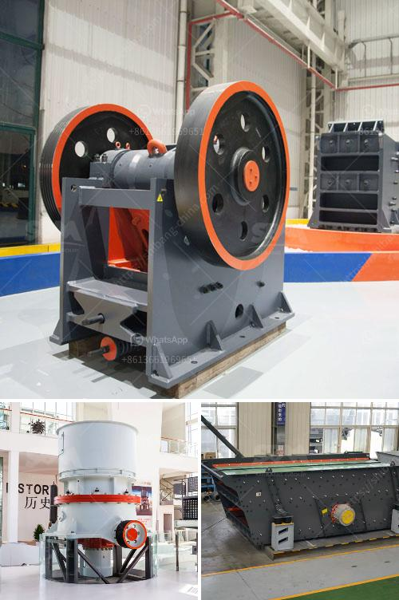

<h3>معدات مصنع الكسارة</h3>
تعد مصانع الكسارات أحد أهم المرافق الصناعية المستخدمة في صناعات التعدين والبناء. وتهدف هذه المصانع إلى سحق الصخور والحجارة إلى أحجام صغيرة تسهل عمليات البناء والإنتاج. وتعمل مصانع الكسارات بشكل رئيسي عن طريق تحويل هذه الصخور والحجارة إلى مختلف الحصص والمنتجات النهائية التي يتم استخدامها في مجموعة واسعة من التطبيقات.

تحتاج مصانع الكسارات إلى معدات متطورة وفعالة لتحقيق أقصى قدر من الإنتاجية والكفاءة. تتضمن هذه المعدات مجموعة من الأجهزة المتخصصة التي تعمل على سحق الصخور والحجارة بطرق مطورة. من بين المعدات الأساسية لمصانع الكسارات:

1. كسارة الفك: تستخدم لسحق الصخور والحجارة الكبيرة إلى أحجام أصغر. تحتوي على فكين متحركين وثابتين يعملان على ضغط المادة وتكسيرها.

2. كسارة المخروط: تستخدم لسحق الصخور إلى حصص أصغر وأكثر دقة. تحتوي على منحدر مائل داخل الكسارة يسمح بتكرار عملية السحق لتحقيق أعلى معدل استخلاص للمادة.

3. الطاحوة العمودية: تستخدم لطحن الصخور وتحويلها إلى مسحوق ناعم. تتميز بطبقة طحن دوارة تعمل على ضغط المادة وسحقها.

4. الناقلات: تستخدم لنقل المادة المكسورة من مرحلة لأخرى داخل المصنع. تتوفر بمجموعة متنوعة من الأحجام والأشكال لتلبية احتياجات المصنع.

5. الشاشات: تستخدم لفصل الحجارة المكسورة إلى حجم صغير وتصنيفها حسب الحجم. تعمل الشاشات على فصل المواد المكسرة حسب الحجم وتحويلها إلى حصص مناسبة للاستخدام المستقبلي.

يجب أن تتميز جميع المعدات المذكورة بالدقة والكفاءة لضمان أقصى استفادة من العملية وتقليل تكلفة التشغيل. يجب أن يتم صيانة وتشغيل هذه المعدات بطريقة صحيحة وفقًا للمعايير الصناعية وتعليمات المصنع لضمان عمر طويل وأداء موثوق به.

باختصار، تتطلب مصانع الكسارات مجموعة من المعدات المختصة والفعالة لضمان سحق الصخور والحجارة بطرق مطورة وتحويلها إلى أحجام مناسبة للإنتاج. يجب أن تتميز هذه المعدات بالكفاءة والدقة لتحقيق الأداء الممتاز والاستفادة القصوى للمصانع.
<h3>Contact us</h3><ul><li><strong>Whatsapp:&nbsp;<a href="https://wa.me/8613661969651">+8613661969651</a></strong></li><li><a href="https://swt.shibang-china.com/?git&amp;zhl&amp;معدات مصنع الكسارة"><strong>Online Service(chat now)</strong></a></li></ul><h3>Related</h3><ul><li><a href='سعر كسارة مخروطية هيدروليكية بتغذية 20 مم.md'>سعر كسارة مخروطية هيدروليكية بتغذية 20 مم</a></li><li><a href='مورد آلة كسارة النفايات الفلبين.md'>مورد آلة كسارة النفايات الفلبين</a></li><li><a href='كسارات ستاملر الأمريكية لكسر المغذية.md'>كسارات ستاملر الأمريكية لكسر المغذية</a></li><li><a href='كسارة الفك 150 250 للبيع.md'>كسارة الفك 150 250 للبيع</a></li><li><a href='كسارة مخروطية الصين.md'>كسارة مخروطية الصين</a></li></ul>