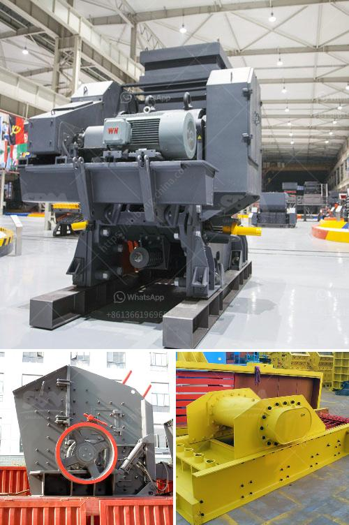

<h3>معدات مصنع حجر الرمل</h3>
مصنع حجر الرمل هو المكان الذي يتم فيه تحويل الصخور الكبيرة إلى حصى صغيرة ورمل. يعد حجر الرمل من المواد الأساسية في العديد من الصناعات مثل صناعة البناء والطرق والسكك الحديدية والزجاج وصناعة السيراميك والإسمنت.

تتكون معدات مصنع حجر الرمل من عدة أجزاء رئيسية. الجزء الأول هو المغذي الاهتزازي الذي يعمل على تغذية الصخور الكبيرة إلى الكسارة الفكية بشكل متساوٍ ومنتظم. بعد ذلك ، تُستخدَم الكسارة الفكية لسحق الصخور الكبيرة إلى قطع صغيرة من الحجم المطلوب. يتم استخدام الكسارات الفكية بشكل رئيسي في عمليات التكسير الأولية.

بعد عملية التكسير الأولية ، يتم تحويل الصخور المسحوقة في الكسارة الفكية إلى الكسارة المخروطية. يستخدم الكسارة المخروطية لسحق الصخور إلى أحجام أصغر وأكثر انتظامًا. من ثم ، يتم إرسال الحجر المسحوق إلى الكسارة المخروطية المتنقلة لإجراء عملية سحق نهائية واستكمال عملية إنتاج الحصى والرمل.

بعد عملية الكسر ، يتم تجفيف الحصى والرمل بواسطة الجفافة الاهتزازية لإزالة الرطوبة منها. بعد ذلك ، يُنقل الحصى والرمل إلى آلة غسل الرمل لغسل الأوساخ والشوائب المعلقة وإزالة الغبار الزائد عنها. يُعد غسل الرمل عملية حاسمة للحصول على رمل نظيف وجيد الجودة.

لا يكتمل مصنع حجر الرمل بدون آلة طحن الرمل. تعتبر آلة طحن الرمل ذات أهمية كبيرة في إنتاج الأحجار الصغيرة والرمل الأنعم والأنعم. وظيفة آلة طحن الرمل الرئيسية هي طحن الحجم الكبير من الحصى والرمل إلى جزيئات أصغر للحصول على حبيبات رمل دقيقة تستخدم في العديد من التطبيقات.

بالإضافة إلى ذلك ، يتم استخدام آلات الفرز لفصل الحجر المكسر والرمل حسب حجم الحبيبات. يسمح الفرز بالحصول على منتجات نهائية بحجم دقيق ومناسب للاستخدام في الصناعات المختلفة.

في الختام ، يلعب مصنع حجر الرمل دورًا حاسمًا في توفير مواد البناء والرمل الأساسية التي تلبي احتياجات الصناعات المختلفة. يستخدم في إعداد مواد البناء والطرق والزجاج والسيراميك والإسمنت. يعد تكوين معدات مصنع حجر الرمل من الكسارات والمطاحن وآلات الفرز ضروريًا للحصول على منتجات نهائية عالية الجودة وفعالة للغاية.
<h3>Contact us</h3><ul><li><strong>Whatsapp:&nbsp;<a href="https://wa.me/8613661969651">+8613661969651</a></strong></li><li><a href="https://swt.shibang-china.com/?git&amp;zhl&amp;معدات مصنع حجر الرمل"><strong>Online Service(chat now)</strong></a></li></ul><h3>Related</h3><ul><li><a href='مطحنة الكرة الرطبة والجافة.md'>مطحنة الكرة الرطبة والجافة</a></li><li><a href='سعر آلة تصنيع الرمل في تاميل نادو.md'>سعر آلة تصنيع الرمل في تاميل نادو</a></li><li><a href='عملية سحق التعدين لخام الحديد.md'>عملية سحق التعدين لخام الحديد</a></li><li><a href='كسارات مزدوجة التبديل.md'>كسارات مزدوجة التبديل</a></li><li><a href='قائمة الأسعار في زيمبابوي لمطاحن الكرة.md'>قائمة الأسعار في زيمبابوي لمطاحن الكرة</a></li></ul>