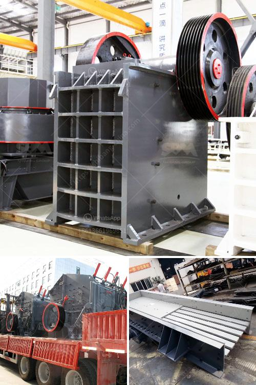

<h3>معدات مطحنة الكرة</h3>
تعتبر مطحنة الكرة (أو طاحونة الكرة) واحدة من أهم المعدات المستخدمة في صناعة الطحن. تستخدم هذه المعدة عادة في طحن المواد الخام بشكل نهائي أو تحويل المساحيق الجافة إلى معجون. تعمل المطحنة عن طريق تحطيم المواد الكبيرة إلى قطع أصغر بواسطة الكرات المعدنية الموجودة داخل الأسطوانة الدوارة.

تتألف مطحنة الكرة من عدة أجزاء أساسية. الجزء الأساسي هو الأسطوانة الدوارة المثبتة أفقياً على محورها، وهي مصنوعة من مواد عالية الجودة مثل الفولاذ. يتم تحميل المواد الخام في الأسطوانة من الجانب الواحد، ويتم إضافة الكرات المعدنية ضمن الأسطوانة. عند تشغيل المطحنة، يتم تدوير الأسطوانة على محورها باستخدام محرك كهربائي، مما يسبب تأثير الطحن.

عملية الطحن تحدث عن طريق تحطيم المواد الخام بفعل سقوط الكرات المعدنية. تنتج عملية السحق قوة احتكاك تسبب تآكل الجسيمات الكبيرة وتحويلها إلى حجم أصغر. كلما زادت سرعة دوران الأسطوانة وحجم الكرات المعدنية، زادت سرعة الطحن وكفاءتها. يتم ضبط سرعة الطحن وحجم الكرات المعدنية ووقت الطحن وفقًا لطبيعة المواد الخام ونتيجة الطحن المطلوبة.

إن مطحنة الكرة لها عدة مميزات. أولاً وقبل كل شيء، تعتبر المطاحن الكروية فعالة من حيث التكلفة. بالمقارنة مع طواحين الأسطوانة الأخرى، فإنها تتطلب تكلفة أقل للصيانة والتشغيل. ثانيًا، فهي تُستخدم لطحن مجموعة واسعة من المواد الخام، بما في ذلك المعادن والمواد الكيميائية والزجاج والسيراميك وغيرها. ثالثًا، فإنها تتطلب مساحة صغيرة ويمكن نقلها بسهولة، مما يسهل استخدامها في المصانع المختلفة.

بشكل عام، تعد مطحنة الكرة معدة ضرورية في عملية الطحن. تستخدم في العديد من الصناعات مثل صناعة الأسمنت والزجاج والسيراميك وصناعة الألومنيوم والمعادن. تسهم في تحويل المواد الخام إلى منتجات نهائية ذات جودة عالية. كما أنها تساعد على تقليل تكاليف الإنتاج وزيادة الإنتاجية. بالإضافة إلى ذلك، تساعد مطاحن الكرة في إعادة استخدام المواد المستخدمة وتقليل التلوث البيئي. في النهاية، يمكن القول إن مطاحن الكرة هي معدات ضرورية في صناعة الطحن وتلعب دورًا فعالًا في تحسين الأداء العام لعمليات الإنتاج.
<h3>Contact us</h3><ul><li><strong>Whatsapp:&nbsp;<a href="https://wa.me/8613661969651">+8613661969651</a></strong></li><li><a href="https://swt.shibang-china.com/?git&amp;zhl&amp;معدات مطحنة الكرة"><strong>Online Service(chat now)</strong></a></li></ul><h3>Related</h3><ul><li><a href='مورد معدات فصل الوسط الكثيف.md'>مورد معدات فصل الوسط الكثيف</a></li><li><a href='بيع كسارة حجر في ماهاراشترا.md'>بيع كسارة حجر في ماهاراشترا</a></li><li><a href='مطحنة طحن الكرةستخدم لطحن الكرات.md'>مطحنة طحن الكرةستخدم لطحن الكرات</a></li><li><a href='طحن خام بحجم يمر عبر الشبكة 200.md'>طحن خام بحجم يمر عبر الشبكة 200</a></li><li><a href='كسارة الحجر الصخري في الفلبين.md'>كسارة الحجر الصخري في الفلبين</a></li></ul>