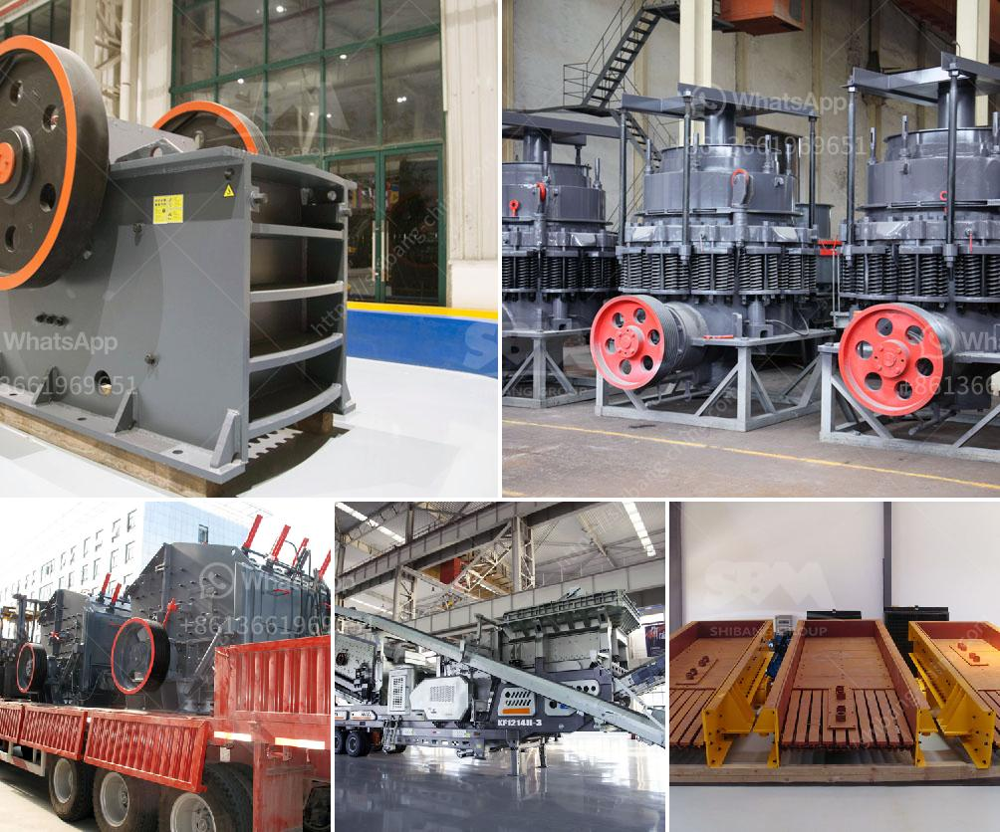

<h3>معدات معالجة الجبس والكالسينيشن</h3>
تُعَدُّ معدات معالجة الجبس والكالسينيشن من الأدوات الحديثة التي تستخدم في صناعات البناء والغذاء والصناعات الكيماوية. ويشمل ذلك منتجات مثل أفران الكالسينيشن والمطاحن والكسارات والمصافي، والتي تُستخدم لصناعة مسحوق الجبس والكالسينيشن. وتعتبر هذه المعدات ضرورية لاستخلاص الجبس من الصخور ومعالجته وتحويله إلى منتجات نهائية قابلة للاستخدام.

تعتمد تقنية معالجة الجبس والكالسينيشن على عدة مراحل مختلفة. في المرحلة الأولى، يتم استخراج الجبس من مناجم الصخور ونقله إلى ورشة العمل المعنية بمعالجته. في هذه الورشة، يتم طحن الجبس إلى حجم ناعم ليتمكن من الذوبان والتفاعل بسهولة في الماء. يتم ذلك عن طريق استخدام المطاحن والكسارات، حيث تقوم تلك المعدات بنقل الجبس إلى مستوى الحجم الذي يتم التعامل معه بسهولة.

ثم يتم تجفيف الجبس المُطحون في أفران الكالسينيشن المخصصة لهذا الغرض. تعتبر هذه الأفران ضرورية لإزالة الرطوبة والماء الزائد من الجبس، بحيث يتم تحويله إلى مركبات كيميائية مستقرة. وبعد تجفيف الجبس، يتم تحويله إلى منتجات نهائية مختلفة مثل الجص البنائي والألواح المضغوطة والعوازل الحرارية.

في صناعة الكالسينيشن، يتم استخدام المعدات المتخصصة لتحويل الحجر الجيري الطبيعي إلى الجير غير المتكلس. تتكون هذه العملية من عدة خطوات، بما في ذلك تعريض الحجر الجيري لدرجة حرارة عالية في أفران الكالسينيشن لإزالة ثاني أكسيد الكربون، مما ينتج عنه تحويل الحجر الجيري إلى الجير النقي غير المتكلس. يتم استخدام المصافي والمعادين وأفران الكالسينيشن في هذه العملية لتجميع وتكرير المنتج النهائي، والذي يُستخدم في العديد من التطبيقات، بما في ذلك الأسمدة ومنتجات البناء والصناعات الكيماوية.

تحظى معدات معالجة الجبس والكالسينيشن بشعبية كبيرة في صناعات البناء والصناعات الكيماوية بسبب ميزاتها الرئيسية. فهي تعمل بكفاءة عالية وتقدم نتائج عالية الجودة. بالإضافة إلى ذلك، فإنها تقلل من تكاليف الإنتاج وتعزز عمليات التشغيل الآمنة والفعالة.

باختصار، تلعب معدات معالجة الجبس والكالسينيشن دورًا حَيويًا في تحويل المواد الخام إلى منتجات نهائية قابلة للاستخدام. تعتبر هذه المعدات من الأدوات الضرورية في صناعات البناء والصناعات الكيماوية، حيث تساهم في دعم التطور والتقدم في هذه الصناعات وتلبية احتياجات السوق.
<h3>Contact us</h3><ul><li><strong>Whatsapp:&nbsp;<a href="https://wa.me/8613661969651">+8613661969651</a></strong></li><li><a href="https://swt.shibang-china.com/?git&amp;zhl&amp;معدات معالجة الجبس والكالسينيشن"><strong>Online Service(chat now)</strong></a></li></ul><h3>Related</h3><ul><li><a href='كسارة حجر في إندونيسيا.md'>كسارة حجر في إندونيسيا</a></li><li><a href='سعر أحزمة الناقلات.md'>سعر أحزمة الناقلات</a></li><li><a href='كثافة أحزمة الناقلات للتعدين.md'>كثافة أحزمة الناقلات للتعدين</a></li><li><a href='معلمات كسارة الهامر المقدمة بالتفصيل.md'>معلمات كسارة الهامر المقدمة بالتفصيل</a></li><li><a href='كسارة فك للبيع في الفيليبين.md'>كسارة فك للبيع في الفيليبين</a></li></ul>