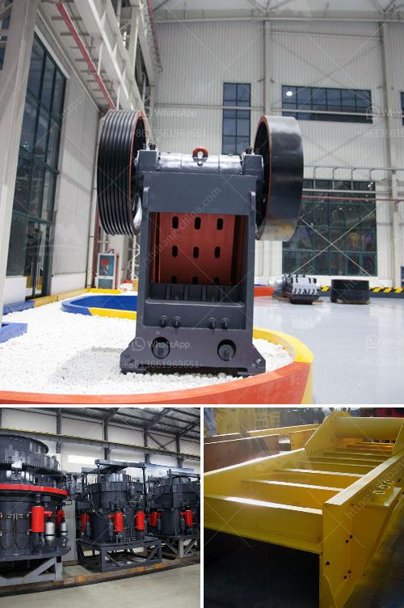

<h3>معدات معالجة الحجر الجيري في جنوب أفريقيا</h3>
تعد معدات معالجة الحجر الجيري في جنوب أفريقيا أحد القطاعات الحيوية لاقتصاد البلاد. يعتبر الحجر الجيري من الموارد الطبيعية الهامة في جنوب أفريقيا، حيث يتم استخدامه في العديد من الصناعات المختلفة بما في ذلك صناعة الإسمنت والحديد والصلب، والزجاج، والسيراميك.

تتوفر في جنوب أفريقيا مجموعة واسعة من المعدات المستخدمة في معالجة الحجر الجيري، وتشمل محطات التكسير والطحن ومعدات الفصل والتجفيف وأجهزة الغربلة. تعتمد اختيار المعدات على حجم وشكل الحجارة المستخدمة والمتطلبات التقنية المحددة للصناعة التي تستخدمها.

تشتهر بعض الشركات في جنوب أفريقيا بصناعة المعدات المتطورة لمعالجة الحجر الجيري. وتعمل هذه الشركات على تقديم حلول مخصصة للعملاء، حيث يتم تصميم المعدات وتصنيعها وتكييفها وفقًا لاحتياجات كل عميل.

بالإضافة إلى ذلك، يتم توفير خدمات ما بعد البيع مثل التثبيت والتدريب والصيانة لضمان أداء مستدام وفعال للمعدات. وتركز هذه الشركات على استخدام التكنولوجيا المتقدمة والابتكار والجودة لتحقيق رضا العملاء وتلبية احتياجاتهم.

تُعد جنوب أفريقيا واحدة من أكبر منتجي الحجر الجيري في العالم، حيث تأتي معظم إنتاج الحجر الجيري من مناجم في المناطق الجنوبية والشمالية للبلاد. وهذا يعزز الصناعة المحلية ويدعم قطاع الاقتصاد الوطني.

في الختام، يُعتبر قطاع معدات معالجة الحجر الجيري في جنوب أفريقيا مهمًا بسبب الاعتماد الكبير على الحجر الجيري في الصناعات المختلفة. يتم توفير مجموعة واسعة من المعدات المتقدمة والحلول المخصصة لتلبية احتياجات العملاء، وهذا يدعم الاقتصاد المحلي ويعزز التنمية الصناعية في البلاد.
<h3>Contact us</h3><ul><li><strong>Whatsapp:&nbsp;<a href="https://wa.me/8613661969651">+8613661969651</a></strong></li><li><a href="https://swt.shibang-china.com/?git&amp;zhl&amp;معدات معالجة الحجر الجيري في جنوب أفريقيا"><strong>Online Service(chat now)</strong></a></li></ul><h3>Related</h3><ul><li><a href='آلة كسارة لصنع الرمل من الحجر.md'>آلة كسارة لصنع الرمل من الحجر</a></li><li><a href='استخدام مطحنة ريموند.md'>استخدام مطحنة ريموند</a></li><li><a href='تسعير حزام الناقل في ماليزيا.md'>تسعير حزام الناقل في ماليزيا</a></li><li><a href='جزء من مطحنة الأسطوانة.md'>جزء من مطحنة الأسطوانة</a></li><li><a href='سعة مطحنة الكرة للطين.md'>سعة مطحنة الكرة للطين</a></li></ul>