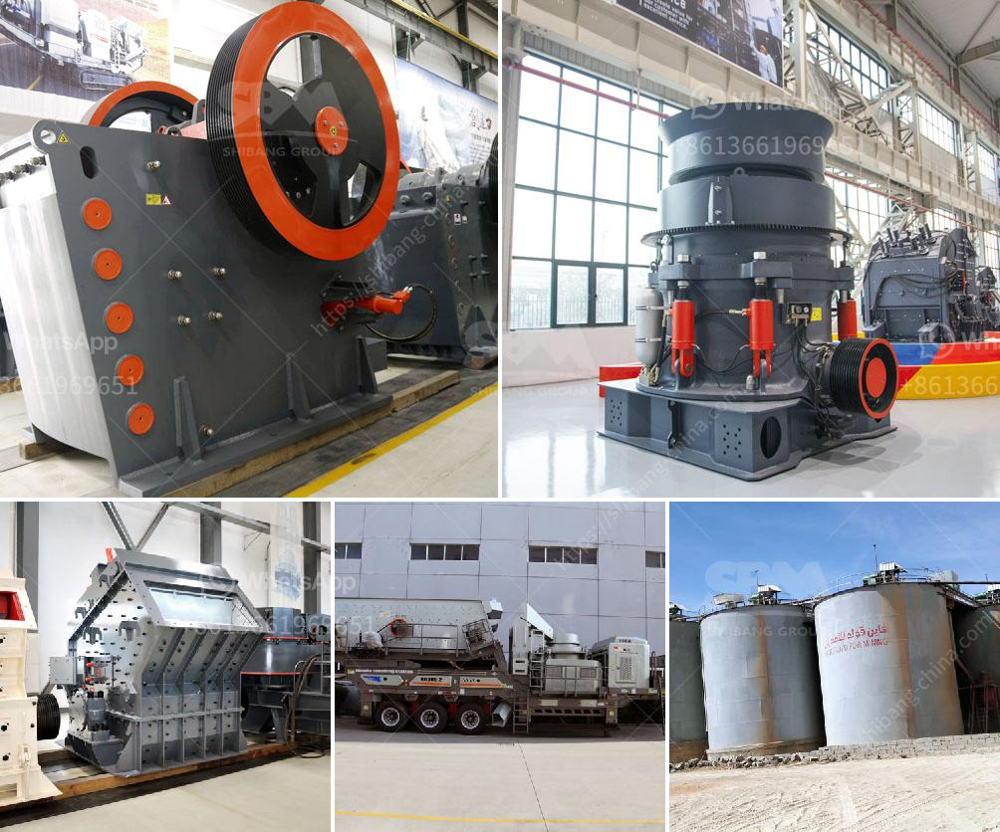

<h3>معدات معالجة الحجر الكاملة محطم 100 طن</h3>
تعد محطات معالجة الحجر الكاملة من أهم المعدات في صناعة التعدين والبناء. تستخدم هذه المعدات لسحق الحجر الصخري إلى أحجام أصغر، وفصل الشوائب عنه للحصول على منتج نهائي ذو جودة عالية. من أهم الأدوات في محطات معالجة الحجر الكاملة هو المحطم.

يعمل المحطم على سحق الحجر الكبير إلى أجزاء صغيرة. تتوفر عدة أنواع من المحاطم بقدرات وأحجام مختلفة. المحاطم التي تستخدم في معالجة الحجر الكاملة عادةً تكون من نوع الفك المزدوج. يتكون المحطم من الفكين العلوي والسفلي، حيث يتم فتح الفكين وإغلاقهما لسحق الحجر بينهما.

يتم استخدام المحطم الكامل عادةً في العديد من المراحل في عملية معالجة الحجر. في المرحلة الأولى، تستخدم المحاطم الكاملة لسحق الحجر الكبير إلى أحجام أصغر تسهل عملية المعالجة اللاحقة. في المرحلة التالية، يتم استخدام محطم الصخور لتقسيم الحجر الصغير إلى جزيئات أكثر صغراً وفصل الشوائب عنه عن طريق فرزه. يتم غالباً تشغيل المحاطم في سلاسل لضمان سحق الحجر بشكل مستمر وبفعالية.

تعتبر محطات معالجة الحجر الكاملة ضرورية في صناعة البناء والتعدين. إنها تسمح بسحق الحجر بكفاءة وفعالية، وإنتاج منتج نهائي بجودة عالية. تعمل هذه المعدات على تحسين إنتاجية العمل وتقليل التكاليف ووقت التشغيل. وبالتالي، فإن استخدام معدات معالجة الحجر الكاملة يسهم في تحسين كفاءة الإنتاج وفعالية عمليات التعدين والبناء.

باختصار، فإن محطات معالجة الحجر الكاملة المجهزة بمحاطم تعد أدوات أساسية في صناعة التعدين والبناء. تستخدم هذه المعدات لسحق الحجر وتقسيمه إلى جزيئات صغيرة، مما يسمح بإنتاج منتج نهائي بجودة عالية. باستخدام هذه المعدات، يمكن للشركات في صناعة التعدين والبناء تحسين الإنتاجية وتحقيق أقصى استفادة من موارد الحجر.
<h3>Contact us</h3><ul><li><strong>Whatsapp:&nbsp;<a href="https://wa.me/8613661969651">+8613661969651</a></strong></li><li><a href="https://swt.shibang-china.com/?git&amp;zhl&amp;معدات معالجة الحجر الكاملة محطم 100 طن"><strong>Online Service(chat now)</strong></a></li></ul><h3>Related</h3><ul><li><a href='حسابات في مطحنة الأسطوانة العمودية.md'>حسابات في مطحنة الأسطوانة العمودية</a></li><li><a href='عملية استخراج الحجر الجيري.md'>عملية استخراج الحجر الجيري</a></li><li><a href='كسارة الصخور كرات الحديد.md'>كسارة الصخور كرات الحديد</a></li><li><a href='كسارة مخروطية في المملكة العربية السعودية.md'>كسارة مخروطية في المملكة العربية السعودية</a></li><li><a href='قائمة معدات تعدين الذهب.md'>قائمة معدات تعدين الذهب</a></li></ul>