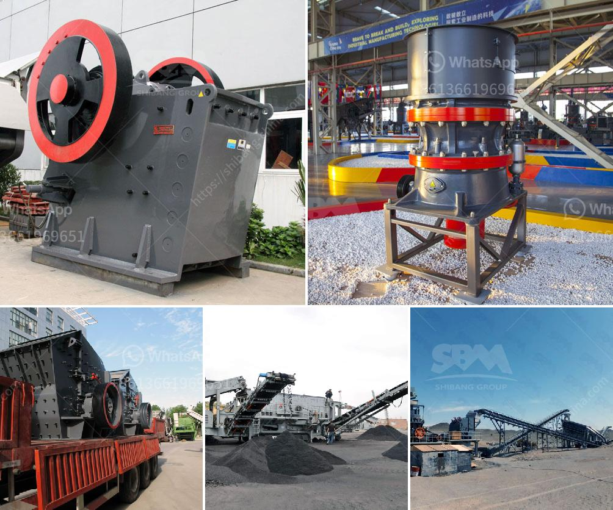

<h3>معدات معالجة الذهب في جنوب أفريقيا</h3>
تُعتبر جنوب أفريقيا من أبرز الدول الرائدة في مجال تعدين ومعالجة الذهب في العالم، حيث تتمتع بموارد ضخمة من الذهب التي جذبت العديد من شركات التعدين والمنقبين من جميع أنحاء العالم.

تعتمد معدات معالجة الذهب في جنوب أفريقيا على تقنيات حديثة ومتطورة لتحقيق أقصى استفادة من هذا المعدن الثمين. تتضمن هذه المعدات مجموعة متنوعة من الأدوات والآلات التي تستخدم في عمليات تكسير وطحن الصخور المحتوية على الذهب، واستخراج الذهب من الصخور المكسورة والتركيز على الذهب المستخرج.

تشمل المعدات المستخدمة في معالجة الذهب في جنوب أفريقيا مختلف الكسارات والمطاحن والغرابيل والفصل الجاذب، بالإضافة إلى المعدات الكيميائية والتقنيات الحيوية التي تُساهم في تنقية الذهب وفصله عن المعادن الأخرى والشوائب.

بالإضافة إلى ذلك، يتم استخدام تقنيات التعويم والترسيب المركز لتعزيز عملية فصل الذهب عن المواد الأخرى، ويستخدم السيانيد والزئبق في بعض العمليات للتخلص من المواد العالقة وزيادة نسبة الذهب المستخرج.

تُعد معدات معالجة الذهب في جنوب أفريقيا حديثة ومبتكرة، وهي تتطلب مؤهلين ومهندسين ذوي خبرة عالية لتنفيذ العمليات بشكل صحيح وفعال. يتم مراقبة جميع العمليات بدقة باستخدام أنظمة تحليل ومراقبة متقدمة، مما يتيح تحقيق أعلى مستوى من الأمان والكفاءة.

تعتبر صناعة معالجة الذهب في جنوب أفريقيا من المصادر الرئيسية للدخل الوطني وتساهم بشكل كبير في تحقيق التنمية الاقتصادية وتوفير فرص العمل للمواطنين. وتعمل الحكومة الجنوب أفريقية على تطبيق سياسات استثمارية وتشريعية تحفز تدفق رؤوس الأموال والتكنولوجيا الحديثة لدعم هذه الصناعة الحيوية وتحقيق الاستدامة البيئية.

وفي الختام، تعتبر معدات معالجة الذهب في جنوب أفريقيا من الأدوات الحديثة والمبتكرة التي تلعب دورًا رئيسيًا في استخراج وتنقية هذا المعدن النفيس. وتعكس هذه الصناعة ازدهار القطاع التعديني في البلاد وتساهم في تحقيق الرخاء الاقتصادي ورفع مستوى المعيشة للمواطنين.
<h3>Contact us</h3><ul><li><strong>Whatsapp:&nbsp;<a href="https://wa.me/8613661969651">+8613661969651</a></strong></li><li><a href="https://swt.shibang-china.com/?git&amp;zhl&amp;معدات معالجة الذهب في جنوب أفريقيا"><strong>Online Service(chat now)</strong></a></li></ul><h3>Related</h3><ul><li><a href='مطحنة صغيرة للمعادن.md'>مطحنة صغيرة للمعادن</a></li><li><a href='كيفية بدء منجم المحاجر.md'>كيفية بدء منجم المحاجر</a></li><li><a href='معدات مطحنة الكرة.md'>معدات مطحنة الكرة</a></li><li><a href='مصنعي آلات المحجر.md'>مصنعي آلات المحجر</a></li><li><a href='معدات كسارة الحجر للبيع.md'>معدات كسارة الحجر للبيع</a></li></ul>