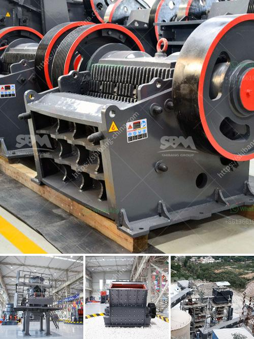

<h3>معدات معالجة الكروم لباكستان</h3>
تعتبر معدات معالجة الكروم من أهم الأدوات التي تستخدم في صناعة تصليح السيارات والأجهزة الميكانيكية الأخرى. توفر هذه المعدات إمكانية معالجة وتشكيل معدن الكروم بطرق مبتكرة وفعالة، مما يسهم في تحسين جودة المنتجات النهائية.

في باكستان، توجد العديد من الشركات والمصانع التي تقوم بتصنيع وتوريد معدات معالجة الكروم عالية الجودة. تستخدم هذه المعدات في محطات الخدمة وورش العمل المختلفة لتلبية احتياجات العملاء وتعزيز إمكانياتهم في مجال معالجة المعادن.

تشتمل معدات معالجة الكروم على عدة أدوات أساسية مثل آلات التلميع والحفر وآلات الكرومة الكهربائية وغيرها. يتم استخدام آلات التلميع لإعطاء القطع المعدنية اللمعان والاستدامة، بينما يستخدم الحفر لإنشاء ثقوب وشقوق دقيقة في المعدن. أما آلات الكرومة الكهربائية فتستخدم لتطبيق طبقة رقيقة من المعدن الكروم على الأسطح، وذلك لزيادة صلابة ومقاومة المعدن للتآكل.

باستخدام معدات معالجة الكروم، يمكن تحسين جودة ومتانة الأجزاء المعدنية، مما يؤدي إلى زيادة عمر الاستخدام وتحسين أداء المعدات النهائية. وبفضل التطور التكنولوجي المستمر، تم تطوير معدات معالجة الكروم بطرق أكثر دقة وكفاءة، مما يخفض التكاليف ويوفر الوقت والجهد.

وتعتبر باكستان واحدة من الدول الرائدة في صناعة معدات معالجة الكروم، حيث تنتج مجموعة واسعة من الأجهزة والمعدات المتقدمة التي تلبي متطلبات مختلف الصناعات. بالإضافة إلى ذلك، تقدم الشركات المحلية دعمًا فنيًا ومختبرات اختبار متقدمة للتأكد من جودة المنتجات والمعدات.

في الختام، يمكن القول إن معدات معالجة الكروم تلعب دورًا هامًا في تحسين جودة المعادن وتطوير صناعة التصليح والصناعة الميكانيكية في باكستان. تمكن هذه المعدات الشركات والمشغلين من تنفيذ العديد من الأعمال بكفاءة عالية، وتحقيق أداء ممتاز ومتانة للمنتجات المعدنية. إن التطور التكنولوجي المستمر في هذا المجال يعد دليلاً قويًا على قدرة المؤسسات الباكستانية على تلبية احتياجات الصناعة والعملاء في هذا القطاع المهم.
<h3>Contact us</h3><ul><li><strong>Whatsapp:&nbsp;<a href="https://wa.me/8613661969651">+8613661969651</a></strong></li><li><a href="https://swt.shibang-china.com/?git&amp;zhl&amp;معدات معالجة الكروم لباكستان"><strong>Online Service(chat now)</strong></a></li></ul><h3>Related</h3><ul><li><a href='موردين لمصانع سحق ld slag في الهند.md'>موردين لمصانع سحق ld slag في الهند</a></li><li><a href='مصنع معالجة الحجر الجيري.md'>مصنع معالجة الحجر الجيري</a></li><li><a href='ميزات كسارة الفك.md'>ميزات كسارة الفك</a></li><li><a href='عملية تلبيس خام المنغنيز.md'>عملية تلبيس خام المنغنيز</a></li><li><a href='مطحنة رايموند مستخدمة في إندونيسيا.md'>مطحنة رايموند مستخدمة في إندونيسيا</a></li></ul>