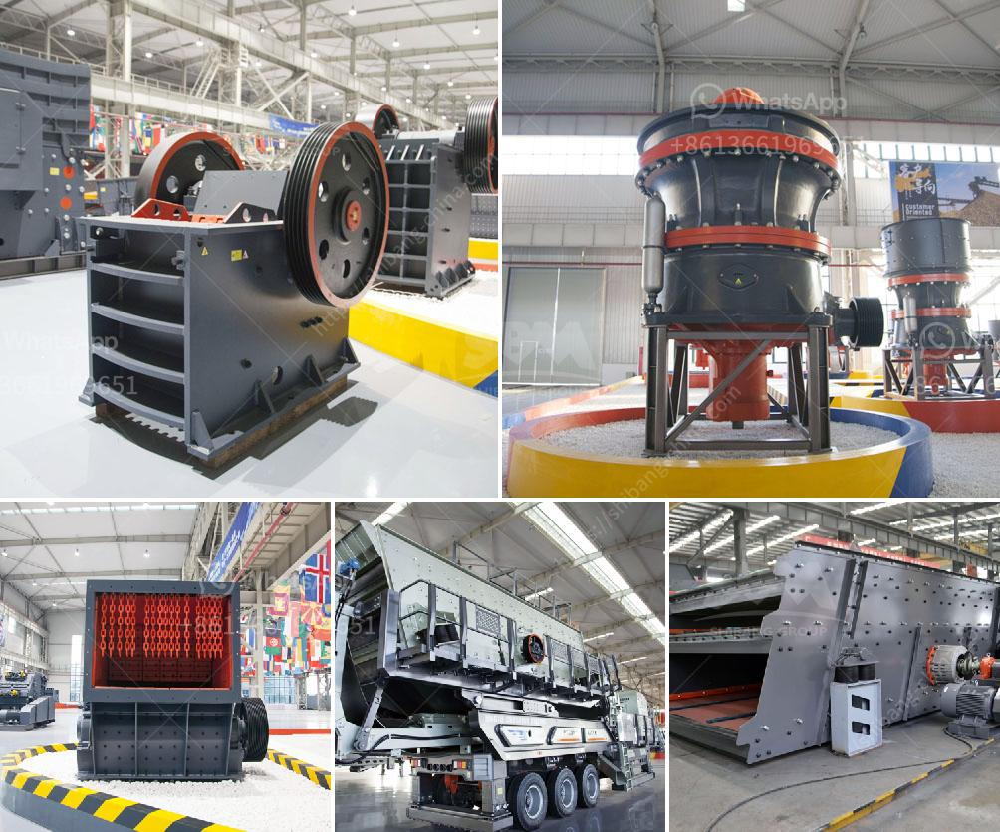

<h3>معدات معالجة خام الحديد</h3>
تُعتبر معدات معالجة خام الحديد من أهم العناصر في عمليات التعدين والإنتاج الصناعي. يتم الحصول على خام الحديد من المناجم ويتم إجراء سلسلة من العمليات لنقله من حالته الخام إلى حالة مفيدة وصالحة للاستخدام في صناعة الصلب.

تتضمن معدات معالجة خام الحديد مجموعة متنوعة من الآلات والأدوات المختلفة التي تستخدم في مراحل مختلفة للمعالجة. أحد العمليات الرئيسية في معالجة خام الحديد هو السحق والطحن، حيث يتم سحق الخام إلى قطع صغيرة باستخدام كسارات ومطاحن لتسهيل عملية فصل الحديد عن بقية المواد الغير مرغوب فيها.

تشمل معدات معالجة خام الحديد أيضًا عمليات الفصل والتركيز، حيث يتم استخدام الفصل المغناطيسي والفصل الكهروستاتيكي والعديد من الطرق الأخرى لفصل خام الحديد عن المواد الأخرى الملوثة. بعد ذلك، يتم تركيز الحديد باستخدام أجهزة الترشيح والتركيز المركز للحصول على تركيز عالٍ من الحديد في المنتج النهائي.

بالإضافة إلى ذلك، تتضمن معدات معالجة خام الحديد عملية الخلط والتكرير، حيث يتم مزج خام الحديد المعالج مع مواد أخرى مثل الحجر الجيري والفحم لإنتاج خليط مجمع. يتم تسخين هذا الخليط في أفران الصهر لإنتاج الحديد الخام الذي يُستخدم في صناعة الصلب.

وفي النهاية، تشمل معدات معالجة خام الحديد أيضاً عملية التعبئة والتغليف والنقل. يتم تعبئة وتغليف المنتج النهائي في حاويات مناسبة لحمايته من التآكل والتلف، ومن ثم يتم نقل المنتج النهائي إلى المستهلكين عن طريق الشاحنات أو السكك الحديدية أو السفن.

باختصار، تعتبر معدات معالجة خام الحديد حجر الزاوية في صناعة الصلب، حيث تقوم بتحويل الخام إلى منتج نهائي عالي الجودة وقابل للاستخدام في العديد من التطبيقات الصناعية. تطورت تلك المعدات بمرور الوقت لتصبح أكثر كفاءة وفعالية، مما يساهم في زيادة الإنتاجية وتحسين جودة المنتج النهائي.
<h3>Contact us</h3><ul><li><strong>Whatsapp:&nbsp;<a href="https://wa.me/8613661969651">+8613661969651</a></strong></li><li><a href="https://swt.shibang-china.com/?git&amp;zhl&amp;معدات معالجة خام الحديد"><strong>Online Service(chat now)</strong></a></li></ul><h3>Related</h3><ul><li><a href='مصانع تكسير الحجر في الهند.md'>مصانع تكسير الحجر في الهند</a></li><li><a href='مصنع كسارة مسحوق الرخام.md'>مصنع كسارة مسحوق الرخام</a></li><li><a href='قطع غيار لكسارات الحجر.md'>قطع غيار لكسارات الحجر</a></li><li><a href='آلة صنع الحجر الخرساني في جنوب أفريقيا.md'>آلة صنع الحجر الخرساني في جنوب أفريقيا</a></li><li><a href='أسعار مطاحن المطرقة في الرأس الشرقي.md'>أسعار مطاحن المطرقة في الرأس الشرقي</a></li></ul>