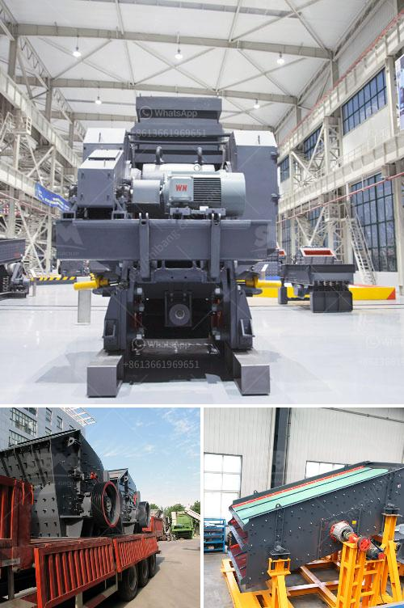

<h3>معدات معالجة خام الذهب المستخدمة للبيع</h3>
تُعتبر صناعة التعدين واحدة من أقدم الصناعات في التاريخ والتي لا تزال تواصل تطورها حتى يومنا هذا. ومن بين المعادن الثمينة التي يُستخرجها التعدين، يتمتع الذهب بمكانة فريدة لدى المستثمرين ومحبي البنوك المركزية، فهو يعتبر الملاذ الآمن في الأوقات الاقتصادية العصيبة. ولكن قبل أن يتم تحويل الذهب إلى مجوهرات أو قطع ذهبية أخرى، يتعين على المنقبين والشركات التعدينية استخراج الخام وتقديمه إلى شركات معالجة الذهب التي تستخدم مجموعة متنوعة من المعدات لتحويل الخام إلى ذهب نقي.

إحدى المعدات المهمة في معالجة خام الذهب هي الكسارة الفكية أو المطرقية، والتي تُستخدم لتكسير الخام إلى قطع صغيرة قابلة للمعالجة. بعد ذلك، يتم نقل الخام إلى المطحنة الكروية التي تستخدم لطحن الخام المتكسر بواسطة كرات معدنية. يُمكن تحقيق حجم جسيمات صغيرة بواسطة المطاحن الكروية، مما يزيد من كفاءة عملية استخراج الذهب بشكل عام.

بالإضافة إلى ذلك، هناك أيضًا المعدات المستخدمة لعملية الترشيح والتصنيف، حيث يتم انتقاء الذهب من الشوائب الأخرى التي قد يحتوي عليها الخام. تُستخدم آلات الترشيح المختلفة مثل التجاويف والهزازات والفصل الإلكترومغناطيسي لهذا الغرض. كل هذه العمليات تساعد في فصل الذهب عن المواد الأخرى المحمولة في الخام.

علاوة على ذلك، يتم استخدام المعدات الكيميائية في عملية فصل الذهب من الشوائب. يتم استخدام السيانيد والزئبق كوسائل فصل للتخلص من الشوائب والحصول على الذهب النقي.

في النهاية، يجب ذكر أن الأسعار المتوفرة لمعدات معالجة خام الذهب تتراوح بين 200 إلى 400 دولار، ولكن تختلف الأسعار بناءً على الحجم والقدرات المطلوبة للمعدات. وبصفة عامة، يُنصح المستثمرون الجدد في صناعة التعدين بالتشاور مع خبراء المجال ودراسة تفصيلية لجميع العوامل المتعلقة بعملية تعدين الذهب واستخراجه قبل اتخاذ قرار بشأن شراء معدات معالجة خام الذهب.

في النهاية، يُمكن القول بأن الإقبال المطرد على الذهب كاستثمار استثنائي يتطلب استخدام معدات متطورة وفعالة لمعالجة خام الذهب. تحظى صناعة معدات معالجة الذهب بإقبال كبير من قبل المنقبين وشركات التعدين بفضل الازدياد المستمر في طلب المعدن الثمين هذا.
<h3>Contact us</h3><ul><li><strong>Whatsapp:&nbsp;<a href="https://wa.me/8613661969651">+8613661969651</a></strong></li><li><a href="https://swt.shibang-china.com/?git&amp;zhl&amp;معدات معالجة خام الذهب المستخدمة للبيع"><strong>Online Service(chat now)</strong></a></li></ul><h3>Related</h3><ul><li><a href='آلة تكسير الحجر للبيع.md'>آلة تكسير الحجر للبيع</a></li><li><a href='كم من الأرض مطلوبة لكسارة الحجر.md'>كم من الأرض مطلوبة لكسارة الحجر</a></li><li><a href='سعر كسارة تأثير الصخور.md'>سعر كسارة تأثير الصخور</a></li><li><a href='مواصفات مطحنة الكرة.md'>مواصفات مطحنة الكرة</a></li><li><a href='سحق الخرسانة والحديد.md'>سحق الخرسانة والحديد</a></li></ul>