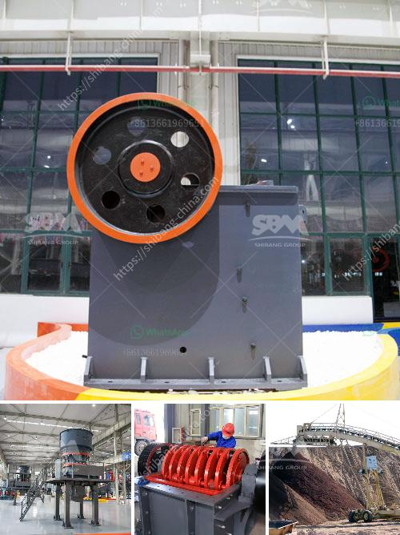

<h3>معدات معالجة مسحوق الجرافيت</h3>
يعد مسحوق الجرافيت من المواد الهامة في صناعات متنوعة، بما في ذلك صناعة اللوازم الإلكترونية والأدوات الميكانيكية والسيارات والبطاريات، وغيرها. لذا، فإن التطور في مجال تكنولوجيا معالجة مسحوق الجرافيت يلعب دورًا مهمًا في تحسين جودة المنتجات والتحكم في خصائصها.

تشمل معدات معالجة مسحوق الجرافيت العديد من الوحدات والتقنيات المختلفة، وسنستعرض بعضها في هذه المقالة.

1- آلة طحن الجرافيت: تستخدم هذه الآلة لطحن المسحوق الخام للحصول على حبيبات صغيرة وموحدة الحجم. تتكون الآلة من جسم رئيسي ونظام توجيه ونظام تحكم في السرعة، حيث يتم ضبط سرعة الجهاز لتحقيق النتائج المرجوة.

2- آلة سحق الجرافيت: تستخدم لتحويل الحبيبات إلى مسحوق ناعم. تتكون الآلة من غرفة سحق ومجموعة من السكاكين الدوارة، وتستخدم عادة مبدأ الضغط والقص لتقليل حجم الحبيبات.

3- آلة فصل الهواء: تستخدم لفصل المسحوق الجاف عن الجسيمات الأخرى الموجودة فيه. تتكون الآلة من منفاخ هواء ومرشح وسدادة تحتوي على ثقوب صغيرة تسمح بمرور الهواء وتحجز الجسيمات الأكبر.

4- آلة تجفيف الجرافيت: تستخدم لتخفيف الرطوبة الموجودة في المسحوق. تعمل هذه الآلة عن طريق تسخين المسحوق إلى درجة حرارة معينة، حيث يتبخر الماء المتبقي فيه ويتم التخلص منه عن طريق نظام مناورة.

5- آلة تعبئة الجرافيت: تستخدم لتغليف وتعبئة المسحوق المعالج داخل حاويات أو أكياس، وذلك للحفاظ على جودة المنتج وسهولة استخدامه وتخزينه.

تُستخدم هذه المعدات الحديثة في صناعة معالجة مسحوق الجرافيت لتحقيق كفاءة عالية وجودة ممتازة من المنتجات. تعمل هذه المعدات بشكل دقيق ومؤكد، وتوفر إنتاجًا سلسًا وفعالًا لمختلف التطبيقات. يعزز التطور المستمر في تكنولوجيا معالجة مسحوق الجرافيت الكفاءة والدقة والاستدامة في صناعة الجرافيت ويدعم تطور الصناعات التابعة له.

في الختام، فإن معدات معالجة مسحوق الجرافيت تلعب دورًا أساسيًا في تحقيق جودة وموثوقية المنتجات المتعلقة بالجرافيت. ومع مزيد من التطورات في هذا المجال، سنشهد تحسينًا مستمرًا في صناعة الجرافيت وتوسيع استخداماتها المستقبلية.
<h3>Contact us</h3><ul><li><strong>Whatsapp:&nbsp;<a href="https://wa.me/8613661969651">+8613661969651</a></strong></li><li><a href="https://swt.shibang-china.com/?git&amp;zhl&amp;معدات معالجة مسحوق الجرافيت"><strong>Online Service(chat now)</strong></a></li></ul><h3>Related</h3><ul><li><a href='شراء محطة غسيل الفحم في ألمانيا.md'>شراء محطة غسيل الفحم في ألمانيا</a></li><li><a href='مصنع المحجر في قوانغدونغ.md'>مصنع المحجر في قوانغدونغ</a></li><li><a href='كسارة باكستان كسارة الجرانيت.md'>كسارة باكستان كسارة الجرانيت</a></li><li><a href='سعر كسارة الحجر المحمولة في الفلبين.md'>سعر كسارة الحجر المحمولة في الفلبين</a></li><li><a href='معدات خط إنتاج كبريتات المغنيسيوم.md'>معدات خط إنتاج كبريتات المغنيسيوم</a></li></ul>