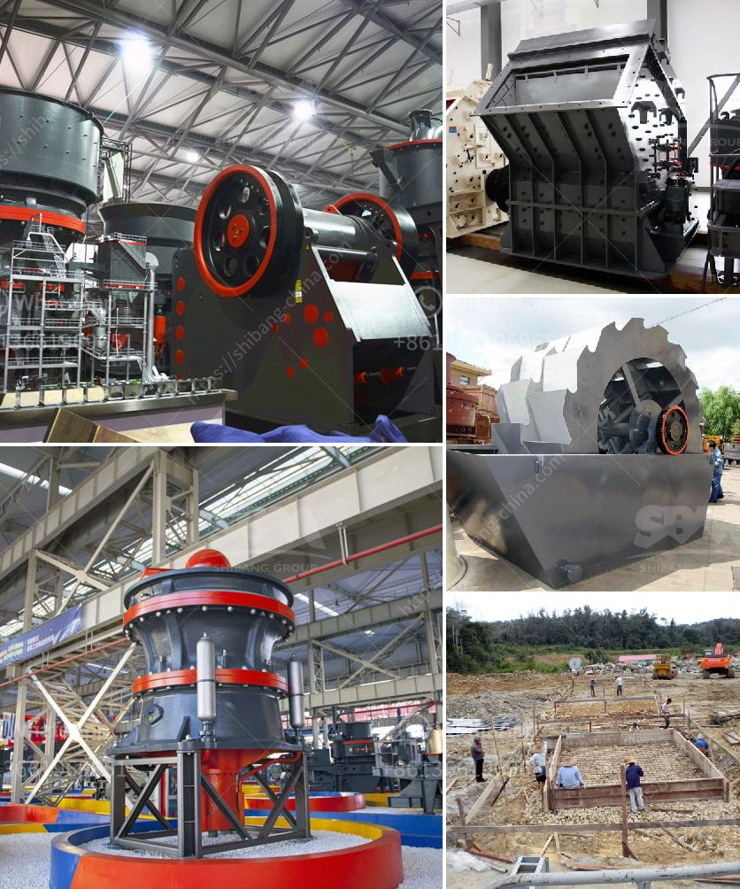

<h3>معدل كسارة الحجر في نيجيريا</h3>
كسارة الحجر هي واحدة من أهم المعدات المستخدمة في صناعة التعدين والبناء في نيجيريا. تُستخدم هذه الكسارات لكسر الصخور الكبيرة إلى قطع صغيرة أو مسحوق لاستخدامه في إنتاج الخرسانة والأسفلت والحصى والرمل وغيرها من مواد البناء.

تشتمل كسارات الحجر في نيجيريا على مجموعة واسعة من الأحجام والأنواع المختلفة، مثل الكسارات الفكية والكسارات الصدمية والكسارات المخروطية والكسارات الهيدروليكية. يتم تقديم هذه الكسارات عادةً بأحجام كبيرة ومصممة للتعامل مع الصخور الكبيرة وذات المقاومة العالية.

معدل إنتاج الكسارات في نيجيريا يختلف اعتمادًا على عدة عوامل، بما في ذلك حجم الجسم الصخري وصلابته والقدرة الإنتاجية للآلة نفسها. باستخدام كسارات الحجر المتوفرة في السوق النيجيرية، يمكن تحطيم الصخور الكبيرة بمعدلات إنتاج تتراوح عادة بين 200 إلى 400 طن في الساعة.

كلمة "معدل" في هذا السياق يشير إلى عدد الطن التي يمكن تحطيمها وإنتاجها خلال ساعة واحدة. ومعدل كسارات الحجر في نيجيريا يمكن أن يكون ضمن هذا النطاق الواسع بسبب الاختلافات في قدرة الآلات والفم العرضي للكسارة وسرعة الدوران والقدرة الكهربائية.

عند اختيار كسارة الحجر للاستخدام في نيجيريا، يجب على المستخدمين النظر في عدة عوامل. من بينها هي المتطلبات الإنتاجية، حجم المادة الخام، ودرجة الصلابة، وكفاءة الطاقة، وميزانية التكلفة. وأيضًا، يجب النظر في صلاحية الكسارة للمكان، مراعاة البيئة والسلامة، وقابلية الصيانة.

باختصار، كسارة الحجر في نيجيريا هي أداة أساسية في صناعة البناء والتعدين. توفر هذه الآلات قدرة كبيرة على تحطيم الصخور الكبيرة وإنتاجها بمعدلات إنتاج عالية تتراوح من 200 إلى 400 طن في الساعة. تختلف مواصفات وأحجام الكسارات المتاحة، ولذلك يجب على المستخدمين اختيار الكسارة الملائمة وفقًا لمتطلباتهم الخاصة وظروف العمل.
<h3>Contact us</h3><ul><li><strong>Whatsapp:&nbsp;<a href="https://wa.me/8613661969651">+8613661969651</a></strong></li><li><a href="https://swt.shibang-china.com/?git&amp;zhl&amp;معدل كسارة الحجر في نيجيريا"><strong>Online Service(chat now)</strong></a></li></ul><h3>Related</h3><ul><li><a href='أسعار مطاحن الكرة في جنوب أفريقيا.md'>أسعار مطاحن الكرة في جنوب أفريقيا</a></li><li><a href='كسارة الحجر بسعة 200 طن في الساعة.md'>كسارة الحجر بسعة 200 طن في الساعة</a></li><li><a href='شركة كسارة في دبي.md'>شركة كسارة في دبي</a></li><li><a href='مصنع تكسير الخرسانة في تركيا.md'>مصنع تكسير الخرسانة في تركيا</a></li><li><a href='مخروط سحق 700 1000.md'>مخروط سحق 700 1000</a></li></ul>