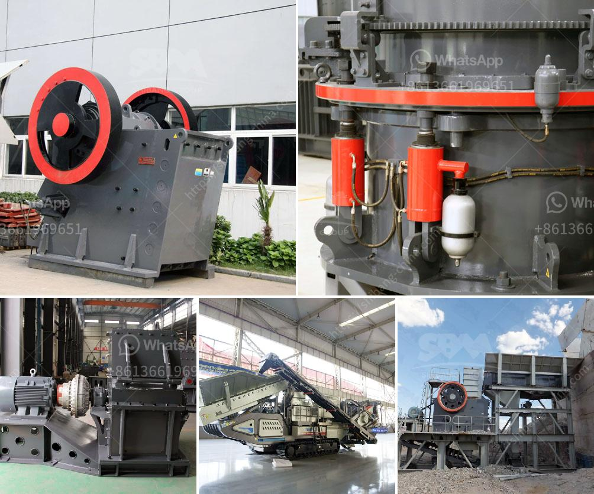

<h3>معلمات فنية لكسارة 20 طن في الساعة</h3>
تعتبر كسارات الحجارة من الآلات الهامة في صناعة البناء والانشاءات، وتقوم بتكسير الحصى والصخور الكبيرة إلى جزيئات صغيرة يمكن استخدامها في العديد من التطبيقات. ومن بين أنواع الكسارات المستخدمة في هذا المجال هي الكسارة الفكية ذات القوة العالية، والتي تعتمد على معلمات فنية محددة لتحقيق الكفاءة القصوى وضمان تحقيق الأداء المثالي.

تتميز الكسارة الفكية بقدرتها على تكسير الصخور الكبيرة وتحويلها إلى جزيئات صغيرة، وذلك بفضل القوة العالية التي تولدها. تشتمل معلمات هذا النوع من الكسارات على قوة التكسير، وهي القوة المطلوبة لتحطيم الصخور والحجارة. تشمل أيضًا حجم المدخل والمخرج، وهو الحجم الذي يمكن أدخاله وإخراجه من الكسارة بشكل مستمر، والذي يجب أن يكون متوافقًا مع القدرة المحددة لها.

بالإضافة إلى ذلك، هناك معلمات فنية أخرى تحدد أداء الكسارة الفكية، مثل سرعة الكسارة، ونسبة التكسير، وسمك قشرة الحصى الناتج. وعادةً ما يكون لديهم دوران أعلى بقليل في النصف الثالث من الفك مما يتيح لهم ضبط نسبة التكسير وجهاز توزيع مستمر ووزن أكثر توزيعا للمنتج النهائي على الآلة.

تعتبر كسارة الحجارة بقدرة 20 طن في الساعة واحدة من الكسارات الشائعة المستخدمة في الصناعة. وتتميز هذه الكسارة بعدد من المعلمات الفنية المهمة، بدءًا من القدرة الإجمالية للكسارة، والتي تحدد الحد الأقصى لكمية الحجارة التي يمكن تكسيرها في ساعة واحدة. وتشمل أيضًا قياسات المدخل والمخرج، وسرعة الدوران التي يعمل بها المحرك، والتي يجب أن تكون متوافقة مع القدرة الكهربائية المتاحة وطبيعة المواد المراد تكسيرها.

علاوة على ذلك، تضمن المعلمات الفنية المحددة لهذه الكسارة الجودة والكفاءة والأداء الممتاز. فمثلاً، يقدم إعدادات الإشعال البدء بسلاسة، ويسمح بالعمل المستمر دون توقف غير مبرر. كما يجب أن يتم ضبط التجويف بشكل سليم لكي يتمكن من تكسير الحصى بكفاءة ومنتجة جزيئات ذات أحجام قياسية.

باختصار، تلعب المعلمات الفنية لكسارة الحجارة بقدرة 20 طن في الساعة دورًا حاسمًا في الحصول على أداء مثالي وكفاءة عالية. ولذا من المهم اختيار الكسارة ذات المعلمات الفنية الملائمة والمتوافقة مع احتياجات الإنتاج وتحقيق الأداء المطلوب في مجال صناعة البناء والانشاءات.
<h3>Contact us</h3><ul><li><strong>Whatsapp:&nbsp;<a href="https://wa.me/8613661969651">+8613661969651</a></strong></li><li><a href="https://swt.shibang-china.com/?git&amp;zhl&amp;معلمات فنية لكسارة 20 طن في الساعة"><strong>Online Service(chat now)</strong></a></li></ul><h3>Related</h3><ul><li><a href='خط إنتاج الكوارتز.md'>خط إنتاج الكوارتز</a></li><li><a href='آلة فاصلة للرمل والحصى للبيع في الفلبين.md'>آلة فاصلة للرمل والحصى للبيع في الفلبين</a></li><li><a href='كسارات Canica 1200 VSI المستعملة.md'>كسارات Canica 1200 VSI المستعملة</a></li><li><a href='معدات مصنع حجر الرمل.md'>معدات مصنع حجر الرمل</a></li><li><a href='مطحنة للحجر الجيري في إيطاليا.md'>مطحنة للحجر الجيري في إيطاليا</a></li></ul>