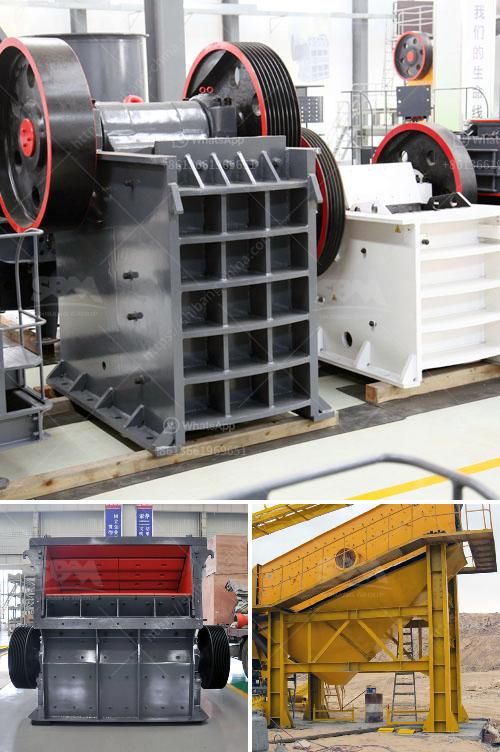

<h3>معلمات كسارة 250 طن في الساعة</h3>
تعتبر كسارات الحجر من أهم المعدات في صناعة البناء والتشييد، فهي تقوم بتكسير الصخور والحجارة إلى قطع أصغر وتنتج الركام المُستخدم في بناء الطرق والمباني. ومن بين هذه الكسارات، تُعد كسارات الحجر بسعة 250 طن في الساعة من الأكثر شهرة واستخداماً في الصناعة.

تتميز كسارات الحجر بسعة 250 طن في الساعة بالعديد من المميزات الفريدة التي يحدثها تصميمها وتكنولوجيتها المتقدمة. فإنها تستخدم أحدث التقنيات في عملية التكسير، مما يجعلها قادرة على تكسير الصخور والحجارة بكفاءة عالية وبسرعة كبيرة. وبفضل سعتها الكبيرة، فهي تستطيع إنتاج كميات كبيرة من الركام في وقت قصير، مما يزيد من إنتاجية عمليات البناء.

بالإضافة إلى ذلك، فإن كسارات الحجر بسعة 250 طن في الساعة تتميز بقدرتها على التعامل مع أنواع مختلفة من الصخور والحجارة. فهي تتمتع بمقاومة تآكل عالية وتكسير فعال للمواد الصلبة، بما في ذلك الجرانيت والحجر الجيري والرخام والكوارتز وغيرها. كما أنها تعمل بكفاءة عالية وتحتاج إلى صيانة قليلة، مما يقلل التكاليف ويحسن الأداء.

علاوة على ذلك، فإن كسارات الحجر بسعة 250 طن في الساعة تأتي مزودة بأنظمة أمان وحماية متقدمة. فهي تتضمن أجهزة استشعار للحماية من الأعطال وتوقف التشغيل في حالة وجود خطر. كما تتميز بنظام تشغيل بسيط وسهل الاستخدام، مما يسهل عملية التشغيل ويحسن الكفاءة.

وفي الختام، تُعتبر كسارات الحجر بسعة 250 طن في الساعة من أفضل الخيارات التي يمكن الاعتماد عليها في عمليات البناء والتشييد. فهي تجمع بين الأداء العالي والكفاءة والأمان، وهي قادرة على تلبية متطلبات الإنتاج الكبيرة وتحسين جودة المنتج النهائي. لذلك، يُنصح باستخدام كسارات الحجر بسعة 250 طن في الساعة في عمليات البناء الكبيرة والمشاريع التجارية.
<h3>Contact us</h3><ul><li><strong>Whatsapp:&nbsp;<a href="https://wa.me/8613661969651">+8613661969651</a></strong></li><li><a href="https://swt.shibang-china.com/?git&amp;zhl&amp;معلمات كسارة 250 طن في الساعة"><strong>Online Service(chat now)</strong></a></li></ul><h3>Related</h3><ul><li><a href='آلة كسارة VSI.md'>آلة كسارة VSI</a></li><li><a href='سعر مركز تركيز خام النحاس.md'>سعر مركز تركيز خام النحاس</a></li><li><a href='آلات الطحن لتكلفة مطحنة الدال.md'>آلات الطحن لتكلفة مطحنة الدال</a></li><li><a href='آلة تعدين الكسارة.md'>آلة تعدين الكسارة</a></li><li><a href='موردين مطاحن الطحن في ججرانوالا.md'>موردين مطاحن الطحن في ججرانوالا</a></li></ul>