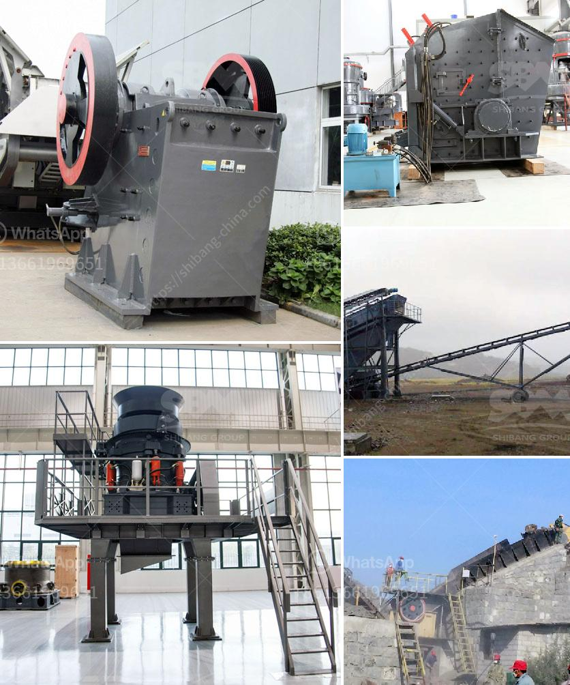

<h3>معلمات كسارة الهامر المقدمة بالتفصيل</h3>
تعتبر كسارة الهامر المعروفة أيضًا باسم كسارة الصخور تكنولوجيا متقدمة في مجال التكسير والطحن. وهي مصممة لتكسير المواد الصلبة مثل الحجارة والفحم والجير والجبس والباريت وغيرها من المواد غير القابلة للتآكل. تستخدم كسارة الهامر في مجموعة متنوعة من الصناعات مثل صناعة التعدين ومواد البناء والكيماويات والمعادن.

تعتبر المقدمة الأولى لكسارة الهامر نظام تغذية المواد الذي يتم تطبيقه عن طريق إرسال المواد إلى غرفة التكسير بواسطة لوحة التغذية المتأرجحة. ويتم تفريغ المواد على الحجر المقروص بواسطة صفيحة التأرجح وتعمل عن طريق قوة الجاذبية. تكسر الهامرات المتداخلة المواد عن طريق تأثير قوة الصدم المتكررة. يتم تجهيز الكسارة بطبقتين من النوعية العالية الكروم الحديد لضمان الاستدامة والكفاءة العالية.

تمتاز كسارة الهامر بأسلوب تحكم أوتوماتيكي متقدم يسمح بتعديل حجم المواد النهائية وكذلك سرعة الدوران. يمكن ضبط الهامر لتحقيق حجم مواد نهائية محدد، مما يسهم في تحسين كفاءة الإنتاج وجودة المنتج النهائي.

كما يتميز نظام التغذية الحلزونية في الكسارة بقدرتها على التعامل مع المواد الضخمة دون توقف وتقليل المخاطر المحتملة للتلف والأعطال في الجهاز. تصميم المروحة على شكل مروحة عكسية يعمل على تدوير الهواء في الغرفة وتسريع فصل الغبار عن المواد وبالتالي تحسين بيئة العمل.

كما أن تركيبة الإنتاج المتناسقة للكسارة وتراص المواد المناسب يجعلانها مثالية لتكسير الحجارة الكبيرة إلى حجر جرانيول الصغير. هذا الأمر يؤدي إلى تحسين جودة المنتج النهائي وتقليل محتوى الأوساخ والشوائب. بفضل تصميمها الفريد، فإن كسارة الهامر تتمتع بأداء مستقر وعمر خدمة طويل.

في النهاية، فإن كسارة الهامر تعتبر تكنولوجيا حديثة تسهم في تحسين صناعة التكسير والطحن. توفر هذه التقنية الكفاءة والاستدامة وجودة المنتج النهائي. إن وجود معلمات تشغيل كسارة الهامر المناسبة وصيانتها الدورية يساهم في زيادة عمر الجهاز وتحسين أدائه.
<h3>Contact us</h3><ul><li><strong>Whatsapp:&nbsp;<a href="https://wa.me/8613661969651">+8613661969651</a></strong></li><li><a href="https://swt.shibang-china.com/?git&amp;zhl&amp;معلمات كسارة الهامر المقدمة بالتفصيل"><strong>Online Service(chat now)</strong></a></li></ul><h3>Related</h3><ul><li><a href='المعدات اللازمة لبدء تعدين الحجر الجيري.md'>المعدات اللازمة لبدء تعدين الحجر الجيري</a></li><li><a href='مصنع تكسير حجر الجرانيت في كينيا.md'>مصنع تكسير حجر الجرانيت في كينيا</a></li><li><a href='رسم مصنع غسيل الفحم.md'>رسم مصنع غسيل الفحم</a></li><li><a href='معلمات فنية لكسارة 20 طن في الساعة.md'>معلمات فنية لكسارة 20 طن في الساعة</a></li><li><a href='حساب سعة كسارة الأسطوانة.md'>حساب سعة كسارة الأسطوانة</a></li></ul>