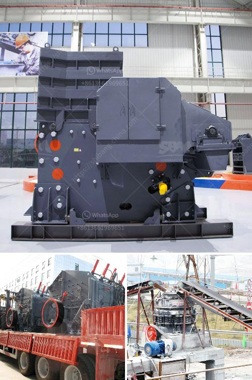

<h3>معلومات عن الكسارة المحمولة</h3>
تعتبر الكسارة المحمولة أحد الأدوات المهمة في صناعة التعدين والبناء، حيث تستخدم لسحق وتكسير الصخور والمواد الصلبة الأخرى. تم تطوير هذا الجهاز بشكل خاص ليكون صغير الحجم وقابل للنقل، مما يتيح للشركات والمقاولين العمل بفعالية في الموقع وتحقيق الإنتاجية العالية. في هذه المقالة، سنستعرض بعض المعلومات حول الكسارة المحمولة ومزاياها.

تتميز الكسارة المحمولة بعدة مزايا جعلتها خيارًا شائعًا للعديد من الشركات والمقاولين. أحد أهم تلك المزايا هو حالتها المحمولة، حيث يمكن نقلها بسهولة من مكان إلى آخر بواسطة شاحنة أو ناقلة خفيفة. هذا يسمح للشركات بإعداد الكسارة في الموقع نفسه، وبالتالي التقليل من تكاليف النقل والتحميل. كما أنها توفر مرونة أكبر في تنظيم الإنتاج وتحقيق وقت الاستجابة السريع لمتطلبات العميل.

بالإضافة إلى حالتها المحمولة، تُعد الكسارة المحمولة أيضًا سهلة الاستخدام والتشغيل، مما يتيح للمشغلين تنفيذ الأعمال بشكل فعال. يأتي الجهاز مع محرك قوي يسهل تشغيله، بالإضافة إلى أنظمة تحكم بسيطة ومفهومة. هذا يعني أنه لا يلزم التدريب الطويل أو فريق كبير لتشغيل الكسارة، مما يوفر المال ويعزز الإنتاجية.

علاوة على ذلك، تتميز الكسارة المحمولة بكونها متعددة الاستخدامات، حيث يمكن استخدامها لسحق مجموعة متنوعة من المواد والصخور، مثل الحجر الجيري والجرانيت والفحم. بفضل الفك المتحرك والأدوات الأُخرى المدمجة في الكسارة، يمكن تكسير الصخور إلى أحجام مختلفة وفقًا لاحتياجات المشروع.

وأخيرًا، يمكن القول إن الكسارة المحمولة هي حلاً مثاليًا للشركات والمقاولين الذين يعملون على مواقع متعددة أو بأحجام محدودة. تساهم في زيادة الإنتاجية وتقليل التكاليف والجهد المبذول في نقل الصخور والمواد الأخرى. بالإضافة إلى ذلك، فإن استخدام الكسارة المحمولة يسهم في تحسين الأمان والسلامة في موقع العمل، حيث يمكن تحميلها وتفريغها بسرعة ودقة.

باختصار، يُعد استثمار الكسارة المحمولة خيارًا مواتيًا للشركات والمقاولين الذين يبحثون عن طريقة فعالة وسريعة لسحق الصخور والمواد الأخرى. فهي تقدم حلاً مرنًا ومتنوعًا يعزز الإنتاجية ويقلل التكاليف ويحسن الأمان في موقع العمل.
<h3>Contact us</h3><ul><li><strong>Whatsapp:&nbsp;<a href="https://wa.me/8613661969651">+8613661969651</a></strong></li><li><a href="https://swt.shibang-china.com/?git&amp;zhl&amp;معلومات عن الكسارة المحمولة"><strong>Online Service(chat now)</strong></a></li></ul><h3>Related</h3><ul><li><a href='مطحنة للحجر الجيري في إيطاليا.md'>مطحنة للحجر الجيري في إيطاليا</a></li><li><a href='كسارة التعدين في تنزانيا.md'>كسارة التعدين في تنزانيا</a></li><li><a href='كسارات رئيسية للبيع على Alibaba.md'>كسارات رئيسية للبيع على Alibaba</a></li><li><a href='كسارة الصخور للكوارتز.md'>كسارة الصخور للكوارتز</a></li><li><a href='موردين استفادة خام الحديد.md'>موردين استفادة خام الحديد</a></li></ul>