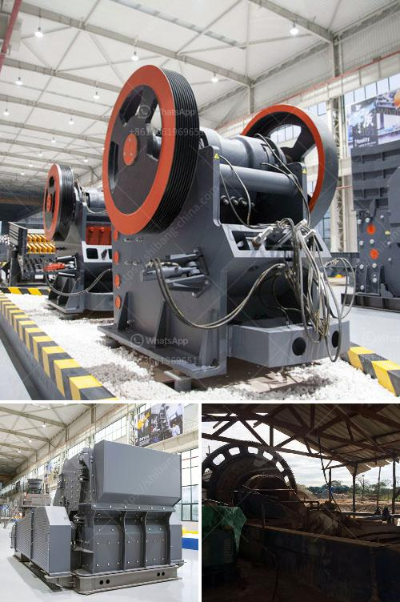

<h3>مغذي اهتزازي لخام السنتر</h3>
يعد مغذي الاهتزاز أحد الأجزاء الرئيسية في عملية تكسير وغربلة الخامات في صناعة التعدين. ويستخدم مغذي الاهتزاز لتغذية خام السنتر (الخام الخشن) إلى آلة التكسير الصخورية أو المطحنة الكروية لتحقيق عملية التكسير الفعالة.

أحد المزايا الرئيسية لمغذي الاهتزاز لخام السنتر هو قدرته على التحميل الثقيل والتحكم المناسب في تدفق الخام. يحتوي مغذي الاهتزاز على طاولة اهتزازية تهتز بشكل مستمر، مما يتيح تغذية الخام بشكل متساوٍ ومستمر نحو المعدات اللاحقة. بالإضافة إلى ذلك، يمكن ضبط التردد والقدرة التغذية بواسطة تغيير الزاوية وسرعة الهز.

يعتبر مغذي الاهتزاز لخام السنتر جهازًا قويًا لتجهيز الخامات الخشنة وكذلك تصنيف وفرز الجسيمات في عملية التكسير. عندما يتم تغذية الخام إلى مغذي الاهتزاز، يتم تكسيره بواسطة الصدمة والاهتزاز، مما يؤدي إلى تفتت الجسيمات وتحسين فرز الحبيبات. يعني هذا أن مغذي الاهتزاز لخام السنتر ليس فقط يقوم بتغذية الخام، ولكنه أيضًا يلعب دورًا في تحضير الخام للمعالجة اللاحقة.

واحدة من المزايا الأخرى لمغذي الاهتزاز لخام السنتر هي قدرته على التكيف مع ظروف العمل المختلفة. لا يقدم مغذي الاهتزاز فقط تغذية مستمرة ومتساوية لخام السنتر، ولكنه أيضًا يمكن تعديله بسهولة لتلبية احتياجات الإنتاج المختلفة. يمكن ضبط تردد الاهتزاز وزاوية الهز وسرعة الدوران لمناسبتها تمامًا للتطبيق المطلوب.

باختصار، يعد مغذي الاهتزاز لخام السنتر جزءًا أساسيًا من عملية تكسير وغربلة الخامات في صناعة التعدين. يعزز من عملية التكسير والفرز للخامات الخشنة، ويوفر تغذية مستمرة ومتوازنة للمعدات اللاحقة. كما يمكن تعديله بسهولة لتلبية المتطلبات المحددة لكل تطبيق. بالتالي، يمكن اعتبار مغذي الاهتزاز لخام السنتر ضروريًا لتحقيق عملية تكسير فعالة وفعالة لخامات السنتر.
<h3>Contact us</h3><ul><li><strong>Whatsapp:&nbsp;<a href="https://wa.me/8613661969651">+8613661969651</a></strong></li><li><a href="https://swt.shibang-china.com/?git&amp;zhl&amp;مغذي اهتزازي لخام السنتر"><strong>Online Service(chat now)</strong></a></li></ul><h3>Related</h3><ul><li><a href='سعر كسارة مخروطية هيدروليكية بتغذية 20 مم.md'>سعر كسارة مخروطية هيدروليكية بتغذية 20 مم</a></li><li><a href='مصنع غسل الحجارة الكوارتز.md'>مصنع غسل الحجارة الكوارتز</a></li><li><a href='مطحنة الكرة للبيع في جنوب أفريقيا.md'>مطحنة الكرة للبيع في جنوب أفريقيا</a></li><li><a href='مطحنة طحن الكرةستخدم لطحن الكرات.md'>مطحنة طحن الكرةستخدم لطحن الكرات</a></li><li><a href='معدات تعدين الرمال والحصى للبيع.md'>معدات تعدين الرمال والحصى للبيع</a></li></ul>