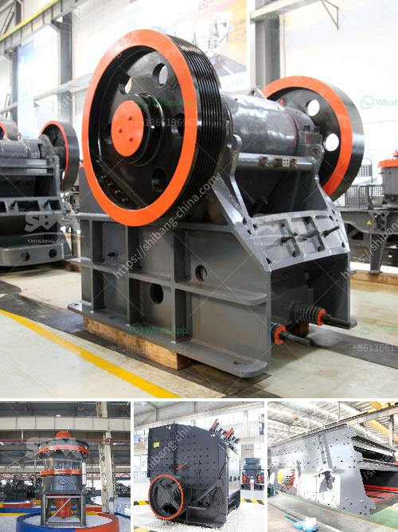

<h3>مفتاح الجص لباريس</h3>
يعتبر مفتاح الجص لباريس واحدًا من المعالم الثقافية والتاريخية البارزة في العاصمة الفرنسية باريس. يقع هذا المعلم الشهير في قلب المدينة على بعد مسافة قصيرة سيرًا على الأقدام من نوتردام وبانثيون وجميع المعالم الأخرى التي تجذب سياح العالم إلى باريس.

يتسم مفتاح الجص بتصميمه العريق والفريد من نوعه، حيث يمتاز بشكل مفتاح عملاق يطلق عليه البعض اسم "مفتاح المدينة". تم تصميمه في نهاية القرن التاسع عشر بواسطة النحات الفرنسي أوغست رودان للاحتفال بفتح القناة الشمالية للمياه الصالحة للشرب في باريس.

يبلغ ارتفاع مفتاح الجص حوالي 20 مترًا وعرضه حوالي 10 مترًا. يتكون المفتاح من الحجر الجيري الأبيض المميز، وهذا الاختيار للمواد المستخدمة يعكس التقاليد المعمارية لباريس.

تعد أهمية مفتاح الجص لباريس في جذب السياح وتعزيز السياحة في المدينة. يعتبر السياح المفتاح واحدًا من الوجهات السياحية المهمة التي يجب أن يراها الزوار عند زيارتهم باريس.

إلى جانب الجمال المعماري، يقدم مفتاح الجص لباريس أيضًا العديد من الفعاليات الثقافية والاجتماعية. يستضيف المفتاح معارض فنية وحفلات موسيقية وعروض حية، مما يزيد من جاذبيته كمكان ترفيهي وثقافي.

في الختام، يعتبر مفتاح الجص لباريس معلمًا تاريخيًا وثقافيًا رائعًا يستحق الزيارة. إن زيارة باريس لا تكتمل دون رؤية هذا المعلم البارز واستكشاف جميع الأنشطة الثقافية المثيرة التي يقدمها.
<h3>Contact us</h3><ul><li><strong>Whatsapp:&nbsp;<a href="https://wa.me/8613661969651">+8613661969651</a></strong></li><li><a href="https://swt.shibang-china.com/?git&amp;zhl&amp;مفتاح الجص لباريس"><strong>Online Service(chat now)</strong></a></li></ul><h3>Related</h3><ul><li><a href='آلة سحق مكعب الخرسانة.md'>آلة سحق مكعب الخرسانة</a></li><li><a href='المعدات المطلوبة لإنشاء محجر الجرانيت.md'>المعدات المطلوبة لإنشاء محجر الجرانيت</a></li><li><a href='كسارة صخور الحجر الجيري.md'>كسارة صخور الحجر الجيري</a></li><li><a href='مطحنة الأسطوانة الرأسية.md'>مطحنة الأسطوانة الرأسية</a></li><li><a href='كسارات مخروط للبيع.md'>كسارات مخروط للبيع</a></li></ul>