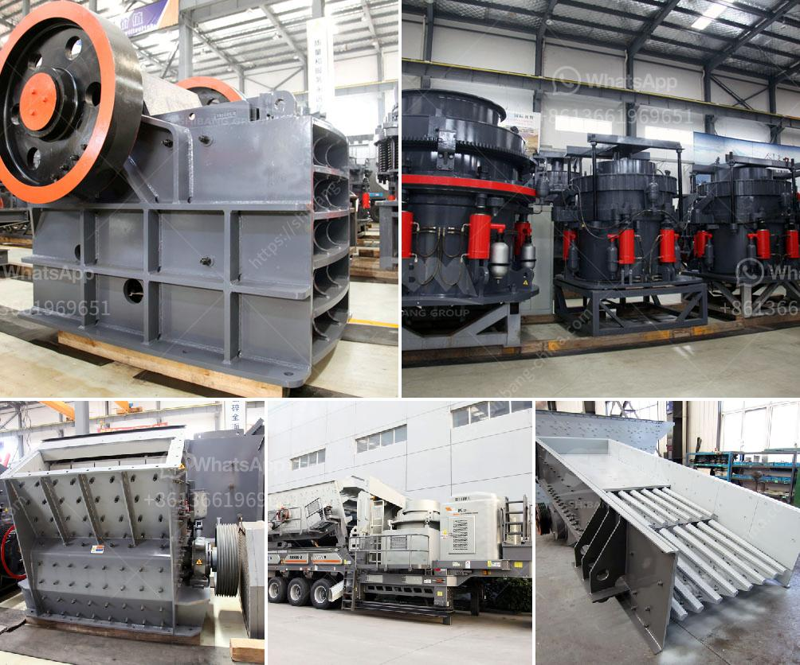

<h3>مقترح مشروع أعمال لكسارة الحجر</h3>
مشروع كسارة الحجر: تعتبر صناعة الحجر واحدة من الصناعات التي تشهد طلباً متزايداً في العديد من القطاعات مثل البناء والهندسة المعمارية وصناعة الطرق. وبالتالي، فإن اقتراح إنشاء كسارة حجر يمكن أن يكون فرصة مثالية لمشروع أعمال ناجح ومربح.

تعمل كسارة الحجر على سحق الصخور والحجارة الكبيرة إلى حجم أصغر، مما يجعلها جاهزة للاستخدام في بناء الطرق وإنشاء المباني. إليكم بعض الأسباب التي تدعو للاستثمار في مشروع كسارة الحجر:

1. زيادة الطلب: يرتفع الطلب على الحجر بشكل مستمر في مختلف القطاعات الصناعية. فمع توسع الإسكان والتطور العمراني، تكثر الحاجة إلى مواد البناء. وتعتبر الكسارات من أهم المصادر للحصول على حصى البناء والركام.

2. ربحية عالية: يعتبر مشروع محطة كسارة الحجر مربحًا للغاية، حيث تتمتع بمعدل ربحية عالية، خاصة عند توفر الطلب الكبير. يمكنك الاحتفاظ بأسعار تنافسية وتوفير منتجات عالية الجودة لمواجهة المنافسة.

3. تكاليف التشغيل المنخفضة: تتطلب عملية الكسارة الحجر متطلبات تشغيل بسيطة وتكاليف صيانة منخفضة. يتم تجهيز الكسارة بفك قوي وآليات لتنظيف قضبان الشاشة المذهلة وسهولة الوصول إلى قاطع التيار العالي وغيرها من الأجزاء الرئيسية.

4. التوسع المحتمل: تتيح لك كسارة الحجر إمكانية التوسع وزيادة طاقتها الإنتاجية بمرور الوقت، مما يعزز العائد المالي. يمكنك البدء بشكل صغير ومن ثم توسيع النطاق وتطوير المزيد من خطوط الإنتاج حسب الطلب والحاجة.

5. دور صديق للبيئة: قد تعتمد بعض الكسارات الحديثة على التكنولوجيا الخضراء وتمتلك أنظمة تصفية لتقليل الانبعاثات الضارة بالبيئة. وبالتالي، فإن تأسيس مشروع آمن بيئياً يساهم في استدامة الأعمال التجارية وتقليل الأثر البيئي السلبي.

في النهاية، يمكن القول إن مشروع كسارة الحجر هو مشروع استثماري مجدٍ يعتبر فرصة لجني الأرباح وتلبية الطلب المتزايد على المواد الصناعية. من المهم أن تتعاون مع فريق متخصص، يستطيع توفير الماكينات والتجهيزات اللازمة ودعمك في عملية البناء والتوسع.
<h3>Contact us</h3><ul><li><strong>Whatsapp:&nbsp;<a href="https://wa.me/8613661969651">+8613661969651</a></strong></li><li><a href="https://swt.shibang-china.com/?git&amp;zhl&amp;مقترح مشروع أعمال لكسارة الحجر"><strong>Online Service(chat now)</strong></a></li></ul><h3>Related</h3><ul><li><a href='تعدين البازلت.md'>تعدين البازلت</a></li><li><a href='كسارة الخرسانة المستعملة للبيع.md'>كسارة الخرسانة المستعملة للبيع</a></li><li><a href='كيفية حساب كفاءة الكسارة.md'>كيفية حساب كفاءة الكسارة</a></li><li><a href='تقرير مشروع مصنع الرخام بتنسيق PDF.md'>تقرير مشروع مصنع الرخام بتنسيق PDF</a></li><li><a href='مصنع كسارة خام الحديد.md'>مصنع كسارة خام الحديد</a></li></ul>