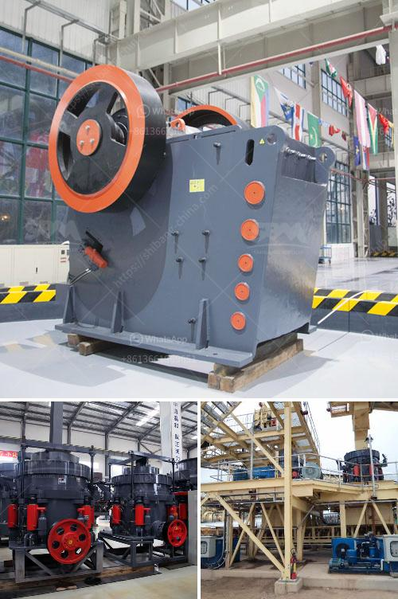

<h3>مقترح مشروع حول مصنع تكسير الحجر</h3>
يعتبر مصنع تكسير الحجر أحد المشاريع الصناعية التي تهدف إلى استغلال وتحويل الموارد الطبيعية المتاحة من الصخور الصلبة إلى مواد بناء قابلة للاستخدام في مختلف الصناعات. يعد هذا المشروع في قطاع صناعة البناء والتشييد من أهم المشاريع، وذلك لتزايد الطلب المستمر على مواد البناء في العالم، وخاصة في البلدان النامية.

يهدف مشروع مصنع تكسير الحجر إلى تكسير الحجارة الكبيرة إلى أحجام صغيرة متجانسة تتناسب مع احتياجات السوق المحلية والعالمية. وتتألف مراحل عمل هذا المشروع من تحميل ونقل الحجارة الكبيرة إلى منطقة التكسير، ثم تمريرها عبر الكسارات المختلفة حتى تصبح أحجام مطابقة للمعايير المطلوبة. ويستفاد من المنتجات النهائية لهذا المشروع كمواد أساسية في صناعة البناء، مثل الأسمنت والخرسانة والطوب.

تعتبر الفرص التجارية المتاحة لمشروع مصنع تكسير الحجر واعدة للغاية، حيث يتم استخدام هذه المنتجات في مشاريع البناء الكبيرة والصغيرة على حد سواء. بالإضافة إلى ذلك، فإن هناك طلب متزايد على مواد البناء في العالم بصفة عامة، وبالتالي فإن السوق لهذه المنتجات ستكون مستدامة طوال فترة تشغيل المشروع.

تعتبر المنافسة في هذا القطاع قوية، حيث يوجد العديد من المنافسين الذين يعملون في مجال تكسير الحجر. ولذلك، يجب على المشروع أن يركز على أفضلية تنافسية للتميز عن المنافسين، مثل جودة المنتج، والكفاءة في الإنتاج، والتكنولوجيا المتقدمة. علاوة على ذلك، يجب أيضًا أن يعتني المشروع بتغييرات السوق واتجاهاته، مثل الاهتمام المتزايد بالتنمية المستدامة والمواد الصديقة للبيئة.

من الناحية التنظيمية، يجب أن يوفر المشروع ما يلي: تراخيص البناء والتشغيل، والتزامات السلامة والبيئة، وإتباع القوانين واللوائح المحلية والدولية المتعلقة بمشاريع تكسير الحجر. كما يجب أن يتمتع المشروع بفريق إدارة مؤهل وكفء لضمان تشغيل مستدام وربحية للمشروع.

في الختام، يمثل مشروع مصنع تكسير الحجر فرصة جيدة للاستثمار في قطاع صناعة البناء والتشييد والاستفادة من طلب السوق المتزايد على مواد البناء. يجب أن يتم التركيز على ضمان جودة المنتج وكفاءة الإنتاج، ومراعاة القوانين البيئية والسلامة. وبالتالي، فإن هذا المشروع قد يكون مستدامًا ومربحًا في المستقبل.
<h3>Contact us</h3><ul><li><strong>Whatsapp:&nbsp;<a href="https://wa.me/8613661969651">+8613661969651</a></strong></li><li><a href="https://swt.shibang-china.com/?git&amp;zhl&amp;مقترح مشروع حول مصنع تكسير الحجر"><strong>Online Service(chat now)</strong></a></li></ul><h3>Related</h3><ul><li><a href='مورد مصنع تكسير الحجر في الفلبين.md'>مورد مصنع تكسير الحجر في الفلبين</a></li><li><a href='مصنع كسارة الحجر بسعة 100 طن.md'>مصنع كسارة الحجر بسعة 100 طن</a></li><li><a href='تقرير مشروع التعدين الكاولين المصغر.md'>تقرير مشروع التعدين الكاولين المصغر</a></li><li><a href='آلات مستخدمة في مصنع الفحم المسحوق.md'>آلات مستخدمة في مصنع الفحم المسحوق</a></li><li><a href='مصنع أسمنت صغير بسعة 100 طن في اليوم.md'>مصنع أسمنت صغير بسعة 100 طن في اليوم</a></li></ul>