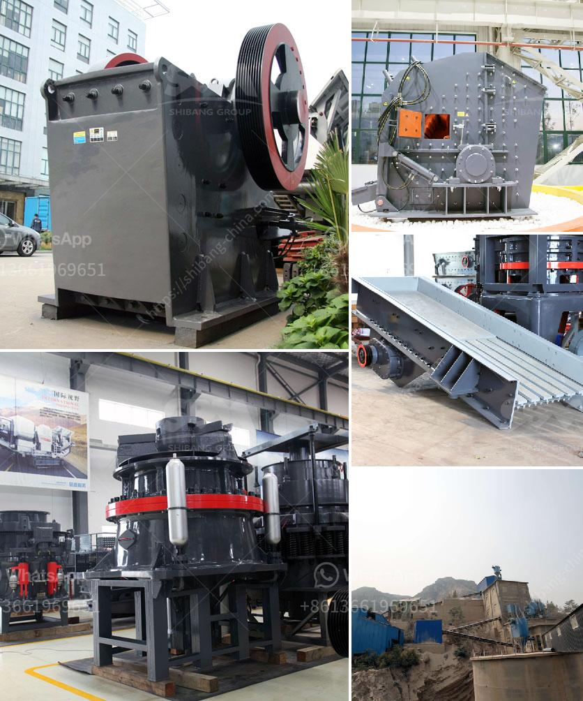

<h3>مكونات مصنع الحجر الجيري الأولي</h3>
مصنع الحجر الجيري الأولي هو أحد المصانع الصناعية الهامة التي تقوم بإنتاج الحجر الجيري الخام. يتكون هذا المصنع من مجموعة من المكونات الأساسية التي تعمل بتناغم لإنتاج الحجر الجيري الأولي بجودة عالية.

أحد المكونات الرئيسية في مصنع الحجر الجيري الأولي هو المحجر. يتم اختيار الموقع المناسب للمحجر بناءً على عدة عوامل، مثل مناخ المنطقة ومستوى التجوية والتوافر المائي. يتم استخراج الحجر الجيري من المحجر بواسطة آلات ثقيلة مثل الحفارات والجرافات.

بعد استخراج الحجر الجيري من المحجر، يتم نقله إلى كسارة الحجر الجيري. في هذه الكسارة، يتم سحق الحجر الجيري إلى أجزاء صغيرة باستخدام آلات التكسير المختلفة. يتم استخدام المطارق الهيدروليكية والكسارات الصدمية لتكسير الحجر الجيري وتقسيمه إلى الحجم المطلوب.

بعد ذلك، يتم نقل الحجر الجيري المكسر إلى الأفران. تتواجد الأفران في المصنع لإجراء عملية الحرق. تتم إدخال الحجر الجيري المكسر إلى الأفران من أجل تسخينه عند درجة حرارة مرتفعة. يتم خلال هذه العملية تحويل الحجر الجيري إلى أكسيد الكالسيوم، وهو المادة الأساسية في صناعة الحجر الجيري.

بعد إتمام عملية الحرق، يتم نقل الحجر الجيري المحروق إلى مصنع التكسير والطحن. في هذا المصنع، يتم طحن الحجر الجيري المحروق إلى مسحوق ناعم باستخدام مطاحن مختلفة. يعتمد حجم وشكل المطاحن على خصائص الحجر الجيري والحجم النهائي المطلوب للمنتج.

في خطوة الأخيرة، يتم تعبئة الحجر الجيري النهائي في أكياس أو حاويات للتخزين أو الشحن للعملاء. يتم تسويق الحجر الجيري في العديد من الصناعات، مثل صناعة الإسمنت والحديد والصلب والزجاج والأسمدة.

باختصار، مصنع الحجر الجيري الأولي يتكون من محجر لاستخراج الحجر ثم كسارة لتكسيره ومن ثم أفران لعملية الحرق وأخيراً مصنع للتكسير والطحن. تعتبر هذه المكونات الأساسية أساسية في عملية إنتاج الحجر الجيري الأولي بجودة عالية.
<h3>Contact us</h3><ul><li><strong>Whatsapp:&nbsp;<a href="https://wa.me/8613661969651">+8613661969651</a></strong></li><li><a href="https://swt.shibang-china.com/?git&amp;zhl&amp;مكونات مصنع الحجر الجيري الأولي"><strong>Online Service(chat now)</strong></a></li></ul><h3>Related</h3><ul><li><a href='أنا أبحث عن كسارة في ماليزيا.md'>أنا أبحث عن كسارة في ماليزيا</a></li><li><a href='آلة كسارة الحصى.md'>آلة كسارة الحصى</a></li><li><a href='تكلفة وحدة طحن الأسمنت tpd كسارة.md'>تكلفة وحدة طحن الأسمنت tpd كسارة</a></li><li><a href='مصنع غسل الذهب msi المستخدم.md'>مصنع غسل الذهب msi المستخدم</a></li><li><a href='كسارات تأجير.md'>كسارات تأجير</a></li></ul>