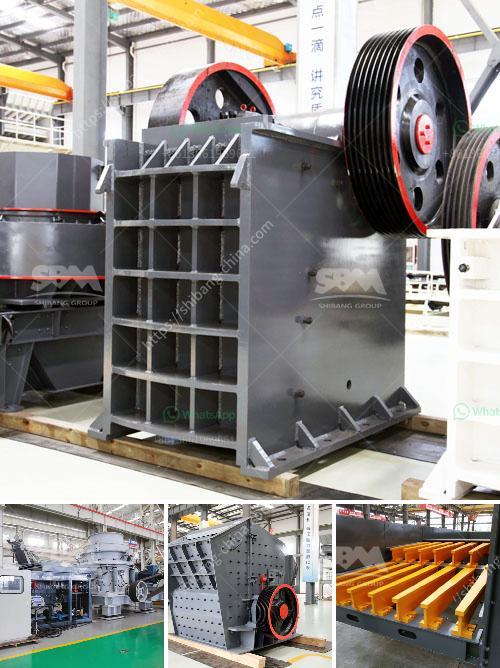

<h3>مكونات مصنع معالجة الفحم المتنقل</h3>
مصنع معالجة الفحم المتنقل هو مصنع يتم نقله وتركيبه بسهولة في مواقع مختلفة لمعالجة الفحم. يعتبر هذا المصنع واحدًا من أهم المعدات المستخدمة في صناعة استخراج الفحم وتحويله إلى مواد قابلة للاستخدام. يتكون المصنع المتنقل من عدة مكونات وأجزاء تعمل معاً لتنفيذ عملية معالجة الفحم بكفاءة وفعالية.

أحد المكونات الرئيسية للمصنع المتنقل هو سحق الفحم. يتم استخدام كسارة الفحم لسحق الفحم الخام إلى حجم مناسب قبل دخوله إلى المصنع المتنقل. يتم ضغط الفحم المسحوق في كتل صلبة تسمى فحم مشتعل يمكن استخدامه في العديد من الصناعات.

ثم يتم نقل الفحم المسحوق إلى مجفف الفحم. يعمل المجفف على إزالة الرطوبة من الفحم المسحوق، مما يجعلها مواد أكثر استقرارًا ويسهل نقلها وتخزينها. يتكون المجفف من فرن حراري يعمل بالهواء الساخن لتسخين الفحم وإزالة الرطوبة منه.

بعد مرحلة تجفيف الفحم، يتم نقله إلى مصنف الفحم. يستخدم المصنف لفصل الفحم المجفف حسب حجمه وتصنيفه. تعتمد عملية التحصين على استخدام الهواء أو الماء لفصل جزيئات الفحم المختلفة وفقًا لحجمها وكثافتها. يتم فصل الفحم الناعم عن الفحم الخشن وتجميعه في حاويات منفصلة للاستفادة منه في صناعات مختلفة.

أخيرًا، يتم تجهيز الفحم المعالج وتعبئته في حاويات أو أكياس لنقله وتسليمه إلى الزبائن. يتم تصنيع هذه الحاويات والأكياس من مواد مختلفة قابلة للتحلل والمحافظة على جودة الفحم. تشمل مهام المصنع المتنقل أيضًا الصيانة الدورية للمعدات وضمان عملها بكفاءة.

باختصار، مصنع معالجة الفحم المتنقل يتكون من سحق الفحم، ومجفف الفحم، ومصنف الفحم، وعملية التعبئة والتغليف. هذه المكونات تعمل معاً لتنفيذ عملية تحويل الفحم إلى منتجات نهائية قابلة للاستخدام. يتم نقل المصنع بسهولة بين المواقع لاستخدامه في مختلف المشاريع. يعتبر تطوير هذا المصنع خطوة هامة في استخدام الطاقة المتجددة وحماية البيئة من التلوث بفضل فحم معالج صديق للبيئة.
<h3>Contact us</h3><ul><li><strong>Whatsapp:&nbsp;<a href="https://wa.me/8613661969651">+8613661969651</a></strong></li><li><a href="https://swt.shibang-china.com/?git&amp;zhl&amp;مكونات مصنع معالجة الفحم المتنقل"><strong>Online Service(chat now)</strong></a></li></ul><h3>Related</h3><ul><li><a href='كسارات الحجر في فرنسا.md'>كسارات الحجر في فرنسا</a></li><li><a href='أسعار مطاحن الكرة الاسمنت.md'>أسعار مطاحن الكرة الاسمنت</a></li><li><a href='مصنع كسارة الدولوميت في الكويت.md'>مصنع كسارة الدولوميت في الكويت</a></li><li><a href='شركة تبيع كسارة الحجر في كينيا.md'>شركة تبيع كسارة الحجر في كينيا</a></li><li><a href='كيفية اختيار كسارة مخروطية.md'>كيفية اختيار كسارة مخروطية</a></li></ul>