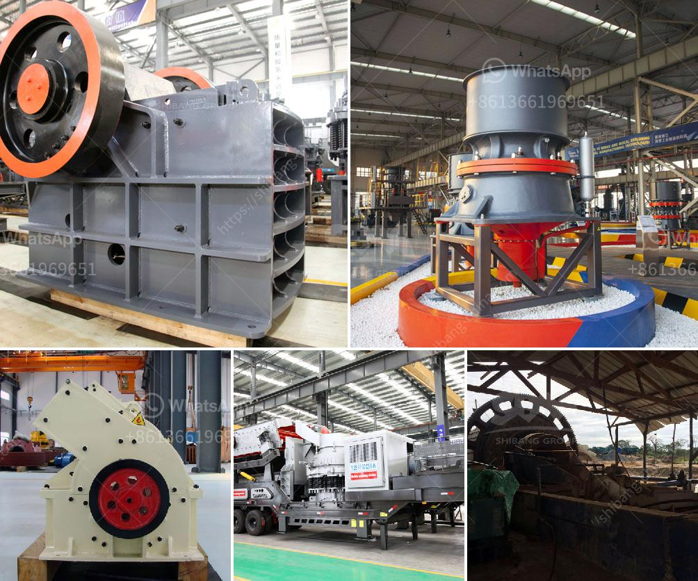

<h3>مكونات مطحنة الأسطوانة</h3>
مطحنة الأسطوانة هي أحد أهم الأدوات المستخدمة في صناعة الطحن. تعتبر هذه المطاحن من أكثر المطاحن استخدامًا في صناعة الأغذية والمواد الكيميائية. تتألف مطاحن الأسطوانة من مجموعة من الأسطوانات المتوازية الملتفة وتتحرك على نحو دوراني لطحن المواد الخام.

تحتوي مطاحن الأسطوانة على العديد من المكونات المهمة التي تسهم في تحقيق قدرة الطحن الفعالة والدقة. سنلقي نظرة على بعض هذه المكونات الرئيسية:

1. الأسطوانات: تتكون مطاحن الأسطوانة عادةً من ثلاثة أسطوانات ملتفة بشكل متوازٍ ومدعومة بإطار معدني. تتحرك الأسطوانات في اتجاه واحد أو في كلا الاتجاهين مستخدمة قوة محرك لتوجيه وسحق المواد الخام.

2. الفتحات: تحتوي الأسطوانات عادةً على فتحات معدنية صغيرة على طولها. يمر المواد الخام عبر هذه الفتحات للتحول إلى أجزاء أصغر، وذلك بفعل ضغط الأسطوانات المتحركة.

3. النشرة: تعتبر النشرة جزءًا مهمًا في مطحنة الأسطوانة، إذ تُستخدم لتحديد المسافة بين الأسطوانات وتحقيق النقل الدقيق والثابت للمواد الخام عبر الفتحات. إذا كانت النشرة رفيعة، فستكون هناك خدوش خطيرة على المواد الخام، بينما إذا كانت سميكة جدًا، فقد يحدث عدم التغذية الجيدة للمواد الخام.

4. المحرك: يستخدم المحرك لتحريك الأسطوانات بسرعة ثابتة وبالاتجاه المطلوب. بالاعتماد على نوعية المواد الخام والمطلوب من الطحن، يعتمد نوع المحرك على الطاقة المطلوبة وقدرة الطحن.

5. الأنظمة الهيدروليكية والكهربائية: تتحكم هذه الأنظمة في تشغيل وإيقاف وضبط مطاحن الأسطوانة. توفر الأنظمة الهيدروليكية القدرة على تعديل ضغط الأسطوانات وتهدئة الاهتزازات المحتملة للحصول على نتائج طحن دقيقة.

باختصار، مطاحن الأسطوانة تعتبر أداة مهمة في صناعة الطحن. تتألف هذه المطاحن من عدة مكونات رئيسية تعمل معًا لطحن المواد الخام بفعالية ودقة. تحتاج مطاحن الأسطوانة إلى صيانة ورعاية دورية لضمان أداءها المثلى والحفاظ على جودة الطحن.
<h3>Contact us</h3><ul><li><strong>Whatsapp:&nbsp;<a href="https://wa.me/8613661969651">+8613661969651</a></strong></li><li><a href="https://swt.shibang-china.com/?git&amp;zhl&amp;مكونات مطحنة الأسطوانة"><strong>Online Service(chat now)</strong></a></li></ul><h3>Related</h3><ul><li><a href='اختلافات بين مطحنة الهامر ومطحنة الكرة.md'>اختلافات بين مطحنة الهامر ومطحنة الكرة</a></li><li><a href='مصنع كسارة حجر محمول في تركيا.md'>مصنع كسارة حجر محمول في تركيا</a></li><li><a href='غرابيل للبيع في ساسكاتشوان.md'>غرابيل للبيع في ساسكاتشوان</a></li><li><a href='آلة معالجة الرماد الطائر.md'>آلة معالجة الرماد الطائر</a></li><li><a href='بيع الكسارات في ماليزيا.md'>بيع الكسارات في ماليزيا</a></li></ul>