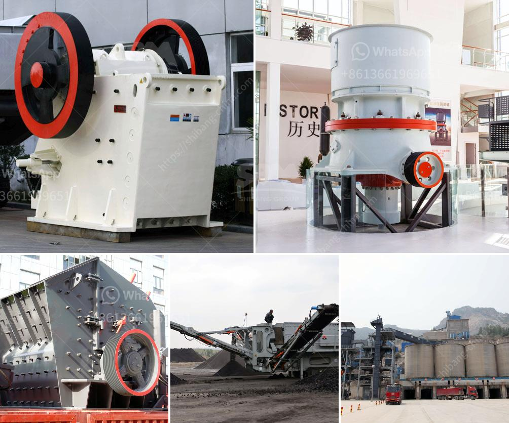

<h3>من مصنع تصنيع البوكسيت في الصين</h3>
تعد الصين من أكبر المنتجين للبوكسيت في العالم، حيث تمتلك مصانع تصنيع متقدمة تقوم بإنتاج كميات ضخمة من البوكسيت سنوياً. البوكسيت هو خام يحتوي على أكسيد الألومنيوم، وهو يعتبر المادة الأولية الأساسية لإنتاج الألومنيوم.

يعتبر مصنع تصنيع البوكسيت في الصين من أفضل المصانع في العالم، حيث يتميز بمعايير عالية للجودة والتكنولوجيا المتقدمة. يتبع المصنع أفضل الممارسات الصناعية ويتم استخدام أحدث الآلات والمعدات في عملية التصنيع.

يبدأ عملية إنتاج البوكسيت بتعدين الخام من المناجم الواقعة في مناطق مختلفة من الصين. يتم تجهيز الخام الخام في الموقع وفقًا للمعايير القياسية لصناعة البوكسيت. يتم طحن وتكسير الخام للحد من حجم الجسيمات وتنقيتها من الشوائب المختلفة.

بعد ذلك، يتم وضع البوكسيت في أفران خاصة للتحول إلى البوكسيت النهائي المستخدم في صناعة الألومنيوم. تتطلب هذه العملية درجات حرارة مرتفعة وظروف محكمة للحصول على النتائج المطلوبة. بفضل التطورات التكنولوجية، تستخدم مصانع تصنيع البوكسيت في الصين أفران حديثة تعمل بكفاءة عالية وتوفر نتائج دقيقة.

في النهاية، يتم نقل البوكسيت الناتج إلى مصانع الألومنيوم التي تقوم بتحويله إلى الألومنيوم الصافي. يتم استخدام الألومنيوم في العديد من الصناعات بما في ذلك صناعة السيارات والطائرات والمواد الكهربائية.

تلتزم مصانع تصنيع البوكسيت في الصين بالاستدامة البيئية والمسؤولية الاجتماعية، حيث تعمل على تقليل الانبعاثات الضارة وإعادة تدوير المخلفات بأفضل الطرق الممكنة. تقوم المصانع بأعمال توعية بيئية للمجتمع المحلي وتوفير فرص عمل للسكان المحليين.

باختصار، يعتبر مصنع تصنيع البوكسيت في الصين من أهم الوحدات الصناعية. يعمل المصنع بجد لتلبية الطلب المتزايد على البوكسيت وإنتاج الألومنيوم بأعلى جودة بيئية وتكنولوجية. من خلال تبني أفضل الممارسات والدراسات المستمرة، يسعى المصنع إلى تحقيق التطور المستدام وتوفير مزيد من فرص النمو والتنمية في الصناعة والمجتمع المحلي.
<h3>Contact us</h3><ul><li><strong>Whatsapp:&nbsp;<a href="https://wa.me/8613661969651">+8613661969651</a></strong></li><li><a href="https://swt.shibang-china.com/?git&amp;zhl&amp;من مصنع تصنيع البوكسيت في الصين"><strong>Online Service(chat now)</strong></a></li></ul><h3>Related</h3><ul><li><a href='مصنع غسيل الكروم للبيع في جنوب أفريقيا.md'>مصنع غسيل الكروم للبيع في جنوب أفريقيا</a></li><li><a href='آخر خط إنتاج مسحوق الجبس.md'>آخر خط إنتاج مسحوق الجبس</a></li><li><a href='تكلفة الكسارة المحمولة للساعة الواحدة.md'>تكلفة الكسارة المحمولة للساعة الواحدة</a></li><li><a href='آلة ميكرونيزر الحجر الجيري مطحنة ميكرونيزر.md'>آلة ميكرونيزر الحجر الجيري مطحنة ميكرونيزر</a></li><li><a href='مكونات مطحنة الأسطوانة.md'>مكونات مطحنة الأسطوانة</a></li></ul>