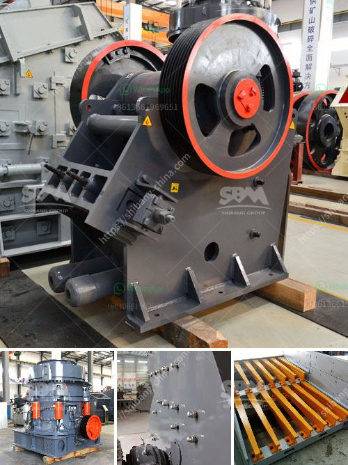

<h3>مناجم الكوبالت والنحاس في زامبيا</h3>
تعتبر زامبيا واحدة من أكبر منتجي الكوبالت والنحاس في العالم، حيث تحتوي على واحدة من أكبر الرواسب المعدنية في العالم. تعتبر صناعة التعدين في زامبيا أحد القطاعات الرئيسية في البلاد وتساهم بنسبة كبيرة في الناتج المحلي الإجمالي.

يتم استخراج الكوبالت والنحاس في زامبيا من عدة مناجم في عدة مناطق مهمة في البلاد. واحدة من أبرزها هي منجم موبيمباشي، الواقع في شمال غرب البلاد. يُعتبر موبيمباشي أكبر منجم للنحاس في زامبيا ويحتوي أيضًا على احتياطيات مهمة من الكوبالت. تم اكتشاف المنجم في عام 1923 وبدأ الإنتاج التجاري فيه في الستينيات. يوجد في هذا المنجم تحديدًا نحو 6.6 مليار طن من الخامات، مما يجعله أحد أكبر منتجي النحاس في العالم.

منجم لومبوي الواقع في شمال وسط زامبيا هو أيضًا منجم مهم للنحاس والكوبالت. ويتمتع بخصائص تحتية عالية الجودة من الرواسب المعدنية ويمتلك احتياطيات هائلة تتراوح بين 116 و 175 مليون طن من الخامات. يجذب هذا المنجم شركات التعدين العالمية الكبرى وتستثمر فيه لاستغلال الرواسب بشكل فعال.

تعتبر صناعة التعدين في زامبيا من القطاعات الحيوية للاقتصاد الوطني، حيث توفر فرص عمل وتسهم في تعزيز النمو الاقتصادي. ومع ذلك، هناك تحديات تواجه هذه الصناعة، بما في ذلك تلوث المياه وتأثيرات البيئة السلبية الأخرى. وقد بذلت الحكومة الزامبية جهودًا لتعزيز ممارسات التعدين الصديق للبيئة وتحسين سلامة العمال في هذا القطاع.

يرتبط ارتفاع أسعار الكوبالت والنحاس في الأسواق العالمية بزيادة الطلب عليهما في الصناعات المختلفة، وخاصةً صناعة الطاقة المتجددة وتصنيع السيارات الكهربائية. ويجد المنتجون في زامبيا فرصة لزيادة إنتاجهم والاستفادة من النفوذ الكبير لهاتين المادتين.

باختصار، تعد مناجم الكوبالت والنحاس في زامبيا من أهم الأصول الاقتصادية للبلاد. تتواجد فيها احتياطات ضخمة من هاتين المادتين الثمينتين وتساهم في توفير فرص عمل للسكان المحليين وتعزيز النمو الاقتصادي للبلاد. ومع الاهتمام المتزايد بالاستدامة والطاقة المتجددة، فإن زامبيا قادرة على الاستفادة من هذه الفرص لزيادة إنتاجها وتنمية قطاع التعدين بشكل أكبر.
<h3>Contact us</h3><ul><li><strong>Whatsapp:&nbsp;<a href="https://wa.me/8613661969651">+8613661969651</a></strong></li><li><a href="https://swt.shibang-china.com/?git&amp;zhl&amp;مناجم الكوبالت والنحاس في زامبيا"><strong>Online Service(chat now)</strong></a></li></ul><h3>Related</h3><ul><li><a href='تحجيم مطاحن الكرة.md'>تحجيم مطاحن الكرة</a></li><li><a href='وكيل وارد ريموند مطحنة إندونيسيا.md'>وكيل وارد ريموند مطحنة إندونيسيا</a></li><li><a href='آلة تعبئة مسحوق التلك.md'>آلة تعبئة مسحوق التلك</a></li><li><a href='مطحنة هامر لتعدين الذهب في جنوب أفريقيا.md'>مطحنة هامر لتعدين الذهب في جنوب أفريقيا</a></li><li><a href='مطحنة الكرة في معدات مصنع الألومنيوم.md'>مطحنة الكرة في معدات مصنع الألومنيوم</a></li></ul>