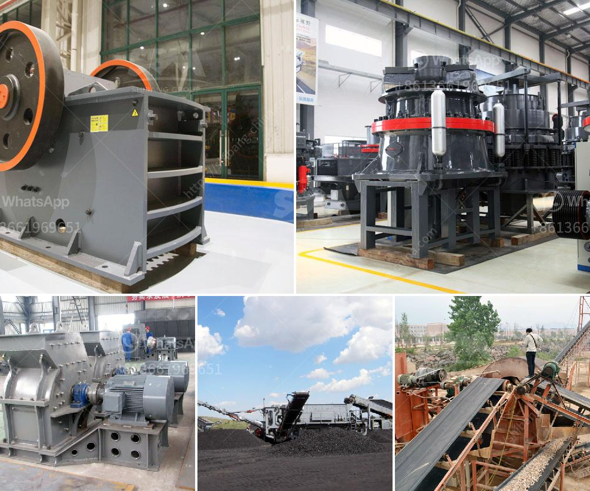

<h3>مناجم رمل السيليكا في الفلبين</h3>
تعتبر مناجم رمل السيليكا في الفلبين من الموارد الطبيعية الهامة التي تساهم في تنمية الاقتصاد الوطني. يُعرف رمل السيليكا أيضًا بالرمل الكوارتزي وهو عبارة عن مادة معدنية تحتوي على نسبة عالية من السليكا البلورية. ويتمتع رمل السيليكا بمرونة ومتانة عالية، كما أنه مقاوم للتآكل والتآكل وغير سام.

توجد مناجم رمل السيليكا في الفلبين بمناطق متفرقة حول البلاد، وتعد جزيرة لوزون ورماجون وزامباليس وبيكول وسمار لليت وجزيرة باناي ومينداناو بعض المواقع الرئيسية للاستخراج والتصنيع. وتشتهر جزيرة سيبو بأنها أكبر منطقة لاستخراج رمل السيليكا في الفلبين.

تستخدم رمال السيليكا في العديد من الصناعات مثل صناعة الزجاج وصناعة السيراميك والبلاستيك والمواد العازلة والإلكترونيات. كما يستخدم أيضًا في صناعة النسيج ومعالجة المياه وصناعة الدهانات وصناعة العدسات اللاصقة والصناعة الكيميائية والعديد من التطبيقات الأخرى.

تتمتع الفلبين بموقع جغرافي استراتيجي حيث تقع في منطقة المحيط الهادئ التي تعتبر منطقة غنية بالموارد الطبيعية. وبالنسبة لمناجم رمل السيليكا في الفلبين، يمكن استغلال الكميات الهائلة من رمال السيليكا الموجودة في البحر الصيني الشرقي والمحيط الهادئ.

تعد صناعة رمل السيليكا في الفلبين مصدرًا هامًا للدخل والتصدير. وتستفيد الحكومة الفلبينية من هذه الصناعة من حيث جلب الاستثمارات الأجنبية المباشرة وتوفير فرص العمل للمواطنين. وتساهم أيضًا في تقويض الفقر وتعزيز التنمية الاقتصادية في المناطق الريفية النائية حيث تقع المناجم.

ومع ذلك، يجب أن نأخذ في الاعتبار أيضًا التأثيرات البيئية المحتملة بسبب استخراج رمل السيليكا. فقد يتسبب استخراج الرمال في تغيير البيئة المحيطة وتلوث المياه والتربة. لذا، يجب أن تضمن الشركات المنقبة عن رمل السيليكا المطابقة للمعايير البيئية وتنفيذ الممارسات الصديقة للبيئة.

تلعب مناجم رمل السيليكا في الفلبين دورًا حاسمًا في تعزيز الاقتصاد الوطني. وتقدم فرص العمل وتعزز التنمية الاقتصادية في المناطق النائية. ومع ذلك، يجب أن يتم استغلال هذه الموارد الطبيعية بحذر ومسؤولية للحفاظ على البيئة وضمان الاستفادة المستدامة للجميع.
<h3>Contact us</h3><ul><li><strong>Whatsapp:&nbsp;<a href="https://wa.me/8613661969651">+8613661969651</a></strong></li><li><a href="https://swt.shibang-china.com/?git&amp;zhl&amp;مناجم رمل السيليكا في الفلبين"><strong>Online Service(chat now)</strong></a></li></ul><h3>Related</h3><ul><li><a href='سعر معدات التعدين المستخدمة.md'>سعر معدات التعدين المستخدمة</a></li><li><a href='كسارات الحجر في نيجيريا.md'>كسارات الحجر في نيجيريا</a></li><li><a href='سعر كسارة الحجر pe 600 900.md'>سعر كسارة الحجر pe 600 900</a></li><li><a href='معدات المحجر للسكك الحديدية.md'>معدات المحجر للسكك الحديدية</a></li><li><a href='مصنع معالجة كروشر في ماليزيا.md'>مصنع معالجة كروشر في ماليزيا</a></li></ul>