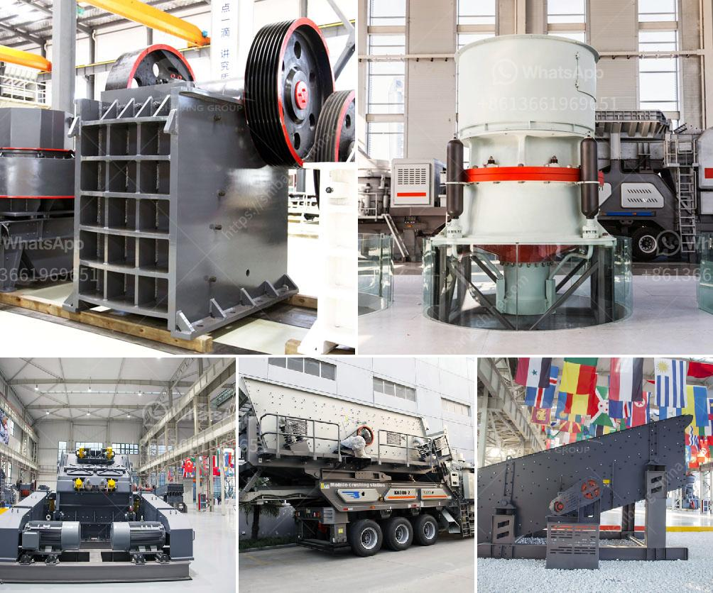

<h3>منتجات آلات الكتل الطينية</h3>
إن صناعة الطوب والكتل الطينية من الممارسات القديمة التي تعود إلى العديد من الحضارات القديمة. كان استخدام الطوب الطيني يعد طريقة رئيسية لبناء المنازل والمباني الأخرى. مع تطور التكنولوجيا وتطور صناعة البناء، أصبح من الممكن تصنيع الطوب الطيني باستخدام آلات الكتل الطينية المتقدمة.

تعتبر آلات الكتل الطينية منتجات يتم استخدامها للتحويل الآلي للطين إلى كتل طينية. تتكون هذه الآلات عادة من ثلاثة أجزاء رئيسية: المكبس، وصينية التلقيم، والمجفف. يعتبر المكبس جزءًا حاسمًا في عملية تشكيل الكتل الطينية حيث يضغط على الطين ويمنحه الشكل المطلوب. تتميز آلات الكتل الطينية المتقدمة بتقنيات مبتكرة تسمح بضبط شكل وحجم الكتل وتحقيق الدقة المطلوبة.

من أهم مزايا استخدام آلات الكتل الطينية هو زيادة كفاءة الإنتاج وتقليل العمل البدني الشاق. حيث يقوم العامل بتغذية الآلة بالطين وتشغيلها، بينما تقوم الآلة بتشكيل الكتل الطينية بشكل سريع ومتسق. هذا يؤدي إلى زيادة الإنتاجية وتوفير الوقت والجهد.

بالإضافة إلى زيادة الإنتاجية، تعتبر آلات الكتل الطينية أيضًا صديقة للبيئة. فعملية تصنيع الطوب الطيني اليدوي التقليدي تستهلك كميات كبيرة من الماء، كما أنها تسبب في تلوث الهواء بسبب الغبار المتولد أثناء عملية التشكيل. ومع ذلك، فإن آلات الكتل الطينية تستخدم كميات أقل من الماء وتحد من تلوث الهواء بشكل كبير.

تتوفر آلات الكتل الطينية بمختلف الأحجام والقدرات، مما يتيح للمنتجين اختيار آلة تناسب احتياجاتهم. يمكن استخدام منتجات آلات الكتل الطينية لتصنيع العديد من المنتجات الطينية مثل الطوب، والبلاط، والكتل الطينية المجوفة. مما يجعلها خيارًا مثاليًا لمن يبحثون عن تحويل سهل وسريع للطين إلى منتجات بناء ذات جودة عالية.

في النهاية، يمكن القول إن آلات الكتل الطينية تعتبر تكنولوجيا حديثة ومبتكرة لتصنيع الطوب والكتل الطينية بكفاءة وجودة عالية. فهي توفر العديد من المزايا مثل زيادة الإنتاجية والتوفير في العمل البدني وحماية البيئة. لذا، فإن استخدام آلات الكتل الطينية يعتبر خيارًا مثاليًا لمن يعملون في صناعة البناء ويرغبون في تحسين عملياتهم وتوفير الوقت والجهد.
<h3>Contact us</h3><ul><li><strong>Whatsapp:&nbsp;<a href="https://wa.me/8613661969651">+8613661969651</a></strong></li><li><a href="https://swt.shibang-china.com/?git&amp;zhl&amp;منتجات آلات الكتل الطينية"><strong>Online Service(chat now)</strong></a></li></ul><h3>Related</h3><ul><li><a href='خط إنتاج مسحوق الجبس.md'>خط إنتاج مسحوق الجبس</a></li><li><a href='تكلفة عمليات مصنع الرمل والحصى.md'>تكلفة عمليات مصنع الرمل والحصى</a></li><li><a href='مصنع كسارة الحجر.md'>مصنع كسارة الحجر</a></li><li><a href='آلة تسخين حجر الكوارتز للبيع.md'>آلة تسخين حجر الكوارتز للبيع</a></li><li><a href='آلة سحق جوز الهند.md'>آلة سحق جوز الهند</a></li></ul>