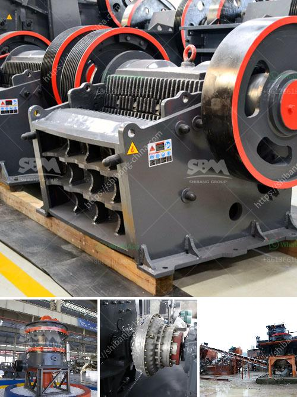

<h3>مواد أحزمة الناقلات القطاعية</h3>
تعتبر أحزمة الناقلات القطاعية موادًا أساسية في صناعة الناقلات والمعدات الثقيلة. تتميز هذه المواد بقدرتها على نقل ونقل البضائع والمنتجات عبر مسافات طويلة بطريقة فعالة وفعالة من حيث التكلفة. في هذه المقالة ، سنلقي نظرة على بعض مواد أحزمة النقل القطاعية الشائعة وخصائصها.

تتوفر مواد أحزمة النقل القطاعية بعدة أنواع ، ولكل منها استخدامات وخصائص مختلفة. واحدة من المواد الأكثر شيوعًا هي المطاط. تعتبر الأحزمة المصنوعة من المطاط متينة ومرنة ، مما يجعلها مناسبة للعديد من التطبيقات. تتميز بدرجة عالية من المرونة والتحمل للضغط ، مما يعني أنها يمكن أن تقاوم الظروف القاسية. تستخدم هذه الأحزمة على نطاق واسع في العديد من الصناعات مثل التعدين والبناء والزراعة.

بالإضافة إلى المطاط ، تستخدم البلاستيك أيضًا في تصنيع أحزمة النقل القطاعية. يتوفر البلاستيك بعدة أشكال وتركيبات ، مما يجعله مادة متعددة الاستخدامات. يمتاز البلاستيك بقدرته على التحمل للتآكل والتدفق المنخفض. يستخدم هذا النوع من الأحزمة على نطاق واسع في صناعة الغذاء وصناعة المشروبات حيث يحتاج المنتجون إلى نقل المنتجات الغذائية بطريقة نظيفة وآمنة.

بجانب المطاط والبلاستيك ، تستخدم أيضًا أحزمة النقل القطاعية المصنوعة من النسيج. تتميز الأحزمة المصنوعة من النسيج بقدرتها على الطي والانحناء بسهولة ، مما يجعلها مناسبة للتطبيقات التي تتطلب قابلية كبيرة للتعديل والتكيف. تستخدم هذه الأحزمة عادةً في النقل الخفيف والتعبئة والتغليف.

بشكل عام ، تختلف مواد أحزمة النقل القطاعية من حيث خصائصها وتطبيقاتها. يجب على المشترين الاهتمام بالراحة والمرونة والقوة والمتانة عند اختيار الأحزمة المناسبة لاحتياجاتهم. بفضل التقدمات التكنولوجية ، يتم تطوير مواد جديدة باستمرار لتحسين أداء الأحزمة الناقلة القطاعية وتلبية متطلبات العملاء المتزايدة.
<h3>Contact us</h3><ul><li><strong>Whatsapp:&nbsp;<a href="https://wa.me/8613661969651">+8613661969651</a></strong></li><li><a href="https://swt.shibang-china.com/?git&amp;zhl&amp;مواد أحزمة الناقلات القطاعية"><strong>Online Service(chat now)</strong></a></li></ul><h3>Related</h3><ul><li><a href='قائمة أسعار معدات كسارة الحجر الثقيلة.md'>قائمة أسعار معدات كسارة الحجر الثقيلة</a></li><li><a href='كيفية صنع كسارة فك صغيرة لنفسك.md'>كيفية صنع كسارة فك صغيرة لنفسك</a></li><li><a href='سعر كسارة الخرسانة.md'>سعر كسارة الخرسانة</a></li><li><a href='خط إنتاج مطحنة عمودية LM.md'>خط إنتاج مطحنة عمودية LM</a></li><li><a href='كسارة المطرقة بسعة ١٠ طن في الساعة وحجمها.md'>كسارة المطرقة بسعة ١٠ طن في الساعة وحجمها</a></li></ul>