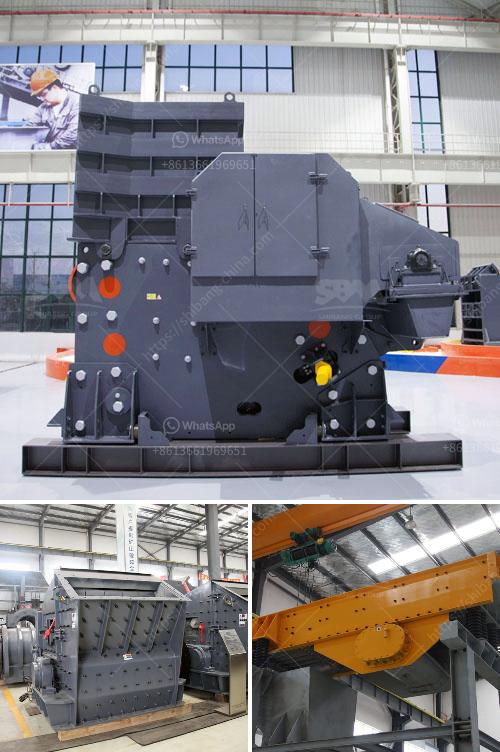

<h3>مواد مطحنة الهامر</h3>
مطحنة الهامر أحد الأدوات الهامة في صناعة التكسير والطحن، حيث تستخدم لتكسير المواد الصلبة إلى قطع صغيرة قبل استخدامها في إنتاج المنتجات النهائية. تستخدم مطاحن الهامر على نطاق واسع في العديد من الصناعات مثل صناعة الأسمدة والأعلاف والأغذية والمعادن والكيماويات.

تعمل مطحنة الهامر عن طريق تطبيق قوى الصدمة على المواد التي تتم طحنها، حيث يدور الرمح المركزي بسرعة عالية وعلى أطرافه يوجد مطارق معدنية متحركة. عند دخول المواد المراد طحنها إلى المطحنة، يتم تكسيرها بفعل الإصطدام بين المطارق وجدران الغرفة الداخلية للمطحنة. تحدث هذه العملية بسرعة كبيرة وتسمح بتحويل المواد الصلبة إلى قطع صغيرة جداً.

تتميز مطاحن الهامر بعدة مزايا تجعلها مرغوبة في صناعة التكسير والطحن. أولاً وقبل كل شيء، فإن هذه المطاحن تتميز بسهولة التشغيل والصيانة، حيث أنها تحتاج إلى قليل جداً من الصيانة والإصلاح، ويمكن التحكم في عملها بسهولة باستخدام واجهة بسيطة.

ثانياً، فإن مطاحن الهامر تتميز بقدرتها على طحن مجموعة متنوعة من المواد الصلبة بشكل فعال وفعالة. سواء كانت المواد صلبة أو هشة أو ناعمة، فإن هذه المطاحن قادرة على تحويلها إلى حجم وشكل مطلوب. هذا يتيح للمصانع إنتاج منتجات عالية الجودة باستخدام مواد مطحونة بشكل موحد.

ثالثاً، فإن مطاحن الهامر تعتبر اقتصادية في استخدام الطاقة، حيث أنها تتطلب طاقة أقل مقارنة بأنواع أخرى من الطواحين المتاحة في السوق. يعني هذا أن الشركات يمكنها تقليل تكاليف التشغيل وزيادة الإنتاجية بفضل استخدام مطاحن الهامر.

بالإضافة إلى ذلك، فإن مطحنة الهامر قابلة للتغيير والتعديل لتلبية متطلبات الإنتاج المختلفة. يمكن ضبط سرعة الدوران، وحجم الفتحات وعدد المطارق حسب الحاجة، مما يسمح بتصنيع المنتجات المطلوبة بشكل دقيق.

باختصار، تعد مطاحن الهامر أداة أساسية في صناعة التكسير والطحن، حيث تساهم في تحويل المواد الصلبة إلى قطع صغيرة جداً بشكل فعال وفعالة. تتميز هذه المطاحن بسهولة التشغيل والصيانة، وقدرتها على طحن مجموعة متنوعة من المواد، واقتصاديتها في استخدام الطاقة. إنها أداة لا غنى عنها في صناعات الأسمدة والأعلاف والأغذية وغيرها.
<h3>Contact us</h3><ul><li><strong>Whatsapp:&nbsp;<a href="https://wa.me/8613661969651">+8613661969651</a></strong></li><li><a href="https://swt.shibang-china.com/?git&amp;zhl&amp;مواد مطحنة الهامر"><strong>Online Service(chat now)</strong></a></li></ul><h3>Related</h3><ul><li><a href='مصنع تكسير نصف متنقل.md'>مصنع تكسير نصف متنقل</a></li><li><a href='مخطط تدفق التعدين ومعالجة المعادن للنيكل.md'>مخطط تدفق التعدين ومعالجة المعادن للنيكل</a></li><li><a href='آلة كسارة الذهب للبيع في جنوب أفريقيا.md'>آلة كسارة الذهب للبيع في جنوب أفريقيا</a></li><li><a href='آلة صنع مسحوق الدولوميت لخط الإنتاج.md'>آلة صنع مسحوق الدولوميت لخط الإنتاج</a></li><li><a href='تقرير مشروع الكسارة 100 tph.md'>تقرير مشروع الكسارة 100 tph</a></li></ul>