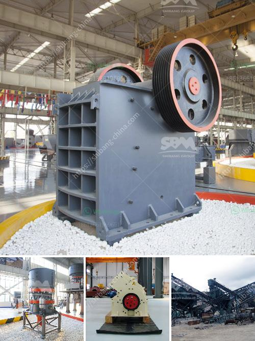

<h3>مواصفات خام الكروم</h3>
خام الكروم هو مادة معدنية ثمينة يتم استخراجها بشكل رئيسي من الصخور المتحولة المعروفة باسم الفواتح. يحتوي خام الكروم على نسب عالية من الكروم العنصر الكيميائي، وهو يستخدم بشكل رئيسي في صناعة الفولاذ المقاوم للصدأ والسبائك الأخرى.

تتميز مواصفات خام الكروم بعدة عوامل رئيسية تشمل التركيب الكيميائي والدرجة والنقاوة. يجب أن يكون خام الكروم ذو تركيب كيميائي متوازن، حيث يجب أن يحتوي على نسبة معتدلة من الكروم وقليل من الشوائب الأخرى. عادةً ما تكون النسبة المطلوبة من الكروم في نطاق 42-48٪، وهذا ما يسمح للمنتجات المصنوعة من هذا الخام بتحقيق قوة وصلابة عالية.

تتفاوت درجة خام الكروم وفقًا لجودتها، حيث يتم تصنيف الخام إلى ثلاث فئات رئيسية: الخام العادي، والخام الجيد، والخام الفائق. يتم تحديد درجة الخام بناءً على تركيز الكروم والشوائب الأخرى المتواجدة فيه. عادةً ما يكون الخام الفائق هو الأفضل في الجودة والنقاوة، ويكون مطلوبًا في الصناعات ذات المتطلبات العالية مثل صناعة الدفع النفاث ومعدات الطيران.

بالإضافة إلى التركيب الكيميائي والدرجة، فإن النقاوة أيضًا عامل رئيسي في تقييم مواصفات خام الكروم. يجب أن يكون الخام خاليًا من الشوائب والشوائب الأخرى التي يمكن أن تؤثر على صلاحيته للاستخدام في الصناعات المختلفة. توفر النقاوة العالية خام الكروم الأفضل أداءً ومتانة في تطبيقات مختلفة.

بشكل عام، يعتبر خام الكروم من المواد الخام الهامة التي تلعب دورًا حاسمًا في صناعة الفولاذ والسبائك الأخرى. يمكن الحصول على هذا الخام من بعض المناطق مثل جنوب أفريقيا وروسيا وكازاخستان. وتتطلب صناعة الكروم عمليات استخراج ومعالجة معقدة للحصول على المنتج النهائي الجودة. يجب أن يتم توفير مواصفات خام الكروم الصحيحة لضمان أداء وجودة منتجات مقاومة للصدأ وسبائك الكروم الأخرى.
<h3>Contact us</h3><ul><li><strong>Whatsapp:&nbsp;<a href="https://wa.me/8613661969651">+8613661969651</a></strong></li><li><a href="https://swt.shibang-china.com/?git&amp;zhl&amp;مواصفات خام الكروم"><strong>Online Service(chat now)</strong></a></li></ul><h3>Related</h3><ul><li><a href='آلات تصنيع كتل الجبس في إيطاليا.md'>آلات تصنيع كتل الجبس في إيطاليا</a></li><li><a href='مصانع التعدين في مصر.md'>مصانع التعدين في مصر</a></li><li><a href='خط إنتاج رمل السيليكا في ألمانيا.md'>خط إنتاج رمل السيليكا في ألمانيا</a></li><li><a href='مطحنة الكرة الرطبة والجافة.md'>مطحنة الكرة الرطبة والجافة</a></li><li><a href='معدات كسارة المحجر المحمولة المستخدمة.md'>معدات كسارة المحجر المحمولة المستخدمة</a></li></ul>