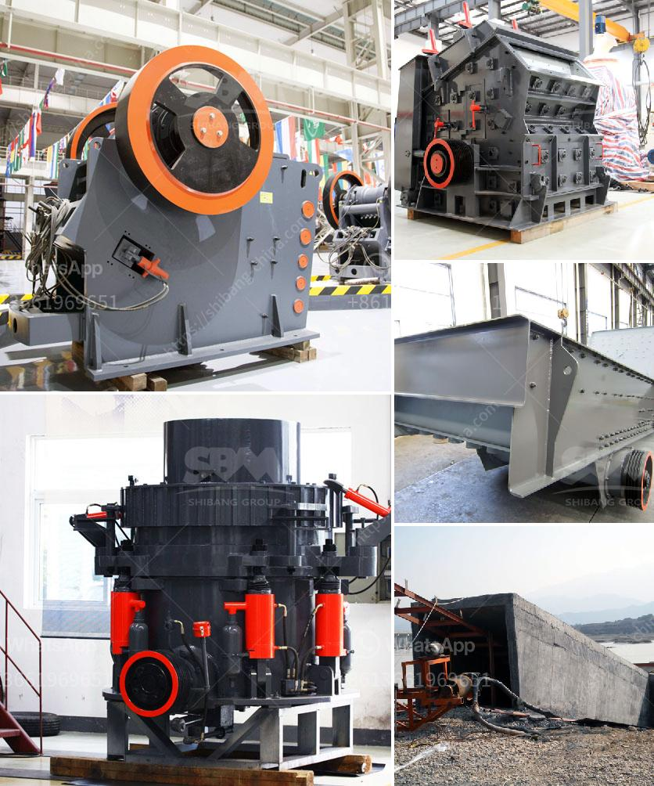

<h3>مواصفات كسارة الفك</h3>
تُعد كسارة الفك واحدة من أهم الأدوات في صناعة التعدين والبناء، حيث تستخدم لسحق المواد الصلبة والكبيرة إلى قطع صغيرة تُستخدم في عملية البناء والإنتاج. وتعتبر كسارة الفك ضرورة في أغلب المصانع والمناجم، وتُستخدم في تكسير المواد المعدنية والخرسانة والطوب والجدران والأحجار الطبيعية والأخشاب.

تتميز كسارة الفك بعدة مواصفات تجعلها مثالية للدور الذي تؤديه في صناعة التعدين والبناء. ومن أبرز تلك المواصفات:

1- قدرة التحمل: تتميز كسارة الفك بقدرتها على تحمل الضغوط العالية والاستمرارية في العمل لفترات طويلة دون حدوث أي أعطال أو تلف في هيكلها الداخلي. وذلك يتطلب استخدام مواد قوية وعالية الجودة في تصنيعها.

2- قوة التكسير: يجب أن يكون لدى كسارة الفك القدرة على تكسير المواد الصلبة والكبيرة بكفاءة عالية. ويتحقق ذلك عن طريق استخدام فكين قويين ومعدنيين للكسر والطحن.

3- سهولة الصيانة: يجب أن تكون كسارة الفك سهلة الصيانة والتشغيل. وذلك يشمل القدرة على التنظيف وتغيير الأجزاء البالية بشكل سهل وسريع لضمان عملية التشغيل المستمرة.

4- التكنولوجيا المتقدمة: يعتبر استخدام التكنولوجيا المتقدمة في تصنيع كسارة الفك أمرًا هامًا. حيث يجب أن تكون مجهزة بنظام تشحيم آلي ونظام تحكم آلي لتحقيق أعلى معدلات الإنتاجية والكفاءة.

5- السلامة: يجب أن تتميز كسارة الفك بنظام سلامة فعال يقي المشغلين والعمال من حوادث العمل والإصابات. وهذا يتطلب توفير مراقبة آلية لعمل الكسارة وتكون الأزرار والمقابض الهيدروليكية والكهربائية قابلة للتحكم والتشغيل بسهولة وأمان.

في النهاية، تُعد كسارة الفك أداة أساسية في صناعة التعدين والبناء، وتعتبر مواصفاتها السابقة أمورًا هامة يجب أخذها في الاعتبار عند اختيار الكسارة المناسبة للاستخدام المطلوب.
<h3>Contact us</h3><ul><li><strong>Whatsapp:&nbsp;<a href="https://wa.me/8613661969651">+8613661969651</a></strong></li><li><a href="https://swt.shibang-china.com/?git&amp;zhl&amp;مواصفات كسارة الفك"><strong>Online Service(chat now)</strong></a></li></ul><h3>Related</h3><ul><li><a href='آلة مطحنة المعادن.md'>آلة مطحنة المعادن</a></li><li><a href='مطاحن هامر زراعية مستعملة.md'>مطاحن هامر زراعية مستعملة</a></li><li><a href='مورد قطع غيار الكسارة كينيا.md'>مورد قطع غيار الكسارة كينيا</a></li><li><a href='كسارة الفك الجديدة من نوع زينيث.md'>كسارة الفك الجديدة من نوع زينيث</a></li><li><a href='تكلفة مصنع كسارة الحجر الجيري.md'>تكلفة مصنع كسارة الحجر الجيري</a></li></ul>