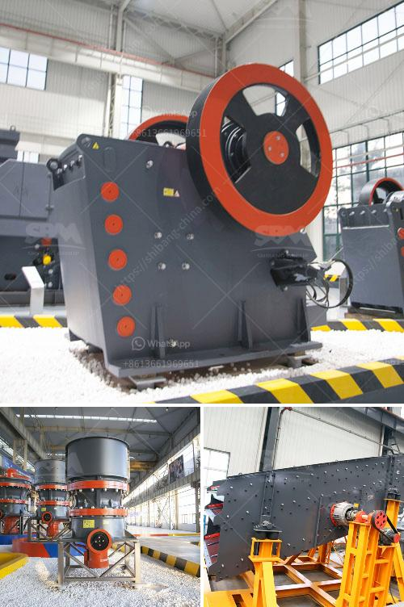

<h3>مواصفات كسارة المخروط</h3>
تُعد كسارة المخروط أحد الأدوات الهامة في صناعة التعدين والبناء، حيث تُستخدم لسحق الصخور والمواد الصلبة الأخرى للحصول على مواد نهائية مطابقة للاحتياجات المطلوبة. تتميز كسارة المخروط بالعديد من المواصفات التي تجعلها الخيار المثالي للعمل في ظروف قاسية وتحت أحمال عالية. في هذه المقالة، سنستعرض بعض أهم مواصفات كسارة المخروط.

أحد أهم العوامل التي يجب أن تُراعى عند اختيار كسارة المخروط هي قدرتها على المعالجة والإنتاج. فمن المهم أن تكون الكسارة بما فيه الكفاية قوية لسحق المواد الصلبة وتحويلها إلى حجم الحجر المطلوب. وبشكل عام، تتراوح القدرة الإنتاجية لكسارة المخروط بين 200 و 400 طن في الساعة، ويمكن أن تختلف حسب طراز الكسارة والمواد المراد سحقها.

بالإضافة إلى القدرة الإنتاجية، يجب أن تتمتع كسارة المخروط أيضًا بالقدرة على مقاومة التآكل والاهتزازات. فعملية سحق الصخور قد تكون عملية قاسية ومرهقة للمعدات، لذا يجب أن تصمم الكسارة بمواد عالية الجودة وتكنولوجيا متقدمة لتتحمل التحميل العالي وتعمل بكفاءة عالية لفترات طويلة من دون الحاجة إلى الصيانة المكثفة.

كما تتطلب كسارة المخروط أيضًا نظام للتحكم الفعال لضمان تشغيلها بأمان. يتضمن ذلك نظام تحكم يمنع تشغيل الكسارة في حالة زيادة الضغط أو وجود أي خلل في عملية السحق. كما يُنصح بوجود نظام تشحيم آلي لتقليل احتمالية حدوث تآكل وتلف في المحامل والأجزاء المتحركة الأخرى.

آخر مواصفة مهمة هي توافر قطع الغيار للكسارة المخروط. يجب أن يكون لدى الشركة المصنعة شبكة توزيع قوية وتوافر الأجزاء البديلة، حتى يمكن توفير الصيانة والإصلاح بشكل سريع وفعال عند الحاجة.

في النهاية، تُعد كسارة المخروط أداة أساسية في صناعة التعدين والبناء، وتحتاج إلى اختيار الطراز المناسب لتناسب احتياجات المشروع واحتمال تشغيلها بكفاءة عالية لفترات طويلة. تتضمن بعض المواصفات الرئيسية للكسارة المخروط القدرة الإنتاجية، قدرتها على مقاومة التآكل والاهتزازات، نظام التحكم الفعال، وتوافر قطع الغيار. الاهتمام بتلك المواصفات سيساعد في تحقيق أعلى مستوى من الأداء والكفاءة في عمليات السحق.
<h3>Contact us</h3><ul><li><strong>Whatsapp:&nbsp;<a href="https://wa.me/8613661969651">+8613661969651</a></strong></li><li><a href="https://swt.shibang-china.com/?git&amp;zhl&amp;مواصفات كسارة المخروط"><strong>Online Service(chat now)</strong></a></li></ul><h3>Related</h3><ul><li><a href='كسارة الكرة باكستان للبيع.md'>كسارة الكرة باكستان للبيع</a></li><li><a href='عملية تصنيع خام البنتونيت.md'>عملية تصنيع خام البنتونيت</a></li><li><a href='عمليات سحق الركام.md'>عمليات سحق الركام</a></li><li><a href='أسعار كسارة الحجر.md'>أسعار كسارة الحجر</a></li><li><a href='شركة تصنيع معدات كسارة الحجر في ألمانيا.md'>شركة تصنيع معدات كسارة الحجر في ألمانيا</a></li></ul>