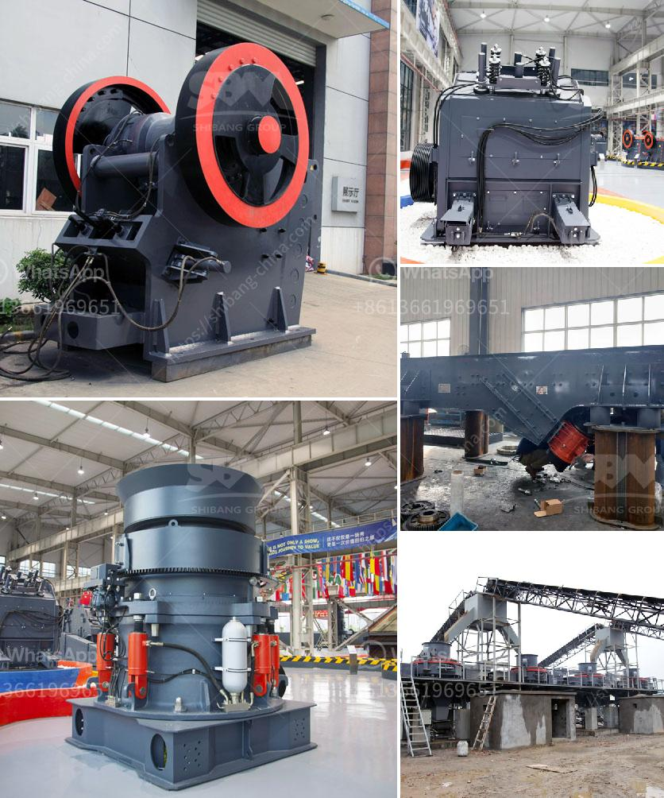

<h3>مواصفات مسحوق الجبس</h3>
مسحوق الجبس هو منتج يتم استخدامه في مجالات متعددة مثل البناء والديكور، حيث يتم استخدامه في تشطيب الجدران والسقوف وتصنيع الأشكال المعمارية والديكورات المختلفة. يتميز مسحوق الجبس بعدة مواصفات وخصائص تجعله مناسبًا للاستخدام العام وتسهم في جعله مادة فعالة ومفيدة في المجالات التي يُستخدم فيها.

أحد المواصفات الهامة لمسحوق الجبس هو كونه مادة طبيعية صديقة للبيئة وغير مسببة للتلوث. فهو يستخلص من الجبس الطبيعي ويتم تكسيره وطحنه إلى حجم الجسيمات التي تناسب استخدامه في البناء والديكور. وبالتالي، فإن استخدام مسحوق الجبس لا يتسبب في إضافة أي مواد ضارة أو غازات سامة إلى البيئة، مما يجعله خيارًا صحيًا ومستدامًا.

من الميزات الأخرى لمسحوق الجبس هو قابليته للتشكيل والتعديل بسهولة. فهو يتمتع بخاصية تجفيف سريعة، مما يمكن المستخدم من تصميم الديكور المرغوب به وإجراء التعديلات اللازمة قبل أن يجف تمامًا. هذه الخاصية تجعل مسحوق الجبس مفضلًا لدى المهندسين المعماريين والمصممين الداخليين الذين يرغبون في تحقيق أشكال فنية متنوعة ومبتكرة.

بالإضافة إلى ذلك، يتميز مسحوق الجبس بقابليته لامتصاص الرطوبة بشكل فعال وسريع. وهذه الخاصية تعتبر هامة جدًا في مناطق ذات ارتفاع نسبة الرطوبة، حيث يمكن استخدام مسحوق الجبس كعازل للرطوبة وتمنع انتشار العفن والرطوبة في الجدران. هذا التحكم في الرطوبة يتيح المزيد من الراحة والجو المناسب داخل المباني.

وأخيرًا، يمتاز مسحوق الجبس بمقاومته العالية للحرارة والنار. وهذا يجعله مادة مناسبة للاستخدام في المطابخ والحمامات والمناطق التي تحتاج إلى مادة غير قابلة للاشتعال. وعند تعرض الجبس لحرارة عالية، فإنه لا يفقد متانته ولا ينكمش أو يتشقق، مما يجعله مواد بناء قوية ومستدامة.

في النهاية، يُعد مسحوق الجبس مادة فعالة ومفيدة في البناء والديكور، حيث يتميز بمواصفات عديدة تجعله مناسبًا للاستخدام العام، بما في ذلك صديق للبيئة، قابل للتشكيل، قادر على امتصاص الرطوبة، ومقاوم للحرارة والنار. يجب أن يتم استخدامه بحذر وفقًا للتوجيهات والمعايير الفنية المطبقة في كل قطاع لضمان استفادة كاملة من المنتج وضمان سلامة الاستخدام.
<h3>Contact us</h3><ul><li><strong>Whatsapp:&nbsp;<a href="https://wa.me/8613661969651">+8613661969651</a></strong></li><li><a href="https://swt.shibang-china.com/?git&amp;zhl&amp;مواصفات مسحوق الجبس"><strong>Online Service(chat now)</strong></a></li></ul><h3>Related</h3><ul><li><a href='آلة طحن وتلميع الصخور.md'>آلة طحن وتلميع الصخور</a></li><li><a href='تقرير الجدوى لاستفادة من خام النحاس.md'>تقرير الجدوى لاستفادة من خام النحاس</a></li><li><a href='كسارة مخروطية جديدة تمامًا للبيع في الهند.md'>كسارة مخروطية جديدة تمامًا للبيع في الهند</a></li><li><a href='كسارة الإسمنت في تركيا.md'>كسارة الإسمنت في تركيا</a></li><li><a href='آلة سحق الحديد.md'>آلة سحق الحديد</a></li></ul>