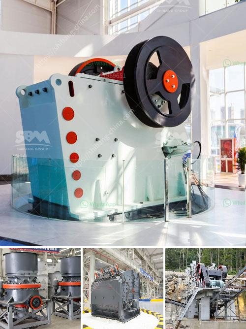

<h3>مواصفات مصنع سحق الحجر الجيري 450 طن في الساعة</h3>
يعد مصنع سحق الحجر الجيري بطاقة إنتاج تبلغ 450 طن في الساعة من أهم المصانع في صناعة التعدين. يستخدم هذا المصنع لسحق الحجر الجيري الخام وتحويله إلى منتج نهائي قابل للتسويق.

تتميز هذه الآلات بعدة مواصفات رئيسية. أولاً، يحتوي المصنع على كسارة فكية تعمل بشكل مستمر وعالية الكفاءة. تستخدم الكسارة الفكية لسحق الحجر الجيري الخام إلى جزيئات صغيرة بحجم يتراوح بين 20 و 50 مم. تعمل الكسارة بنظام هيدروليكي وتحتوي على محرك قوي يسمح بتشغيلها بشكل مستمر دون توقف.

ثانيًا، يتضمن المصنع كسارة تصادمية لسحق الجزيئات الصغيرة إلى جزيئات أصغر وأدق. تسمح الكسارة التصادمية بزيادة كفاءة الإنتاج وتحسين جودة المنتج النهائي. تعمل الكسارة بنظام هيدروليكي مما يجعلها قادرة على التكيف مع أي حجم من الجزيئات.

ثالثًا، يتم استخدام الغرابيل والمغاسل الاهتزازية في المصنع لفصل الجزيئات المختلفة وتنظيفها. يتم وضع الحجر الجيري المسحوق في الغرابيل وتنقسم الجزيئات وفقًا لحجمها. ثم يتم وضع الجزيئات في المغاسل الاهتزازية لإزالة العوالق الموجودة عليها وتنظيفها بشكل فعال.

وأخيرًا، يتم استخدام ناقلات الحزام لنقل الجزيئات المسحوقة من مرحلة السحق إلى مرحلة الفصل والتنظيف. تعمل الناقلات بدقة وسرعة وتسهم في ضمان استمرارية الإنتاج وفعالية العملية.

باختصار، يتميز مصنع سحق الحجر الجيري بسعة إنتاج عالية وأداء ممتاز. يعتبر من أهم المصانع في صناعة التعدين نظرًا لقدرته على تحويل الحجر الجيري الخام إلى منتج نهائي عالي الجودة وقابل للتسويق. من خلال استخدام الكسارات والغرابيل والمغاسل الاهتزازية وناقلات الحزام، يتم تحقيق الكفاءة والفعالية في عملية الإنتاج وتلبية احتياجات السوق بشكل كامل.
<h3>Contact us</h3><ul><li><strong>Whatsapp:&nbsp;<a href="https://wa.me/8613661969651">+8613661969651</a></strong></li><li><a href="https://swt.shibang-china.com/?git&amp;zhl&amp;مواصفات مصنع سحق الحجر الجيري 450 طن في الساعة"><strong>Online Service(chat now)</strong></a></li></ul><h3>Related</h3><ul><li><a href='آلة صنع المسحوق في جنوب أفريقيا.md'>آلة صنع المسحوق في جنوب أفريقيا</a></li><li><a href='مصنعين محطم في جنوب أفريقيا.md'>مصنعين محطم في جنوب أفريقيا</a></li><li><a href='آلة معالجة النحاس.md'>آلة معالجة النحاس</a></li><li><a href='سعر مصنع خام الحديد للبيع في المكسيك.md'>سعر مصنع خام الحديد للبيع في المكسيك</a></li><li><a href='قائمة أسعار آلة سحق البنتونيت.md'>قائمة أسعار آلة سحق البنتونيت</a></li></ul>