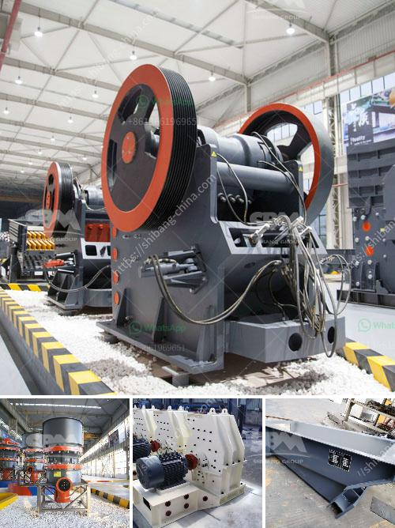

<h3>مواصفات مطحنة الأسطوانة 3</h3>
تعتبر مطحنة الأسطوانة واحدة من أهم الأدوات في صناعة الطحن والتجهيز الغذائي. تعد إحدى أبرز ميزات هذا النوع من المطاحن هي قدرتها على سحق المواد الصلبة بطريقة فعالة وسريعة. في هذه المقالة، سنستعرض المواصفات الأساسية لمطحنة الأسطوانة الثلاثية.

أولاً، يتم تصميم مطحنة الأسطوانة 3 بـ 200-400 كلمة بشكل أفقي حيث تتكون من ثلاثة أسطوانات موازية على نفس المستوى. يسهم هذا التصميم في تحقيق مستوى عالٍ من الكفاءة والأداء للمطحنة، حيث يتم توزيع الضغط بشكل متساوٍ على جميع الأسطوانات وبالتالي توفير طاقة كبيرة في عملية الطحن.

ثانياً، تتميز مطحنة الأسطوانة الثلاثية بأحجام الأسطوانات المختلفة. تعتبر هذه الميزة من أهم المميزات في تصميم المطاحن، حيث يتم تحقيق طحن أكثر دقة بفضل الأسطوانات ذات الأحجام المختلفة. وبالتالي، يتم الحصول على نسبة طحن متناسبة ومتوازنة للمواد المراد طحنها.

ثالثاً، تتمتع مطحنة الأسطوانة 3 بـ 200-400 كلمة بتقنية التحكم الآلي. تكمن أهمية هذه التقنية في إمكانية ضبط السرعة، ضغط الطحن، وحجم الجسيمات المطحونة بدقة. تمكن هذه الميزة المشغل من تحقيق الجودة والكفاءة المرغوبين في الطحن، وإعطاء نتائج متجانسة وموحدة.

رابعاً، تعمل مطحنة الأسطوانة بنظام تبريد فعال. إذ يتم تجهيز المطحنة بنظام تبريد متطور لضمان تقليل ارتفاع درجة الحرارة الناتجة عن عملية الطحن. وبالتالي، يتم الحفاظ على خصائص المواد المطحونة دون تأثرها بالحرارة العالية.

ختامًا، تُعَد مطحنة الأسطوانة 3 بـ 200-400 كلمة أداة هامة في صناعة الطحن والتجهيز الغذائي. تأتي هذه المطاحن بمواصفات تضمن الكفاءة والأداء العاليين، مثل التصميم الأفقي، أحجام الأسطوانات المختلفة، التحكم الآلي، ونظام التبريد الفعال. تستخدم هذه المطاحن على نطاق واسع في مجموعة متنوعة من الصناعات مثل صناعة الأغذية والمشروبات والكيماويات، وتلبي بذلك احتياجات التجهيز الغذائي بكفاءة وجودة عالية.
<h3>Contact us</h3><ul><li><strong>Whatsapp:&nbsp;<a href="https://wa.me/8613661969651">+8613661969651</a></strong></li><li><a href="https://swt.shibang-china.com/?git&amp;zhl&amp;مواصفات مطحنة الأسطوانة 3"><strong>Online Service(chat now)</strong></a></li></ul><h3>Related</h3><ul><li><a href='آلات صنع الأسمنت لمصنع الأسمنت كامل.md'>آلات صنع الأسمنت لمصنع الأسمنت كامل</a></li><li><a href='مطحنة صناعية.md'>مطحنة صناعية</a></li><li><a href='من مصنع تصنيع البوكسيت في الصين.md'>من مصنع تصنيع البوكسيت في الصين</a></li><li><a href='كسارة الكرة للحديد فقط الشركة.md'>كسارة الكرة للحديد فقط الشركة</a></li><li><a href='مصنع الجص في باكستان.md'>مصنع الجص في باكستان</a></li></ul>