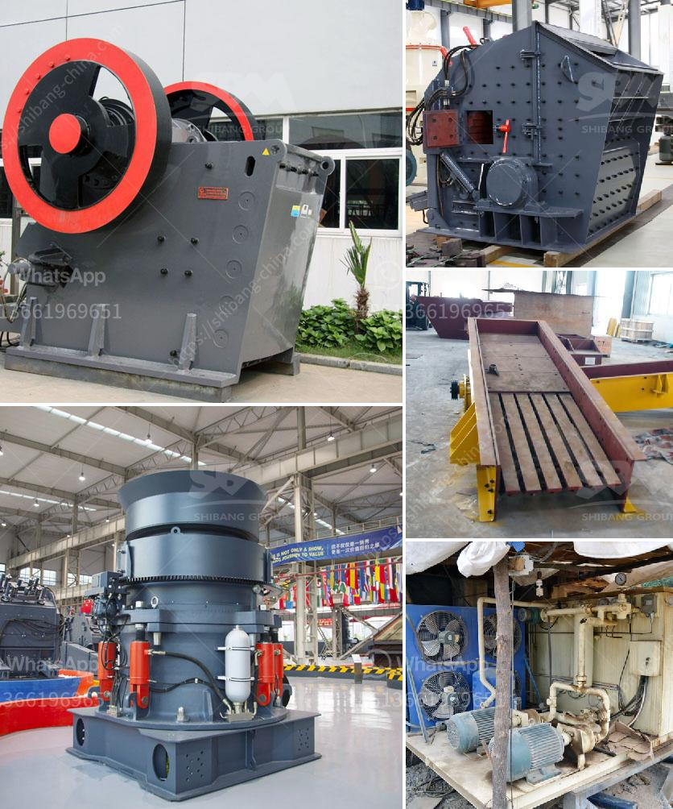

<h3>مواصفات مطحنة الكرة</h3>
تعتبر مطحنة الكرة من أهم الأجهزة الهندسية المستخدمة في صناعة الطحن والتكسير في العديد من الصناعات مثل صناعة الأسمنت والكيماويات والألبان والزجاج وغيرها. وتستخدم هذه المطاحن لطحن المواد الخام وتكسيرها إلى قطع صغيرة قبل تداولها في العملية الإنتاجية.

تتكون مطحنة الكرة من جسم أسطواني يحتوي على كرات طحن معدنية في داخله. وتعمل بواسطة تدوير الجسم الأسطواني حول محوره. يتم إدخال المادة الخام إلى المطحنة من الأعلى وتتحرك بفعل الطاقة الميكانيكية التي تولدها الكرات الطحن. تتحرك الكرات داخل الأسطوانة وتطحن وتكسر المادة الخام في داخلها. وتنتج المادة النهائية بعد خروجها من الفتحة الموجودة في الجزء السفلي للمطحنة.

تختلف مواصفات مطحنة الكرة حسب الاستخدام وحسب صناعة التطبيق. ومن أبرز المواصفات التي يجب أخذها في الاعتبار عند اختيار المطحنة هي:

1. السعة: تعتمد مواصفات المطحنة على الكمية المطلوب طحنها أو تكسيرها في فترة زمنية محددة. وتختلف السعة بين المطاحن حسب حجمها وسرعتها وشكلها.

2. الحجم الأقصى للمادة الخام: يجب مراعاة حجم المادة الخام المطلوب طحنها أو تكسيرها في المطحنة. إذا كانت المادة الخام كبيرة الحجم، يمكن أن يكون هناك حاجة لمطحنة ذات قدرة أعلى.

3. سرعة الدوران: تعتمد فعالية المطحنة على سرعة دوران الجسم الأسطواني. ويجب اختيار سرعة الدوران المناسبة حسب متطلبات عملية الطحن والتكسير.

4. طريقة التفريغ: يتم تفريغ المادة النهائية من المطحنة عن طريق فتحة في الجزء السفلي للأسطوانة. وتختلف طرق التفريغ حسب تصميم المطحنة وصناعة التطبيق.

5. الاستهلاك الطاقوي: يجب النظر في استهلاك الطاقة الذي يتطلبه تشغيل المطحنة. وعادة ما يتم حساب الاستهلاك الطاقوي بناءً على حجم الكرات الطحن وسرعة الدوران ونسبة التحميل.

6. الصيانة: يجب أخذ في الاعتبار صيانة المطحنة وتكاليفها. حيث يجب أن يكون تصميم المطحنة سهل الصيانة ومتين لضمان تشغيلها بكفاءة لفترة طويلة.

في النهاية، تعتبر مطحنة الكرة أداة ضرورية في صناعة الطحن والتكسير. ويجب اختيارها بعناية حسب احتياجات العملية الإنتاجية والمتطلبات الفنية المحددة. ومن خلال مراعاة المواصفات المذكورة أعلاه، يمكن تحقيق أداء متميز وفعالية عالية في عملية الطحن والتكسير.
<h3>Contact us</h3><ul><li><strong>Whatsapp:&nbsp;<a href="https://wa.me/8613661969651">+8613661969651</a></strong></li><li><a href="https://swt.shibang-china.com/?git&amp;zhl&amp;مواصفات مطحنة الكرة"><strong>Online Service(chat now)</strong></a></li></ul><h3>Related</h3><ul><li><a href='شراء آلة محجر من أوروبا.md'>شراء آلة محجر من أوروبا</a></li><li><a href='مطاحن طحن أتا.md'>مطاحن طحن أتا</a></li><li><a href='مصنع سحق حجر كامل بسعة 300 طن.md'>مصنع سحق حجر كامل بسعة 300 طن</a></li><li><a href='مصانع تكسير الحجر في الهند.md'>مصانع تكسير الحجر في الهند</a></li><li><a href='خط تكسير الحجر.md'>خط تكسير الحجر</a></li></ul>